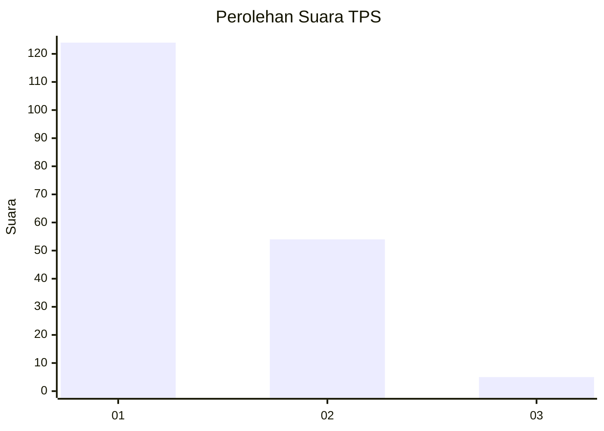
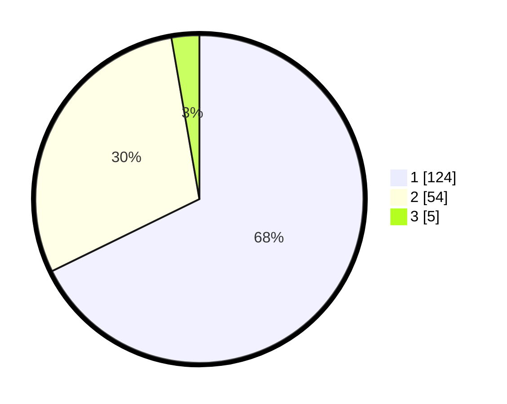

# Hasil

## Grafik

## Tabel

| No. | Nama Paslon    | Suara | Suara (raw) | Persentase |
|:--- |:-------------- | -----:| -----------:| ----------:|
| 1   | ANIES MUHAIMIN | 124   | [124][p-1]  | 67,76      |
| 2   | PRABOWO GIBRAN | 54    | [54][p-2]   | 29,51      |
| 3   | GANJAR MAHFUD  | 5     | [5][p-3]    | 2,73       |

[p-1]: https://github.com/gigit-pemilu/pemilu-2024/blob/main/pilpres/hitung-suara/sub/12-sumatera-utara/sub/71-kota-medan/sub/09-medan-amplas/sub/1002-sitirejo-ii/sub/021-tps/sub/paslon-1.txt
[p-2]: https://github.com/gigit-pemilu/pemilu-2024/blob/main/pilpres/hitung-suara/sub/12-sumatera-utara/sub/71-kota-medan/sub/09-medan-amplas/sub/1002-sitirejo-ii/sub/021-tps/sub/paslon-2.txt
[p-3]: https://github.com/gigit-pemilu/pemilu-2024/blob/main/pilpres/hitung-suara/sub/12-sumatera-utara/sub/71-kota-medan/sub/09-medan-amplas/sub/1002-sitirejo-ii/sub/021-tps/sub/paslon-3.txt

## Foto C Plano

https://sirekap-obj-formc.kpu.go.id/129b/pemilu/ppwp/12/71/09/10/02/1271091002021-20240214-214832--a5333af7-72c9-43d6-b62b-4dc244a0368e.jpg

https://sirekap-obj-formc.kpu.go.id/129b/pemilu/ppwp/12/71/09/10/02/1271091002021-20240214-215006--97558589-d016-4de4-b884-9d01eec187cb.jpg

https://sirekap-obj-formc.kpu.go.id/129b/pemilu/ppwp/12/71/09/10/02/1271091002021-20240214-215129--a0806ca2-390e-4dae-8d58-60726b5500cf.jpg

## Metadata

| Key        | Value               |
| ---------- | ------------------- |
| Time Stamp | 2024-02-25 19:00:00 |

