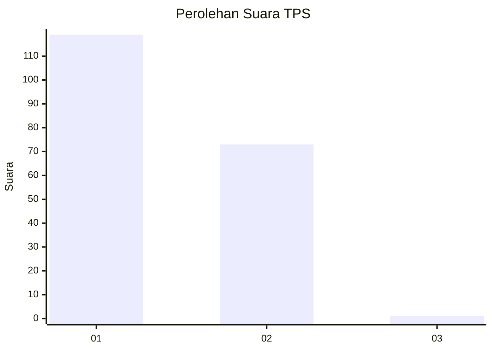
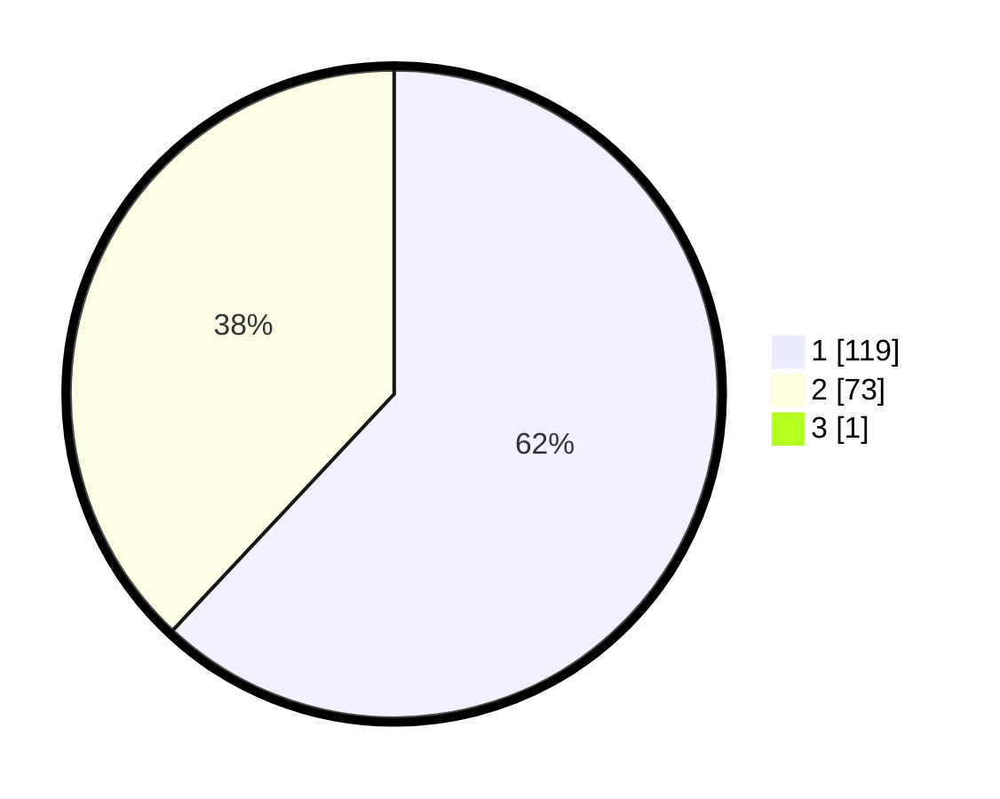

# Hasil

## Grafik

## Tabel

| No. | Nama Paslon    | Suara | Suara (raw) | Persentase |
|:--- |:-------------- | -----:| -----------:| ----------:|
| 1   | ANIES MUHAIMIN | 119   | [119][p-1]  | 61,66      |
| 2   | PRABOWO GIBRAN | 73    | [73][p-2]   | 37,82      |
| 3   | GANJAR MAHFUD  | 1     | [1][p-3]    | 0,52       |

[p-1]: https://github.com/gigit-pemilu/pemilu-2024/blob/main/pilpres/hitung-suara/sub/12-sumatera-utara/sub/71-kota-medan/sub/09-medan-amplas/sub/1002-sitirejo-ii/sub/022-tps/sub/paslon-1.txt
[p-2]: https://github.com/gigit-pemilu/pemilu-2024/blob/main/pilpres/hitung-suara/sub/12-sumatera-utara/sub/71-kota-medan/sub/09-medan-amplas/sub/1002-sitirejo-ii/sub/022-tps/sub/paslon-2.txt
[p-3]: https://github.com/gigit-pemilu/pemilu-2024/blob/main/pilpres/hitung-suara/sub/12-sumatera-utara/sub/71-kota-medan/sub/09-medan-amplas/sub/1002-sitirejo-ii/sub/022-tps/sub/paslon-3.txt

## Foto C Plano

https://sirekap-obj-formc.kpu.go.id/45f5/pemilu/ppwp/12/71/09/10/02/1271091002022-20240214-185113--20bf8588-b838-4661-83de-e61aa8d5a124.jpg

https://sirekap-obj-formc.kpu.go.id/45f5/pemilu/ppwp/12/71/09/10/02/1271091002022-20240214-185431--18ba104f-5b7d-4020-89f3-120f6e7ceda0.jpg

https://sirekap-obj-formc.kpu.go.id/45f5/pemilu/ppwp/12/71/09/10/02/1271091002022-20240214-155402--c954a145-421c-4287-b87d-b3f23fd70e19.jpg

## Metadata

| Key        | Value               |
| ---------- | ------------------- |
| Time Stamp | 2024-02-25 17:00:00 |

