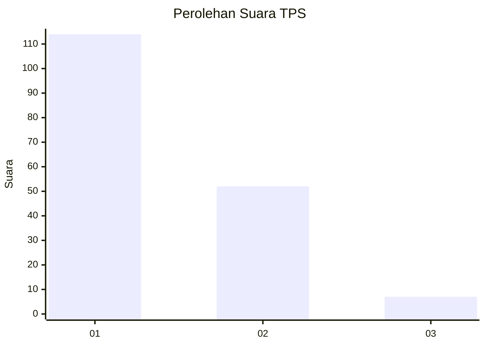
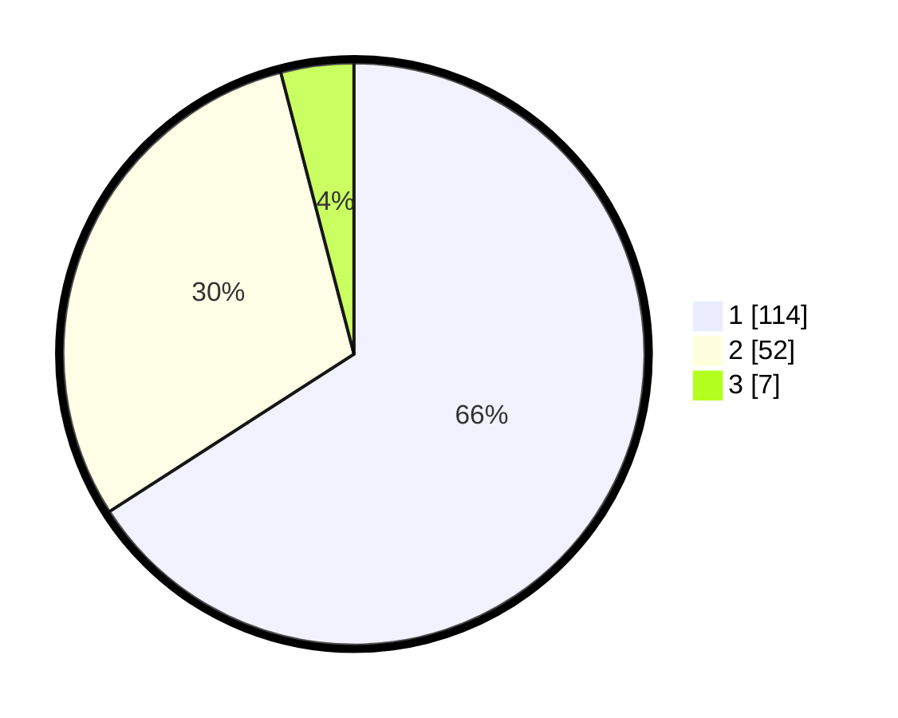

# Hasil

## Grafik

## Tabel

| No. | Nama Paslon    | Suara | Suara (raw) | Persentase |
|:--- |:-------------- | -----:| -----------:| ----------:|
| 1   | ANIES MUHAIMIN | 114   | [114][p-1]  | 65,90      |
| 2   | PRABOWO GIBRAN | 52    | [52][p-2]   | 30,06      |
| 3   | GANJAR MAHFUD  | 7     | [7][p-3]    | 4,05       |

[p-1]: https://github.com/gigit-pemilu/pemilu-2024-12-sumatera-utara/blob/main/pilpres/hitung-suara/sub/12-sumatera-utara/sub/71-kota-medan/sub/09-medan-amplas/sub/1003-sitirejo-iii/sub/003-tps/sub/paslon-1.txt
[p-2]: https://github.com/gigit-pemilu/pemilu-2024-12-sumatera-utara/blob/main/pilpres/hitung-suara/sub/12-sumatera-utara/sub/71-kota-medan/sub/09-medan-amplas/sub/1003-sitirejo-iii/sub/003-tps/sub/paslon-2.txt
[p-3]: https://github.com/gigit-pemilu/pemilu-2024-12-sumatera-utara/blob/main/pilpres/hitung-suara/sub/12-sumatera-utara/sub/71-kota-medan/sub/09-medan-amplas/sub/1003-sitirejo-iii/sub/003-tps/sub/paslon-3.txt

## Foto C Plano

https://sirekap-obj-formc.kpu.go.id/3afe/pemilu/ppwp/12/71/09/10/03/1271091003003-20240214-195631--8caa5ab9-a51b-426b-a5bb-dcdf8f9dc19b.jpg

https://sirekap-obj-formc.kpu.go.id/3afe/pemilu/ppwp/12/71/09/10/03/1271091003003-20240214-195755--050366a9-ab7f-4e9f-b32f-62e5f78cc9dc.jpg

https://sirekap-obj-formc.kpu.go.id/3afe/pemilu/ppwp/12/71/09/10/03/1271091003003-20240214-200221--6a39ace1-2217-487c-bead-ccd5cd25210c.jpg

## Metadata

| Key        | Value               |
| ---------- | ------------------- |
| Time Stamp | 2024-02-24 22:31:28 |

