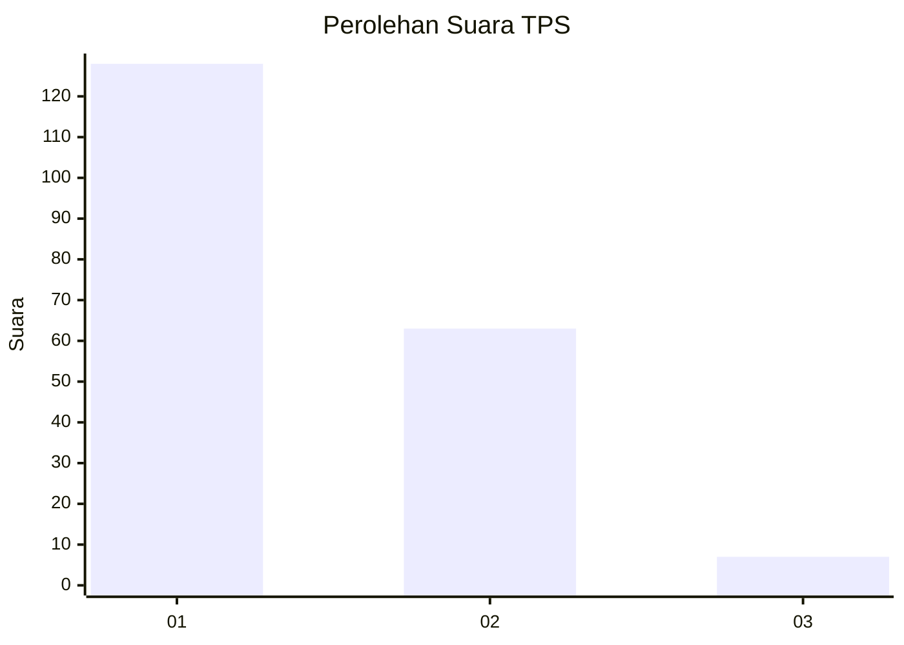
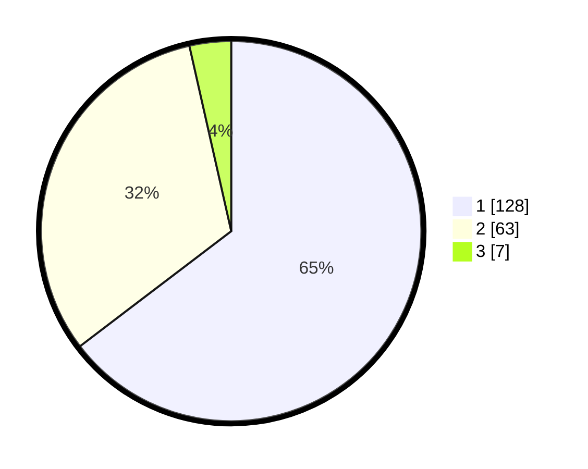

# Hasil

## Grafik

## Tabel

| No. | Nama Paslon    | Suara | Suara (raw) | Persentase |
|:--- |:-------------- | -----:| -----------:| ----------:|
| 1   | ANIES MUHAIMIN | 128   | [128][p-1]  | 64,65      |
| 2   | PRABOWO GIBRAN | 63    | [63][p-2]   | 31,82      |
| 3   | GANJAR MAHFUD  | 7     | [7][p-3]    | 3,54       |

[p-1]: https://github.com/gigit-pemilu/pemilu-2024-12-sumatera-utara/blob/main/pilpres/hitung-suara/sub/12-sumatera-utara/sub/71-kota-medan/sub/09-medan-amplas/sub/1004-harjosari-i/sub/002-tps/sub/paslon-1.txt
[p-2]: https://github.com/gigit-pemilu/pemilu-2024-12-sumatera-utara/blob/main/pilpres/hitung-suara/sub/12-sumatera-utara/sub/71-kota-medan/sub/09-medan-amplas/sub/1004-harjosari-i/sub/002-tps/sub/paslon-2.txt
[p-3]: https://github.com/gigit-pemilu/pemilu-2024-12-sumatera-utara/blob/main/pilpres/hitung-suara/sub/12-sumatera-utara/sub/71-kota-medan/sub/09-medan-amplas/sub/1004-harjosari-i/sub/002-tps/sub/paslon-3.txt

## Foto C Plano

https://sirekap-obj-formc.kpu.go.id/852e/pemilu/ppwp/12/71/09/10/04/1271091004002-20240218-115533--68d24c99-35bc-43ab-b3fc-6289941f7fca.jpg

https://sirekap-obj-formc.kpu.go.id/852e/pemilu/ppwp/12/71/09/10/04/1271091004002-20240218-115631--c12ea0b6-f82f-409a-bead-3616e4e5064b.jpg

https://sirekap-obj-formc.kpu.go.id/852e/pemilu/ppwp/12/71/09/10/04/1271091004002-20240218-120307--626035b7-6366-4bb4-8305-c5baeda1033a.jpg

## Metadata

| Key        | Value               |
| ---------- | ------------------- |
| Time Stamp | 2024-02-19 12:00:00 |

## DATA PEMILIH TETAP

Jumlah pemilih dalam DPT: **2**.
 * L: **90**.
 * P: **0**.

## DATA PENGGUNA HAK PILIH

Jumlah pengguna hak pilih dalam DPT: **850**.
 * L: **4**.
 * P: **107**.

Jumlah pengguna hak pilih dalam DPTb: **530**.
 * L: **2**.
 * P: **70**.

Jumlah pengguna hak pilih dalam DPK: **311**.
 * L: **41**.
 * P: **147**.

Jumlah pengguna hak pilih: **24**.
 * L: **0**.
 * P: **0**.

## JUMLAH SUARA SAH DAN TIDAK SAH

JUMLAH SELURUH SUARA SAH: **198**.

JUMLAH SUARA TIDAK SAH: **0**.

JUMLAH SELURUH SUARA SAH DAN SUARA TIDAK SAH: **198**.

