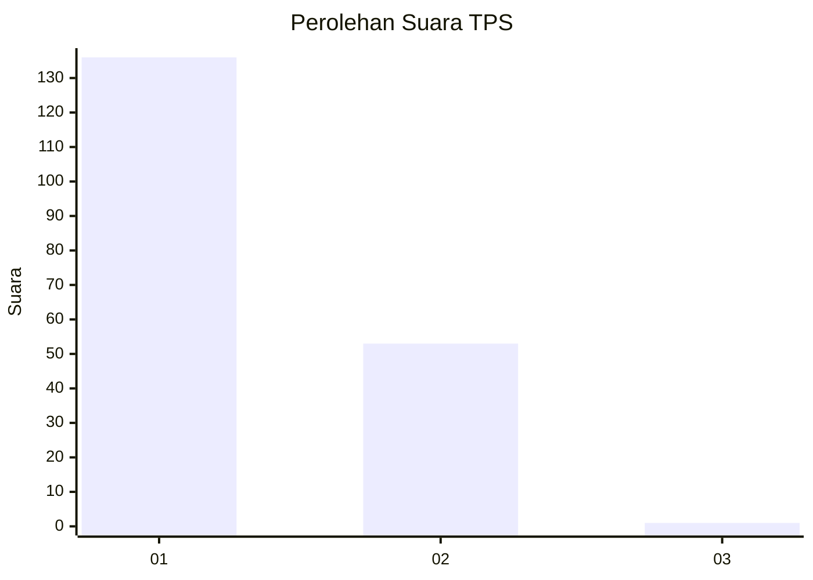
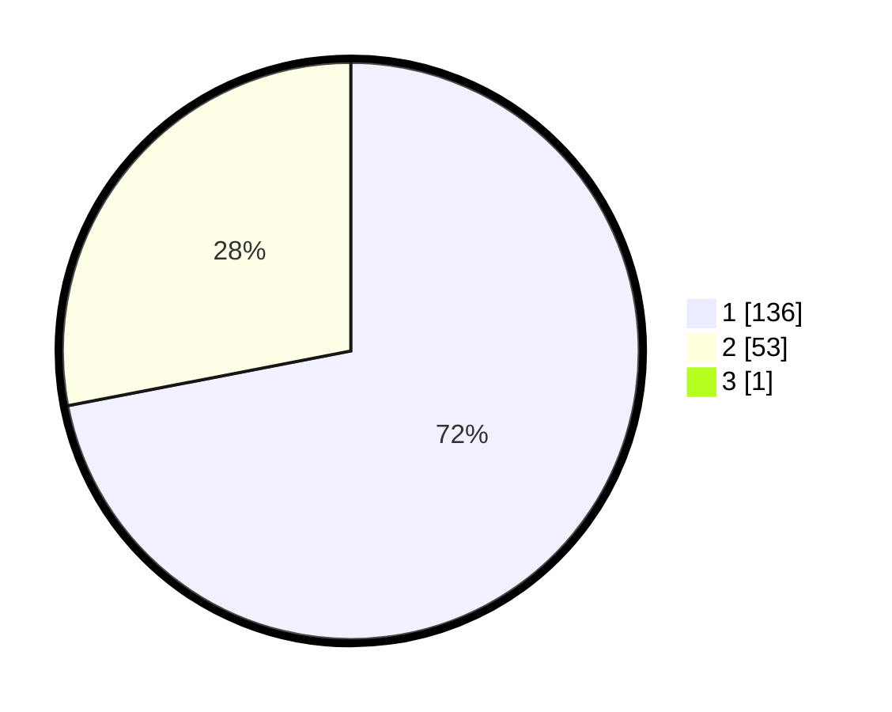

# Hasil

## Grafik

## Tabel

| No. | Nama Paslon    | Suara | Suara (raw) | Persentase |
|:--- |:-------------- | -----:| -----------:| ----------:|
| 1   | ANIES MUHAIMIN | 136   | [136][p-1]  | 71,58      |
| 2   | PRABOWO GIBRAN | 53    | [53][p-2]   | 27,89      |
| 3   | GANJAR MAHFUD  | 1     | [1][p-3]    | 0,53       |

[p-1]: https://github.com/gigit-pemilu/pemilu-2024/blob/main/pilpres/hitung-suara/sub/12-sumatera-utara/sub/71-kota-medan/sub/09-medan-amplas/sub/1004-harjosari-i/sub/003-tps/sub/paslon-1.txt
[p-2]: https://github.com/gigit-pemilu/pemilu-2024/blob/main/pilpres/hitung-suara/sub/12-sumatera-utara/sub/71-kota-medan/sub/09-medan-amplas/sub/1004-harjosari-i/sub/003-tps/sub/paslon-2.txt
[p-3]: https://github.com/gigit-pemilu/pemilu-2024/blob/main/pilpres/hitung-suara/sub/12-sumatera-utara/sub/71-kota-medan/sub/09-medan-amplas/sub/1004-harjosari-i/sub/003-tps/sub/paslon-3.txt

## Foto C Plano

https://sirekap-obj-formc.kpu.go.id/75d4/pemilu/ppwp/12/71/09/10/04/1271091004003-20240218-142557--9c5b2dc9-01ef-40ce-a4cb-36268ec59290.jpg

https://sirekap-obj-formc.kpu.go.id/75d4/pemilu/ppwp/12/71/09/10/04/1271091004003-20240218-144750--9b768e02-b543-4ab5-bfbb-55c5bfceee7d.jpg

https://sirekap-obj-formc.kpu.go.id/75d4/pemilu/ppwp/12/71/09/10/04/1271091004003-20240218-145446--a09fb207-1c0e-4604-bdd2-3876a5ff9b8a.jpg

## Metadata

| Key        | Value               |
| ---------- | ------------------- |
| Time Stamp | 2024-02-19 06:16:00 |

## DATA PEMILIH TETAP

Jumlah pemilih dalam DPT: **270**.
 * L: **125**.
 * P: **145**.

## DATA PENGGUNA HAK PILIH

Jumlah pengguna hak pilih dalam DPT: **191**.
 * L: **25**.
 * P: **109**.

Jumlah pengguna hak pilih dalam DPTb: **400**.
 * L: **532**.
 * P: **0**.

Jumlah pengguna hak pilih dalam DPK: **400**.
 * L: **553**.
 * P: **322**.

Jumlah pengguna hak pilih: **22**.
 * L: **410**.
 * P: **2**.

## JUMLAH SUARA SAH DAN TIDAK SAH

JUMLAH SELURUH SUARA SAH: **190**.

JUMLAH SUARA TIDAK SAH: **1**.

JUMLAH SELURUH SUARA SAH DAN SUARA TIDAK SAH: **141**.

