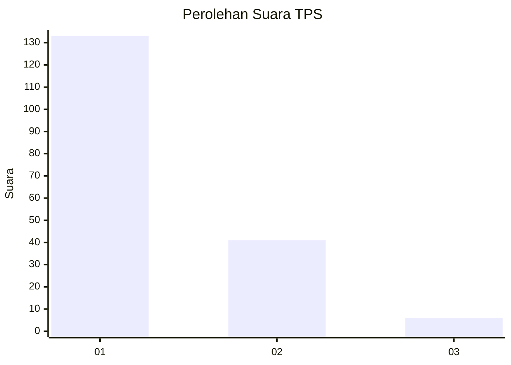
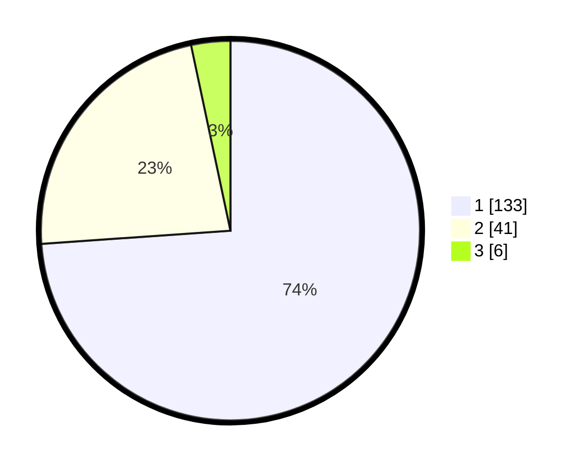

# Hasil

## Grafik

## Tabel

| No. | Nama Paslon    | Suara | Suara (raw) | Persentase |
|:--- |:-------------- | -----:| -----------:| ----------:|
| 1   | ANIES MUHAIMIN | 133   | [133][p-1]  | 73,89      |
| 2   | PRABOWO GIBRAN | 41    | [41][p-2]   | 22,78      |
| 3   | GANJAR MAHFUD  | 6     | [6][p-3]    | 3,33       |

[p-1]: https://github.com/gigit-pemilu/pemilu-2024/blob/main/pilpres/hitung-suara/sub/12-sumatera-utara/sub/71-kota-medan/sub/09-medan-amplas/sub/1004-harjosari-i/sub/005-tps/sub/paslon-1.txt
[p-2]: https://github.com/gigit-pemilu/pemilu-2024/blob/main/pilpres/hitung-suara/sub/12-sumatera-utara/sub/71-kota-medan/sub/09-medan-amplas/sub/1004-harjosari-i/sub/005-tps/sub/paslon-2.txt
[p-3]: https://github.com/gigit-pemilu/pemilu-2024/blob/main/pilpres/hitung-suara/sub/12-sumatera-utara/sub/71-kota-medan/sub/09-medan-amplas/sub/1004-harjosari-i/sub/005-tps/sub/paslon-3.txt

## Foto C Plano

https://sirekap-obj-formc.kpu.go.id/dfaf/pemilu/ppwp/12/71/09/10/04/1271091004005-20240218-174308--ecdd11e4-f97a-4c0f-b4b3-888511b9f8d2.jpg

https://sirekap-obj-formc.kpu.go.id/dfaf/pemilu/ppwp/12/71/09/10/04/1271091004005-20240218-174348--651d1612-0879-4538-afdd-fe6ec55d4a13.jpg

https://sirekap-obj-formc.kpu.go.id/dfaf/pemilu/ppwp/12/71/09/10/04/1271091004005-20240218-174439--3cb2f499-d0b4-4347-9401-4e2eef977753.jpg

## Metadata

| Key        | Value               |
| ---------- | ------------------- |
| Time Stamp | 2024-02-19 17:00:00 |

## DATA PEMILIH TETAP

Jumlah pemilih dalam DPT: **264**.
 * L: **124**.
 * P: **145**.

## DATA PENGGUNA HAK PILIH

Jumlah pengguna hak pilih dalam DPT: **522**.
 * L: **44**.
 * P: **105**.

Jumlah pengguna hak pilih dalam DPTb: **822**.
 * L: **555**.
 * P: **522**.

Jumlah pengguna hak pilih dalam DPK: **507**.
 * L: **55**.
 * P: **702**.

Jumlah pengguna hak pilih: **2**.
 * L: **100**.
 * P: **0**.

## JUMLAH SUARA SAH DAN TIDAK SAH

JUMLAH SELURUH SUARA SAH: **180**.

JUMLAH SUARA TIDAK SAH: **1**.

JUMLAH SELURUH SUARA SAH DAN SUARA TIDAK SAH: **181**.

