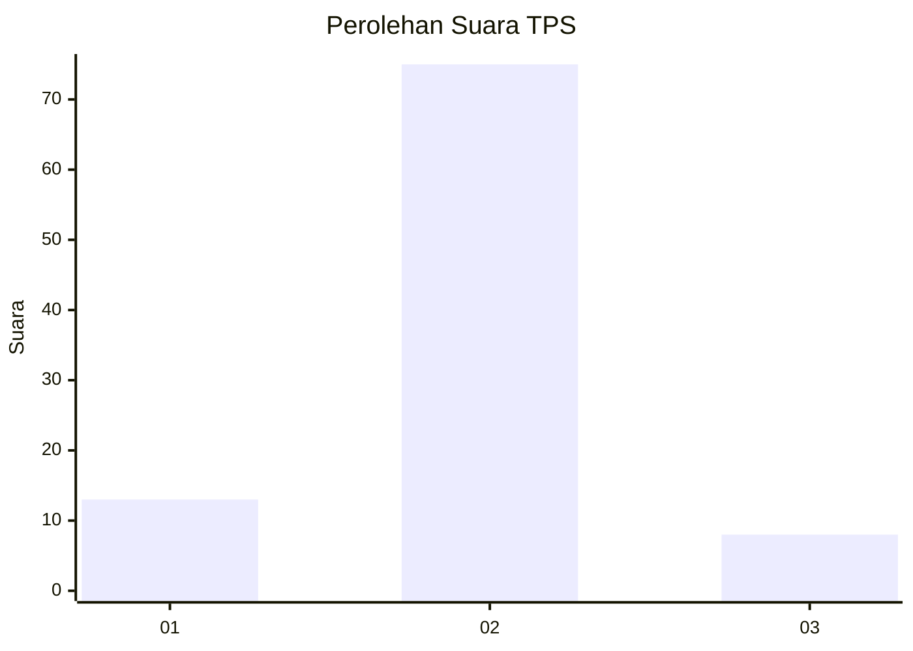
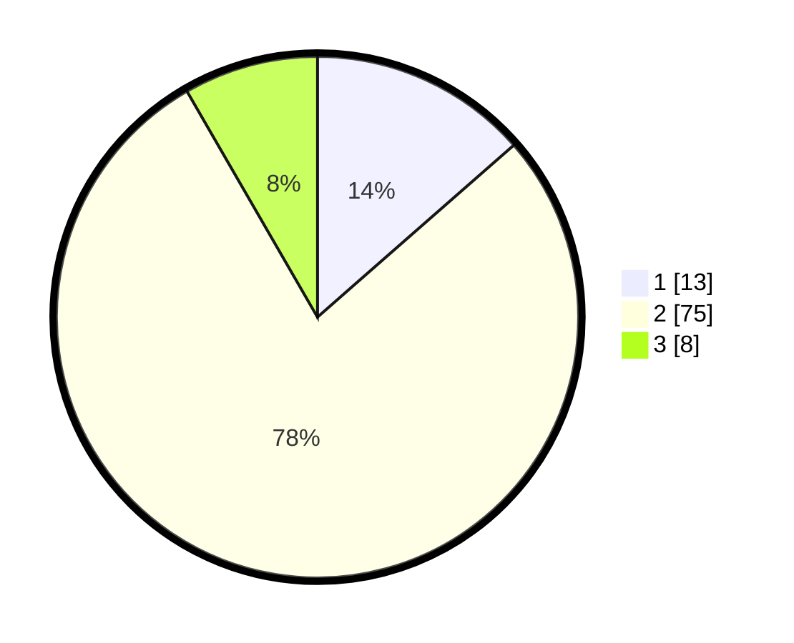

# Hasil

## Grafik

## Tabel

| No. | Nama Paslon    | Suara | Suara (raw) | Persentase |
|:--- |:-------------- | -----:| -----------:| ----------:|
| 1   | ANIES MUHAIMIN | 13    | [13][p-1]   | 13,54      |
| 2   | PRABOWO GIBRAN | 75    | [75][p-2]   | 78,13      |
| 3   | GANJAR MAHFUD  | 8     | [8][p-3]    | 8,33       |

[p-1]: https://github.com/gigit-pemilu/pemilu-2024/blob/main/pilpres/hitung-suara/sub/12-sumatera-utara/sub/71-kota-medan/sub/09-medan-amplas/sub/1005-harjosari-ii/sub/049-tps/sub/paslon-1.txt
[p-2]: https://github.com/gigit-pemilu/pemilu-2024/blob/main/pilpres/hitung-suara/sub/12-sumatera-utara/sub/71-kota-medan/sub/09-medan-amplas/sub/1005-harjosari-ii/sub/049-tps/sub/paslon-2.txt
[p-3]: https://github.com/gigit-pemilu/pemilu-2024/blob/main/pilpres/hitung-suara/sub/12-sumatera-utara/sub/71-kota-medan/sub/09-medan-amplas/sub/1005-harjosari-ii/sub/049-tps/sub/paslon-3.txt

## Foto C Plano

https://sirekap-obj-formc.kpu.go.id/7fe3/pemilu/ppwp/12/71/09/10/05/1271091005049-20240214-214423--07ad5a60-1c64-4b93-a566-203f033418ab.jpg

https://sirekap-obj-formc.kpu.go.id/7fe3/pemilu/ppwp/12/71/09/10/05/1271091005049-20240214-214529--11ed6381-d34d-4df1-8dba-7403591b2d57.jpg

https://sirekap-obj-formc.kpu.go.id/7fe3/pemilu/ppwp/12/71/09/10/05/1271091005049-20240214-214632--63a04505-506b-42b9-a84e-7953303e8e67.jpg

## Metadata

| Key        | Value               |
| ---------- | ------------------- |
| Time Stamp | 2024-02-25 13:00:00 |

