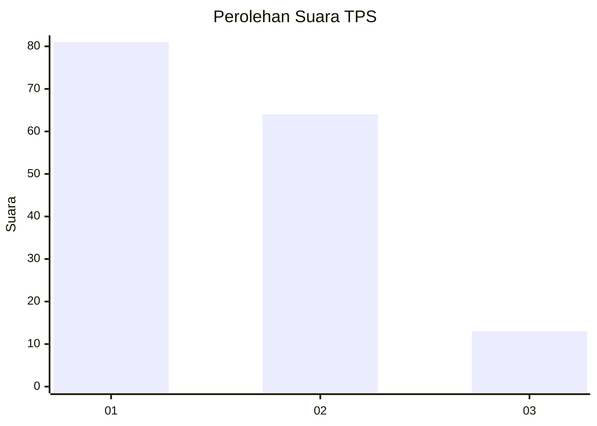
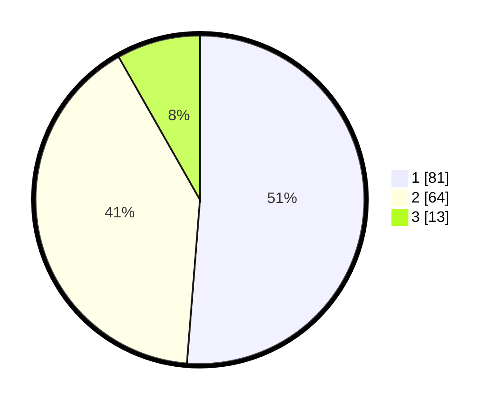

# Hasil

## Grafik

## Tabel

| No. | Nama Paslon    | Suara | Suara (raw) | Persentase |
|:--- |:-------------- | -----:| -----------:| ----------:|
| 1   | ANIES MUHAIMIN | 81    | [81][p-1]   | 51,27      |
| 2   | PRABOWO GIBRAN | 64    | [64][p-2]   | 40,51      |
| 3   | GANJAR MAHFUD  | 13    | [13][p-3]   | 8,23       |

[p-1]: https://github.com/gigit-pemilu/pemilu-2024/blob/main/pilpres/hitung-suara/sub/12-sumatera-utara/sub/71-kota-medan/sub/09-medan-amplas/sub/1006-timbang-deli/sub/012-tps/sub/paslon-1.txt
[p-2]: https://github.com/gigit-pemilu/pemilu-2024/blob/main/pilpres/hitung-suara/sub/12-sumatera-utara/sub/71-kota-medan/sub/09-medan-amplas/sub/1006-timbang-deli/sub/012-tps/sub/paslon-2.txt
[p-3]: https://github.com/gigit-pemilu/pemilu-2024/blob/main/pilpres/hitung-suara/sub/12-sumatera-utara/sub/71-kota-medan/sub/09-medan-amplas/sub/1006-timbang-deli/sub/012-tps/sub/paslon-3.txt

## Foto C Plano

https://sirekap-obj-formc.kpu.go.id/088b/pemilu/ppwp/12/71/09/10/06/1271091006012-20240215-112839--890abf73-b6be-4090-8724-61f12eb4ef9c.jpg

https://sirekap-obj-formc.kpu.go.id/088b/pemilu/ppwp/12/71/09/10/06/1271091006012-20240215-112942--d974221b-4bf6-4b44-a7f4-e5bb81dc3385.jpg

https://sirekap-obj-formc.kpu.go.id/088b/pemilu/ppwp/12/71/09/10/06/1271091006012-20240215-113039--87c78dfe-6a0a-4928-a98d-49f7c77cb752.jpg

## Metadata

| Key        | Value               |
| ---------- | ------------------- |
| Time Stamp | 2024-02-25 14:00:00 |

