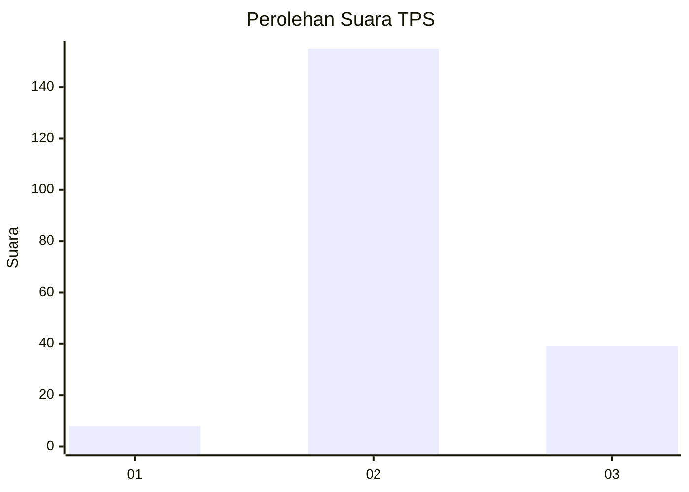
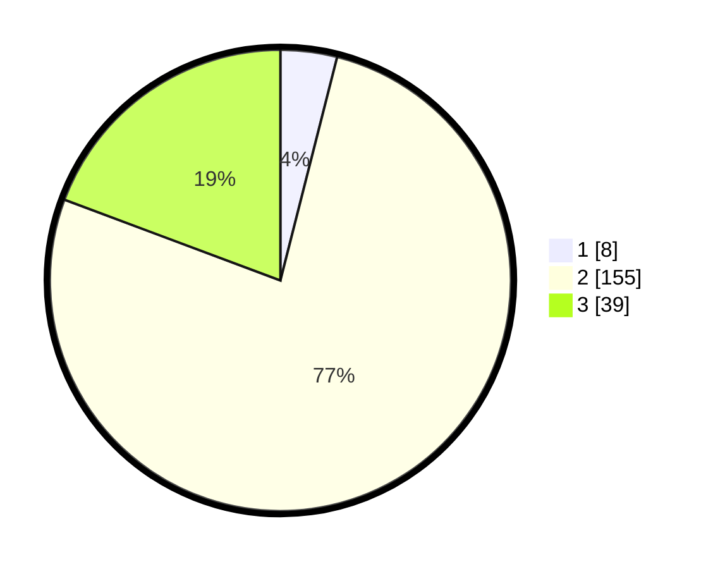

# Hasil

## Grafik

## Tabel

| No. | Nama Paslon    | Suara | Suara (raw) | Persentase |
|:--- |:-------------- | -----:| -----------:| ----------:|
| 1   | ANIES MUHAIMIN | 8     | [8][p-1]    | 3,96       |
| 2   | PRABOWO GIBRAN | 155   | [155][p-2]  | 76,73      |
| 3   | GANJAR MAHFUD  | 39    | [39][p-3]   | 19,31      |

[p-1]: https://github.com/gigit-pemilu/pemilu-2024-12-sumatera-utara/blob/main/pilpres/hitung-suara/sub/12-sumatera-utara/sub/71-kota-medan/sub/09-medan-amplas/sub/1007-bangun-mulia/sub/005-tps/sub/paslon-1.txt
[p-2]: https://github.com/gigit-pemilu/pemilu-2024-12-sumatera-utara/blob/main/pilpres/hitung-suara/sub/12-sumatera-utara/sub/71-kota-medan/sub/09-medan-amplas/sub/1007-bangun-mulia/sub/005-tps/sub/paslon-2.txt
[p-3]: https://github.com/gigit-pemilu/pemilu-2024-12-sumatera-utara/blob/main/pilpres/hitung-suara/sub/12-sumatera-utara/sub/71-kota-medan/sub/09-medan-amplas/sub/1007-bangun-mulia/sub/005-tps/sub/paslon-3.txt

## Foto C Plano

https://sirekap-obj-formc.kpu.go.id/9cd6/pemilu/ppwp/12/71/09/10/07/1271091007005-20240217-203137--2f3abad2-3e97-48f6-abf7-efed77a0399b.jpg

https://sirekap-obj-formc.kpu.go.id/9cd6/pemilu/ppwp/12/71/09/10/07/1271091007005-20240217-204023--8dfdae29-24d2-4e50-ad7e-0d82cde9a771.jpg

https://sirekap-obj-formc.kpu.go.id/9cd6/pemilu/ppwp/12/71/09/10/07/1271091007005-20240217-203433--13e7434b-520c-445d-9822-63e9948b270f.jpg

## Metadata

| Key        | Value               |
| ---------- | ------------------- |
| Time Stamp | 2024-02-19 06:16:00 |

## DATA PEMILIH TETAP

Jumlah pemilih dalam DPT: **285**.
 * L: **137**.
 * P: **148**.

## DATA PENGGUNA HAK PILIH

Jumlah pengguna hak pilih dalam DPT: **207**.
 * L: **84**.
 * P: **115**.

Jumlah pengguna hak pilih dalam DPTb: **2**.
 * L: **201**.
 * P: **1**.

Jumlah pengguna hak pilih dalam DPK: **0**.
 * L: **322**.
 * P: **0**.

Jumlah pengguna hak pilih: **205**.
 * L: **0**.
 * P: **216**.

## JUMLAH SUARA SAH DAN TIDAK SAH

JUMLAH SELURUH SUARA SAH: **203**.

JUMLAH SUARA TIDAK SAH: **7**.

JUMLAH SELURUH SUARA SAH DAN SUARA TIDAK SAH: **750**.

