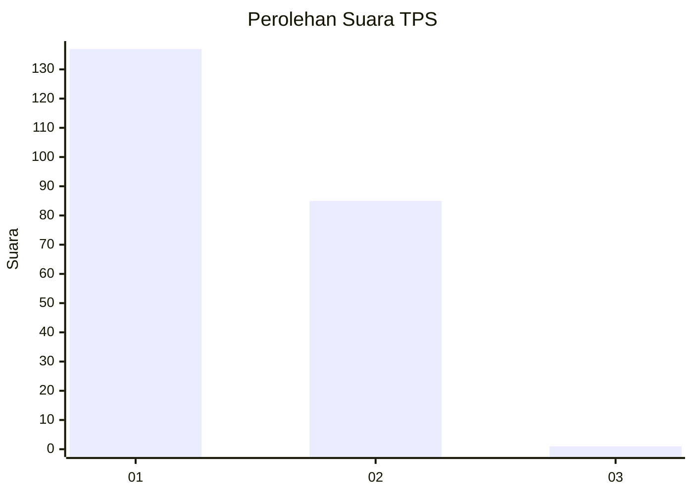
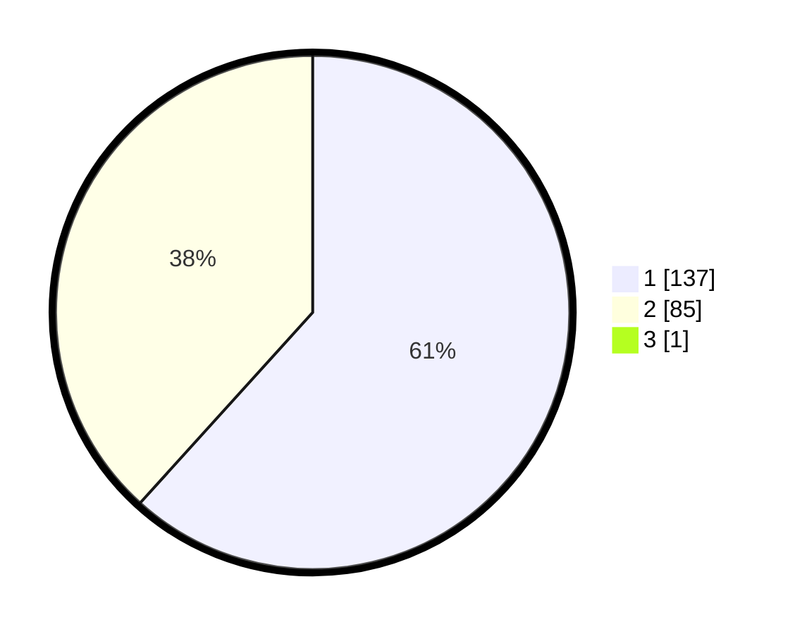

# Hasil

## Grafik

## Tabel

| No. | Nama Paslon    | Suara | Suara (raw) | Persentase |
|:--- |:-------------- | -----:| -----------:| ----------:|
| 1   | ANIES MUHAIMIN | 137   | [137][p-1]  | 61,43      |
| 2   | PRABOWO GIBRAN | 85    | [85][p-2]   | 38,12      |
| 3   | GANJAR MAHFUD  | 1     | [1][p-3]    | 0,45       |

[p-1]: https://github.com/gigit-pemilu/pemilu-2024/blob/main/pilpres/hitung-suara/sub/12-sumatera-utara/sub/71-kota-medan/sub/10-medan-area/sub/1001-sukaramai-i/sub/001-tps/sub/paslon-1.txt
[p-2]: https://github.com/gigit-pemilu/pemilu-2024/blob/main/pilpres/hitung-suara/sub/12-sumatera-utara/sub/71-kota-medan/sub/10-medan-area/sub/1001-sukaramai-i/sub/001-tps/sub/paslon-2.txt
[p-3]: https://github.com/gigit-pemilu/pemilu-2024/blob/main/pilpres/hitung-suara/sub/12-sumatera-utara/sub/71-kota-medan/sub/10-medan-area/sub/1001-sukaramai-i/sub/001-tps/sub/paslon-3.txt

## Foto C Plano

https://sirekap-obj-formc.kpu.go.id/b2bf/pemilu/ppwp/12/71/10/10/01/1271101001001-20240214-212236--1ed57b2f-01c0-4a1e-a4e8-af9afde5b444.jpg

https://sirekap-obj-formc.kpu.go.id/b2bf/pemilu/ppwp/12/71/10/10/01/1271101001001-20240214-212301--caa4c572-7794-4631-857d-79eff98b2300.jpg

https://sirekap-obj-formc.kpu.go.id/b2bf/pemilu/ppwp/12/71/10/10/01/1271101001001-20240214-212321--4cdc1027-6edd-4215-b9cd-6c19a11578cd.jpg

## Metadata

| Key        | Value               |
| ---------- | ------------------- |
| Time Stamp | 2024-02-16 00:00:26 |

