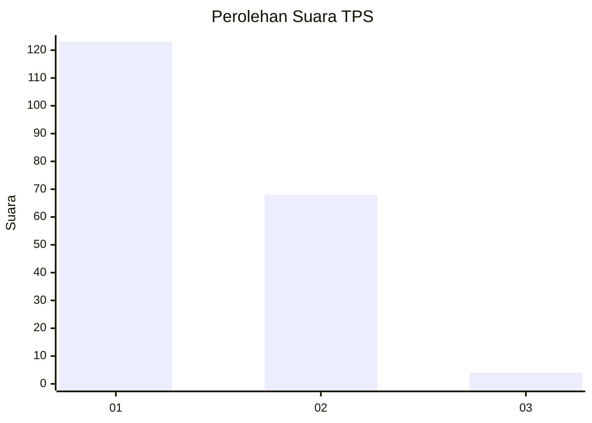
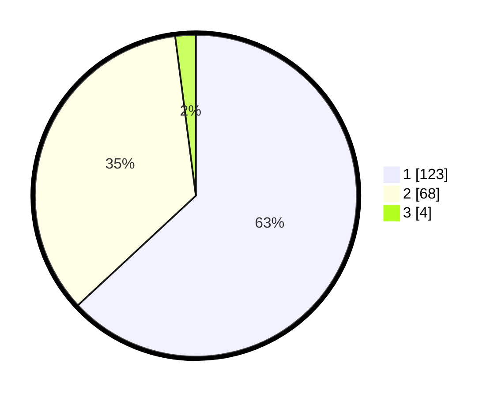

# Hasil

## Grafik

## Tabel

| No. | Nama Paslon    | Suara | Suara (raw) | Persentase |
|:--- |:-------------- | -----:| -----------:| ----------:|
| 1   | ANIES MUHAIMIN | 123   | [123][p-1]  | 63,08      |
| 2   | PRABOWO GIBRAN | 68    | [68][p-2]   | 34,87      |
| 3   | GANJAR MAHFUD  | 4     | [4][p-3]    | 2,05       |

[p-1]: https://github.com/gigit-pemilu/pemilu-2024/blob/main/pilpres/hitung-suara/sub/12-sumatera-utara/sub/71-kota-medan/sub/10-medan-area/sub/1001-sukaramai-i/sub/002-tps/sub/paslon-1.txt
[p-2]: https://github.com/gigit-pemilu/pemilu-2024/blob/main/pilpres/hitung-suara/sub/12-sumatera-utara/sub/71-kota-medan/sub/10-medan-area/sub/1001-sukaramai-i/sub/002-tps/sub/paslon-2.txt
[p-3]: https://github.com/gigit-pemilu/pemilu-2024/blob/main/pilpres/hitung-suara/sub/12-sumatera-utara/sub/71-kota-medan/sub/10-medan-area/sub/1001-sukaramai-i/sub/002-tps/sub/paslon-3.txt

## Foto C Plano

https://sirekap-obj-formc.kpu.go.id/a58e/pemilu/ppwp/12/71/10/10/01/1271101001002-20240214-214244--5d223daf-c4c3-402a-8fe5-88ab5e24a6b0.jpg

https://sirekap-obj-formc.kpu.go.id/a58e/pemilu/ppwp/12/71/10/10/01/1271101001002-20240214-214252--4ee5c2d0-8f3c-4bd7-b256-cf2e93e6dcd5.jpg

https://sirekap-obj-formc.kpu.go.id/a58e/pemilu/ppwp/12/71/10/10/01/1271101001002-20240214-214300--aedee90b-ebda-4bcc-854e-f4eec39b5f6c.jpg

## Metadata

| Key        | Value               |
| ---------- | ------------------- |
| Time Stamp | 2024-02-25 00:00:00 |

