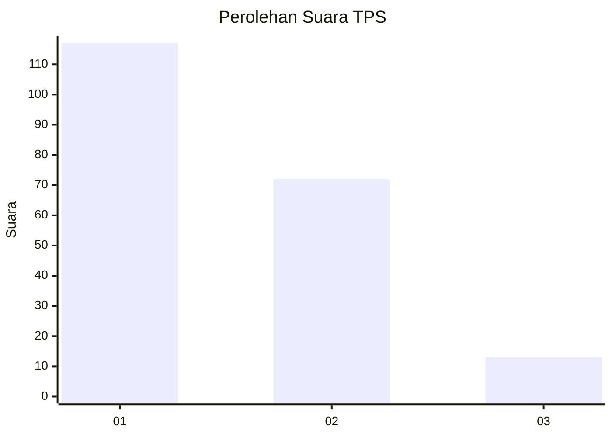
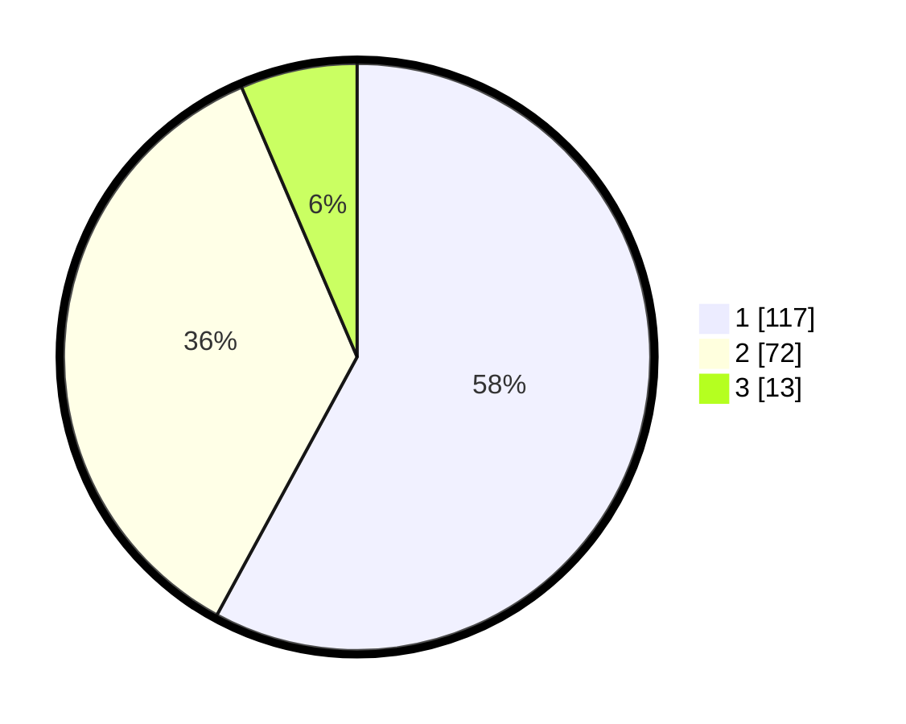

# Hasil

## Grafik

## Tabel

| No. | Nama Paslon    | Suara | Suara (raw) | Persentase |
|:--- |:-------------- | -----:| -----------:| ----------:|
| 1   | ANIES MUHAIMIN | 117   | [117][p-1]  | 57,92      |
| 2   | PRABOWO GIBRAN | 72    | [72][p-2]   | 35,64      |
| 3   | GANJAR MAHFUD  | 13    | [13][p-3]   | 6,44       |

[p-1]: https://github.com/gigit-pemilu/pemilu-2024-12-sumatera-utara/blob/main/pilpres/hitung-suara/sub/12-sumatera-utara/sub/71-kota-medan/sub/10-medan-area/sub/1001-sukaramai-i/sub/005-tps/sub/paslon-1.txt
[p-2]: https://github.com/gigit-pemilu/pemilu-2024-12-sumatera-utara/blob/main/pilpres/hitung-suara/sub/12-sumatera-utara/sub/71-kota-medan/sub/10-medan-area/sub/1001-sukaramai-i/sub/005-tps/sub/paslon-2.txt
[p-3]: https://github.com/gigit-pemilu/pemilu-2024-12-sumatera-utara/blob/main/pilpres/hitung-suara/sub/12-sumatera-utara/sub/71-kota-medan/sub/10-medan-area/sub/1001-sukaramai-i/sub/005-tps/sub/paslon-3.txt

## Foto C Plano

https://sirekap-obj-formc.kpu.go.id/87e1/pemilu/ppwp/12/71/10/10/01/1271101001005-20240216-122040--9e9e62e7-d2fa-41a8-9016-342253aae03c.jpg

https://sirekap-obj-formc.kpu.go.id/87e1/pemilu/ppwp/12/71/10/10/01/1271101001005-20240216-122139--b7981eec-fbc9-40dc-9031-7f44ad79b925.jpg

https://sirekap-obj-formc.kpu.go.id/87e1/pemilu/ppwp/12/71/10/10/01/1271101001005-20240216-122724--3423dbaf-c2f4-4028-810d-b4095eb2e813.jpg

## Metadata

| Key        | Value               |
| ---------- | ------------------- |
| Time Stamp | 2024-02-24 22:31:28 |

