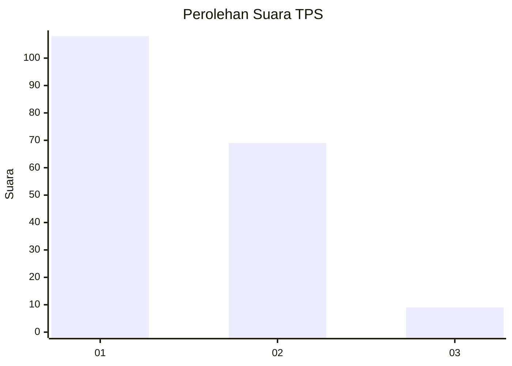
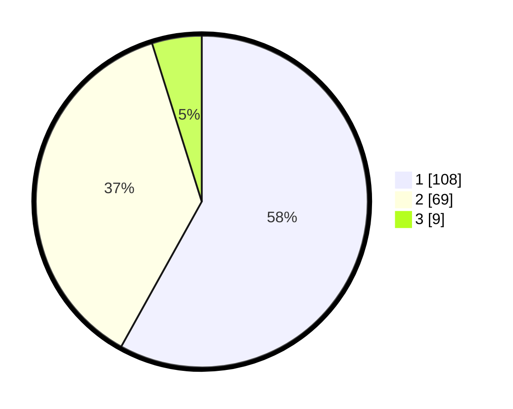

# Hasil

## Grafik

## Tabel

| No. | Nama Paslon    | Suara | Suara (raw) | Persentase |
|:--- |:-------------- | -----:| -----------:| ----------:|
| 1   | ANIES MUHAIMIN | 108   | [108][p-1]  | 58,06      |
| 2   | PRABOWO GIBRAN | 69    | [69][p-2]   | 37,10      |
| 3   | GANJAR MAHFUD  | 9     | [9][p-3]    | 4,84       |

[p-1]: https://github.com/gigit-pemilu/pemilu-2024/blob/main/pilpres/hitung-suara/sub/12-sumatera-utara/sub/71-kota-medan/sub/10-medan-area/sub/1001-sukaramai-i/sub/007-tps/sub/paslon-1.txt
[p-2]: https://github.com/gigit-pemilu/pemilu-2024/blob/main/pilpres/hitung-suara/sub/12-sumatera-utara/sub/71-kota-medan/sub/10-medan-area/sub/1001-sukaramai-i/sub/007-tps/sub/paslon-2.txt
[p-3]: https://github.com/gigit-pemilu/pemilu-2024/blob/main/pilpres/hitung-suara/sub/12-sumatera-utara/sub/71-kota-medan/sub/10-medan-area/sub/1001-sukaramai-i/sub/007-tps/sub/paslon-3.txt

## Foto C Plano

https://sirekap-obj-formc.kpu.go.id/d480/pemilu/ppwp/12/71/10/10/01/1271101001007-20240214-235523--e3600f68-09ed-42c8-a77f-08d6a5576acd.jpg

https://sirekap-obj-formc.kpu.go.id/d480/pemilu/ppwp/12/71/10/10/01/1271101001007-20240215-124223--8d949201-56c3-4d78-9b32-39ea63e4d05a.jpg

https://sirekap-obj-formc.kpu.go.id/d480/pemilu/ppwp/12/71/10/10/01/1271101001007-20240215-124240--af9a4d85-a0ac-4646-b71f-a0fbe6ed04fb.jpg

## Metadata

| Key        | Value               |
| ---------- | ------------------- |
| Time Stamp | 2024-02-16 12:51:22 |

