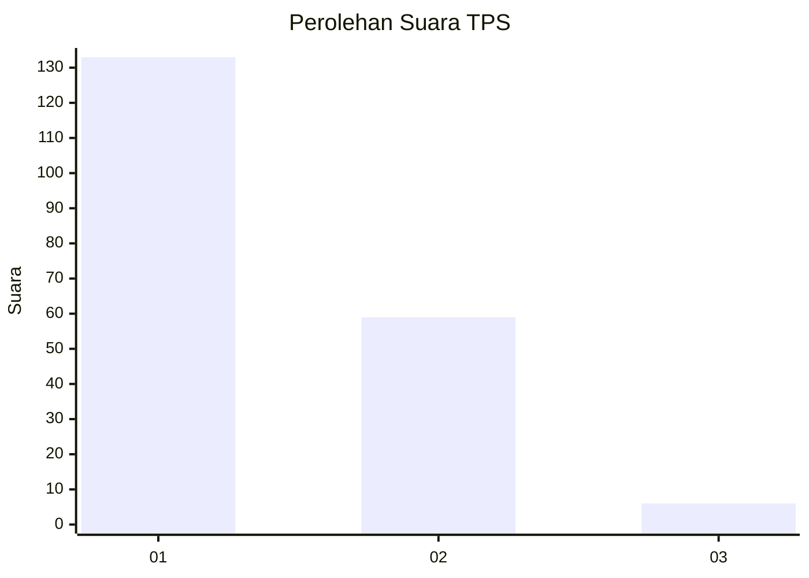
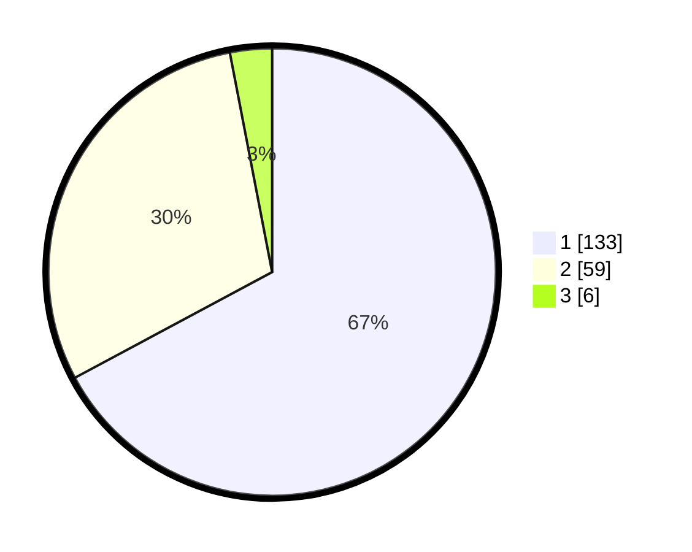

# Hasil

## Grafik

## Tabel

| No. | Nama Paslon    | Suara | Suara (raw) | Persentase |
|:--- |:-------------- | -----:| -----------:| ----------:|
| 1   | ANIES MUHAIMIN | 133   | [133][p-1]  | 67,17      |
| 2   | PRABOWO GIBRAN | 59    | [59][p-2]   | 29,80      |
| 3   | GANJAR MAHFUD  | 6     | [6][p-3]    | 3,03       |

[p-1]: https://github.com/gigit-pemilu/pemilu-2024-12-sumatera-utara/blob/main/pilpres/hitung-suara/sub/12-sumatera-utara/sub/71-kota-medan/sub/10-medan-area/sub/1001-sukaramai-i/sub/009-tps/sub/paslon-1.txt
[p-2]: https://github.com/gigit-pemilu/pemilu-2024-12-sumatera-utara/blob/main/pilpres/hitung-suara/sub/12-sumatera-utara/sub/71-kota-medan/sub/10-medan-area/sub/1001-sukaramai-i/sub/009-tps/sub/paslon-2.txt
[p-3]: https://github.com/gigit-pemilu/pemilu-2024-12-sumatera-utara/blob/main/pilpres/hitung-suara/sub/12-sumatera-utara/sub/71-kota-medan/sub/10-medan-area/sub/1001-sukaramai-i/sub/009-tps/sub/paslon-3.txt

## Foto C Plano

https://sirekap-obj-formc.kpu.go.id/e208/pemilu/ppwp/12/71/10/10/01/1271101001009-20240215-063155--c33b46c0-3a00-4af8-bc48-0bd5ab8c89fc.jpg

https://sirekap-obj-formc.kpu.go.id/e208/pemilu/ppwp/12/71/10/10/01/1271101001009-20240215-063337--9a79eeec-e406-4887-a79f-72cd4043dc42.jpg

https://sirekap-obj-formc.kpu.go.id/e208/pemilu/ppwp/12/71/10/10/01/1271101001009-20240215-063456--131f2d5d-aab9-4f0d-960f-871aca150387.jpg

## Metadata

| Key        | Value               |
| ---------- | ------------------- |
| Time Stamp | 2024-02-25 01:00:00 |

