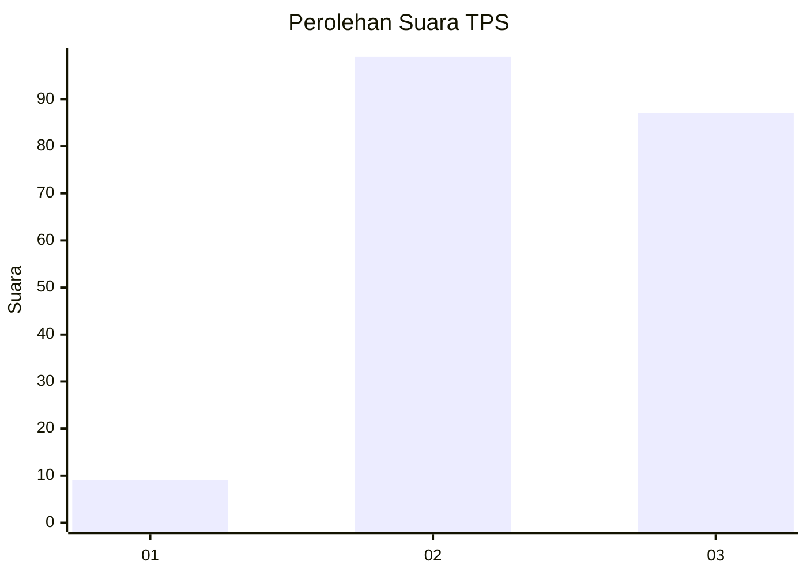
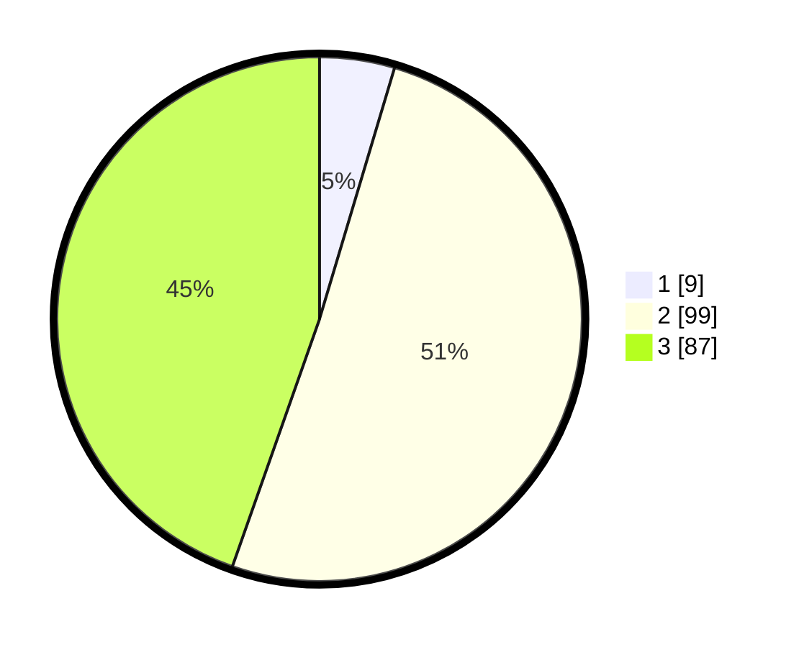

# Hasil

## Grafik

## Tabel

| No. | Nama Paslon    | Suara | Suara (raw) | Persentase |
|:--- |:-------------- | -----:| -----------:| ----------:|
| 1   | ANIES MUHAIMIN | 9     | [9][p-1]    | 4,62       |
| 2   | PRABOWO GIBRAN | 99    | [99][p-2]   | 50,77      |
| 3   | GANJAR MAHFUD  | 87    | [87][p-3]   | 44,62      |

[p-1]: https://github.com/gigit-pemilu/pemilu-2024/blob/main/pilpres/hitung-suara/sub/12-sumatera-utara/sub/71-kota-medan/sub/10-medan-area/sub/1003-sei-rengas-ii/sub/001-tps/sub/paslon-1.txt
[p-2]: https://github.com/gigit-pemilu/pemilu-2024/blob/main/pilpres/hitung-suara/sub/12-sumatera-utara/sub/71-kota-medan/sub/10-medan-area/sub/1003-sei-rengas-ii/sub/001-tps/sub/paslon-2.txt
[p-3]: https://github.com/gigit-pemilu/pemilu-2024/blob/main/pilpres/hitung-suara/sub/12-sumatera-utara/sub/71-kota-medan/sub/10-medan-area/sub/1003-sei-rengas-ii/sub/001-tps/sub/paslon-3.txt

## Foto C Plano

https://sirekap-obj-formc.kpu.go.id/1cb2/pemilu/ppwp/12/71/10/10/03/1271101003001-20240214-221844--5d728a5b-56dd-427c-8364-9f9adf23060d.jpg

https://sirekap-obj-formc.kpu.go.id/1cb2/pemilu/ppwp/12/71/10/10/03/1271101003001-20240214-222128--88b0057e-fec4-48b4-bbe7-9f5e7f67782e.jpg

https://sirekap-obj-formc.kpu.go.id/1cb2/pemilu/ppwp/12/71/10/10/03/1271101003001-20240214-222258--e7078c4b-d52f-482d-aa59-79b7b69bc275.jpg

## Metadata

| Key        | Value               |
| ---------- | ------------------- |
| Time Stamp | 2024-02-25 14:00:00 |

