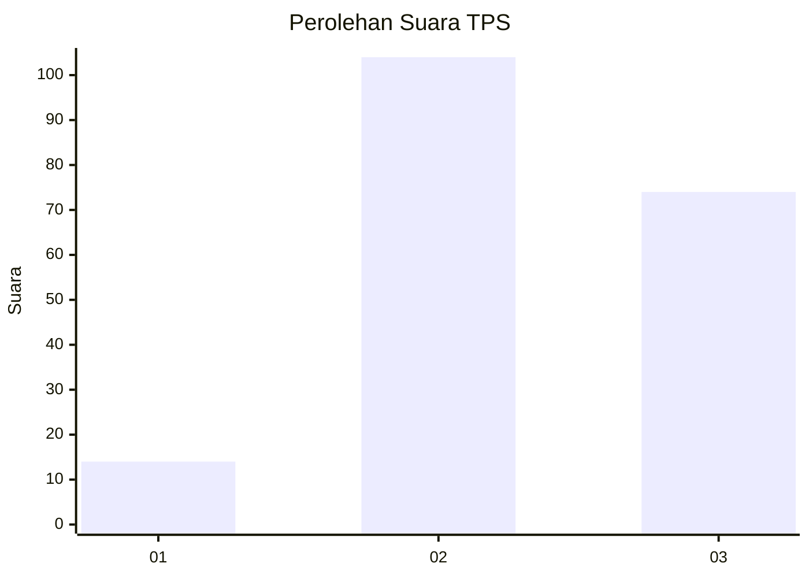
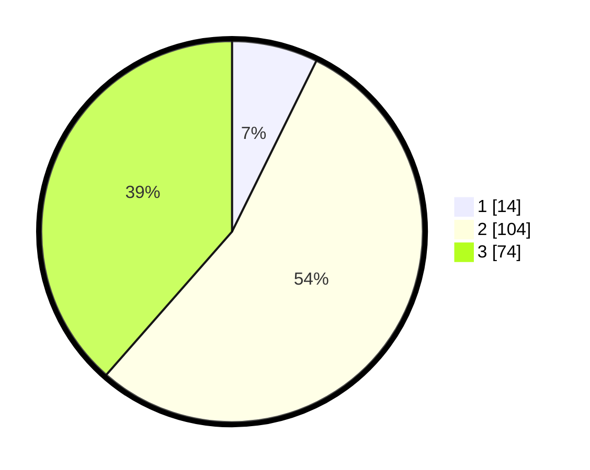

# Hasil

## Grafik

## Tabel

| No. | Nama Paslon    | Suara | Suara (raw) | Persentase |
|:--- |:-------------- | -----:| -----------:| ----------:|
| 1   | ANIES MUHAIMIN | 14    | [14][p-1]   | 7,29       |
| 2   | PRABOWO GIBRAN | 104   | [104][p-2]  | 54,17      |
| 3   | GANJAR MAHFUD  | 74    | [74][p-3]   | 38,54      |

[p-1]: https://github.com/gigit-pemilu/pemilu-2024/blob/main/pilpres/hitung-suara/sub/12-sumatera-utara/sub/71-kota-medan/sub/10-medan-area/sub/1003-sei-rengas-ii/sub/005-tps/sub/paslon-1.txt
[p-2]: https://github.com/gigit-pemilu/pemilu-2024/blob/main/pilpres/hitung-suara/sub/12-sumatera-utara/sub/71-kota-medan/sub/10-medan-area/sub/1003-sei-rengas-ii/sub/005-tps/sub/paslon-2.txt
[p-3]: https://github.com/gigit-pemilu/pemilu-2024/blob/main/pilpres/hitung-suara/sub/12-sumatera-utara/sub/71-kota-medan/sub/10-medan-area/sub/1003-sei-rengas-ii/sub/005-tps/sub/paslon-3.txt

## Foto C Plano

https://sirekap-obj-formc.kpu.go.id/1d11/pemilu/ppwp/12/71/10/10/03/1271101003005-20240214-203314--66b18bab-b3e5-45a9-b61b-ee0cf758a54c.jpg

https://sirekap-obj-formc.kpu.go.id/1d11/pemilu/ppwp/12/71/10/10/03/1271101003005-20240214-202112--f48e2dae-46b8-49ef-a67e-413e12ab22a6.jpg

https://sirekap-obj-formc.kpu.go.id/1d11/pemilu/ppwp/12/71/10/10/03/1271101003005-20240214-203602--472f06aa-a67e-4cd6-8de3-def791b6842d.jpg

## Metadata

| Key        | Value               |
| ---------- | ------------------- |
| Time Stamp | 2024-02-25 11:00:00 |

