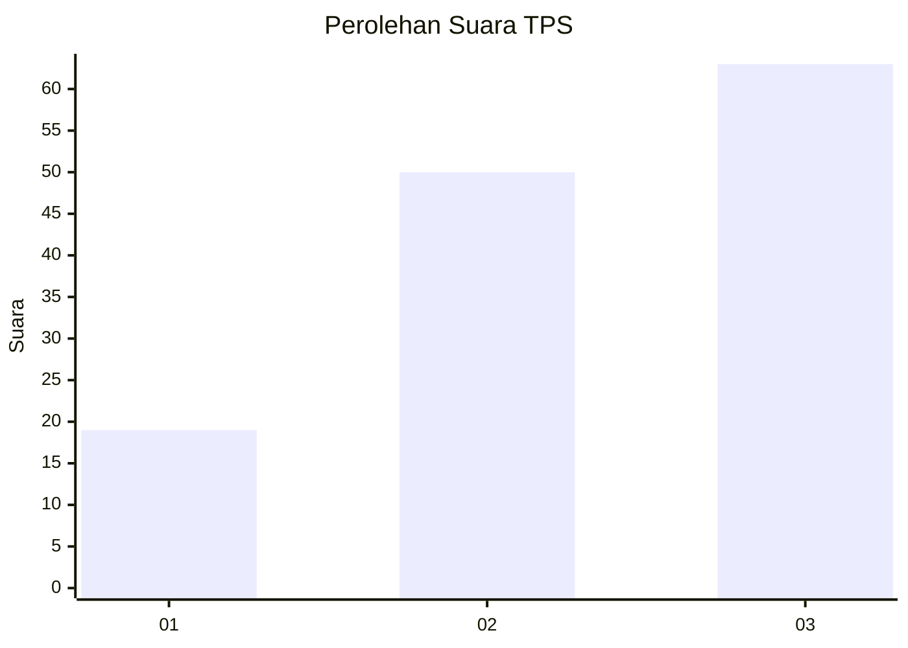
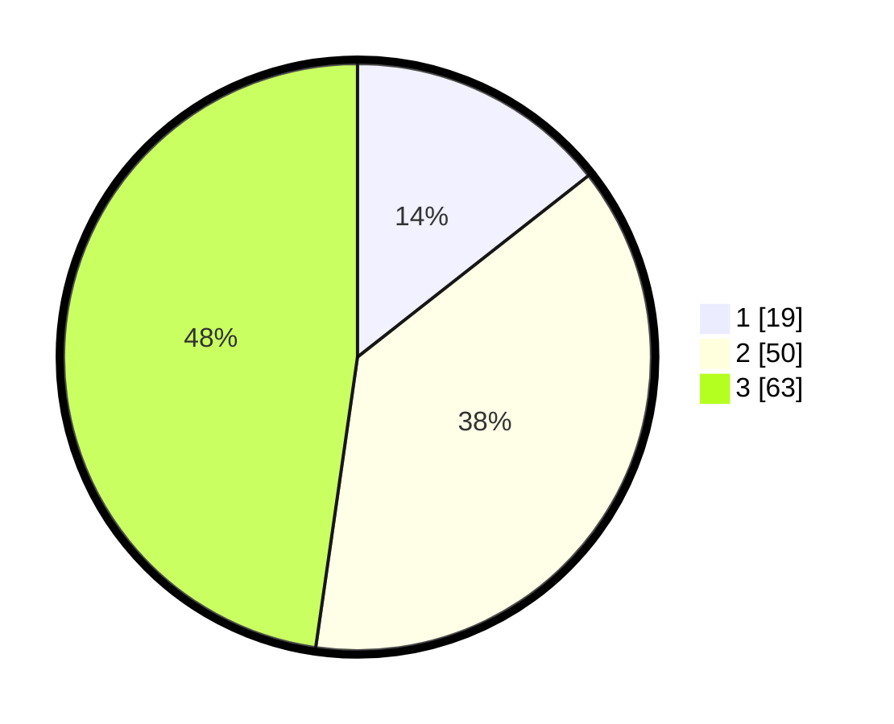

# Hasil

## Grafik

## Tabel

| No. | Nama Paslon    | Suara | Suara (raw) | Persentase |
|:--- |:-------------- | -----:| -----------:| ----------:|
| 1   | ANIES MUHAIMIN | 19    | [19][p-1]   | 14,39      |
| 2   | PRABOWO GIBRAN | 50    | [50][p-2]   | 37,88      |
| 3   | GANJAR MAHFUD  | 63    | [63][p-3]   | 47,73      |

[p-1]: https://github.com/gigit-pemilu/pemilu-2024/blob/main/pilpres/hitung-suara/sub/12-sumatera-utara/sub/71-kota-medan/sub/10-medan-area/sub/1004-s-rengas-permata/sub/002-tps/sub/paslon-1.txt
[p-2]: https://github.com/gigit-pemilu/pemilu-2024/blob/main/pilpres/hitung-suara/sub/12-sumatera-utara/sub/71-kota-medan/sub/10-medan-area/sub/1004-s-rengas-permata/sub/002-tps/sub/paslon-2.txt
[p-3]: https://github.com/gigit-pemilu/pemilu-2024/blob/main/pilpres/hitung-suara/sub/12-sumatera-utara/sub/71-kota-medan/sub/10-medan-area/sub/1004-s-rengas-permata/sub/002-tps/sub/paslon-3.txt

## Foto C Plano

https://sirekap-obj-formc.kpu.go.id/d319/pemilu/ppwp/12/71/10/10/04/1271101004002-20240214-213114--3d2271ab-c345-41ea-acc1-600b8b0bd2ca.jpg

https://sirekap-obj-formc.kpu.go.id/d319/pemilu/ppwp/12/71/10/10/04/1271101004002-20240214-213119--94f13eb0-e5c9-4e55-850b-461b834876e6.jpg

https://sirekap-obj-formc.kpu.go.id/d319/pemilu/ppwp/12/71/10/10/04/1271101004002-20240214-213124--54b07aa2-0bec-4a24-aaa2-b255978fbb68.jpg

## Metadata

| Key        | Value               |
| ---------- | ------------------- |
| Time Stamp | 2024-02-25 15:00:00 |

