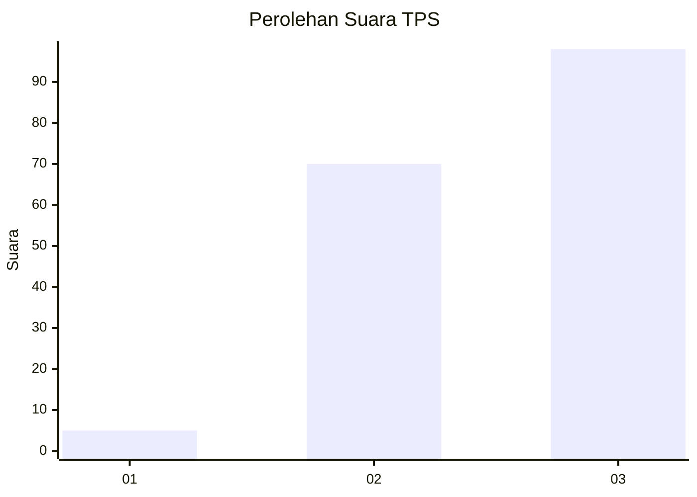
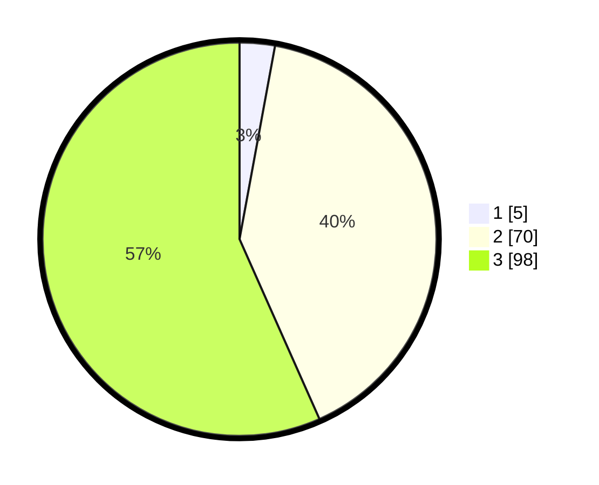

# Hasil

## Grafik

## Tabel

| No. | Nama Paslon    | Suara | Suara (raw) | Persentase |
|:--- |:-------------- | -----:| -----------:| ----------:|
| 1   | ANIES MUHAIMIN | 5     | [5][p-1]    | 2,89       |
| 2   | PRABOWO GIBRAN | 70    | [70][p-2]   | 40,46      |
| 3   | GANJAR MAHFUD  | 98    | [98][p-3]   | 56,65      |

[p-1]: https://github.com/gigit-pemilu/pemilu-2024/blob/main/pilpres/hitung-suara/sub/12-sumatera-utara/sub/71-kota-medan/sub/10-medan-area/sub/1004-s-rengas-permata/sub/007-tps/sub/paslon-1.txt
[p-2]: https://github.com/gigit-pemilu/pemilu-2024/blob/main/pilpres/hitung-suara/sub/12-sumatera-utara/sub/71-kota-medan/sub/10-medan-area/sub/1004-s-rengas-permata/sub/007-tps/sub/paslon-2.txt
[p-3]: https://github.com/gigit-pemilu/pemilu-2024/blob/main/pilpres/hitung-suara/sub/12-sumatera-utara/sub/71-kota-medan/sub/10-medan-area/sub/1004-s-rengas-permata/sub/007-tps/sub/paslon-3.txt

## Foto C Plano

https://sirekap-obj-formc.kpu.go.id/278a/pemilu/ppwp/12/71/10/10/04/1271101004007-20240214-221733--8beb2bf3-685b-4433-a62c-6f3da7f864d5.jpg

https://sirekap-obj-formc.kpu.go.id/278a/pemilu/ppwp/12/71/10/10/04/1271101004007-20240214-222216--541f1d83-c830-46bb-8b72-c7ac5e2cd16e.jpg

https://sirekap-obj-formc.kpu.go.id/278a/pemilu/ppwp/12/71/10/10/04/1271101004007-20240214-222425--c32b4849-9671-42af-b8fa-693c4e678d8b.jpg

## Metadata

| Key        | Value               |
| ---------- | ------------------- |
| Time Stamp | 2024-02-25 13:00:00 |

