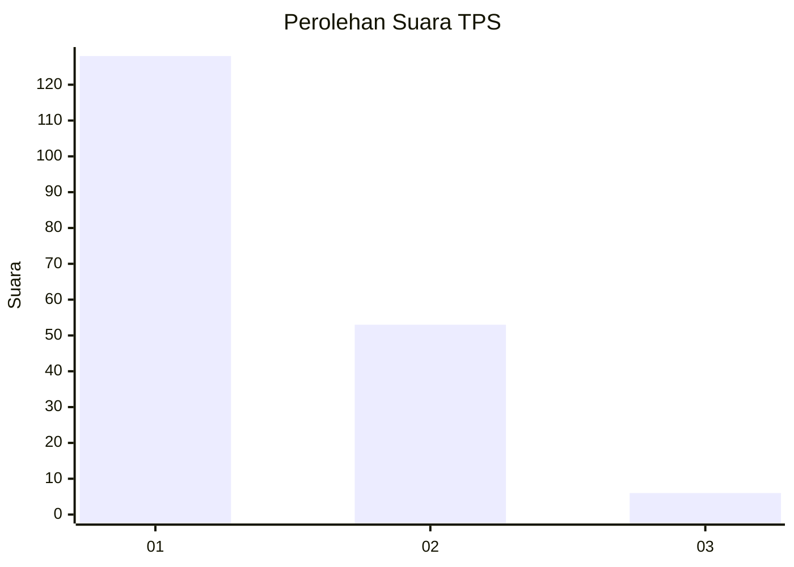
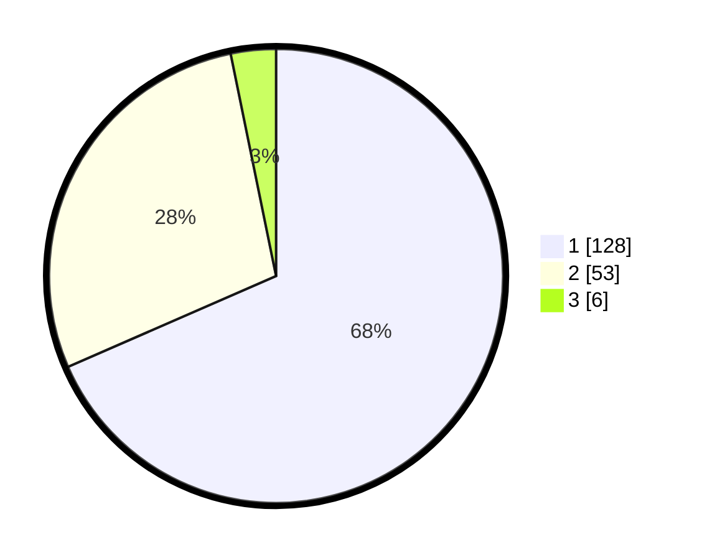

# Hasil

## Grafik

## Tabel

| No. | Nama Paslon    | Suara | Suara (raw) | Persentase |
|:--- |:-------------- | -----:| -----------:| ----------:|
| 1   | ANIES MUHAIMIN | 128   | [128][p-1]  | 68,45      |
| 2   | PRABOWO GIBRAN | 53    | [53][p-2]   | 28,34      |
| 3   | GANJAR MAHFUD  | 6     | [6][p-3]    | 3,21       |

[p-1]: https://github.com/gigit-pemilu/pemilu-2024/blob/main/pilpres/hitung-suara/sub/12-sumatera-utara/sub/71-kota-medan/sub/10-medan-area/sub/1006-kota-matsum-i/sub/003-tps/sub/paslon-1.txt
[p-2]: https://github.com/gigit-pemilu/pemilu-2024/blob/main/pilpres/hitung-suara/sub/12-sumatera-utara/sub/71-kota-medan/sub/10-medan-area/sub/1006-kota-matsum-i/sub/003-tps/sub/paslon-2.txt
[p-3]: https://github.com/gigit-pemilu/pemilu-2024/blob/main/pilpres/hitung-suara/sub/12-sumatera-utara/sub/71-kota-medan/sub/10-medan-area/sub/1006-kota-matsum-i/sub/003-tps/sub/paslon-3.txt

## Foto C Plano

https://sirekap-obj-formc.kpu.go.id/16d1/pemilu/ppwp/12/71/10/10/06/1271101006003-20240216-192130--f2ac5d0a-0a43-4e22-b595-7ba410046ab3.jpg

https://sirekap-obj-formc.kpu.go.id/16d1/pemilu/ppwp/12/71/10/10/06/1271101006003-20240216-192149--8f1d2879-ebc7-46dd-a7e8-57259fe80d17.jpg

https://sirekap-obj-formc.kpu.go.id/16d1/pemilu/ppwp/12/71/10/10/06/1271101006003-20240216-192151--c20aa0ea-ba1c-4a32-8283-d7588a988b7d.jpg

## Metadata

| Key        | Value               |
| ---------- | ------------------- |
| Time Stamp | 2024-02-25 09:00:00 |

