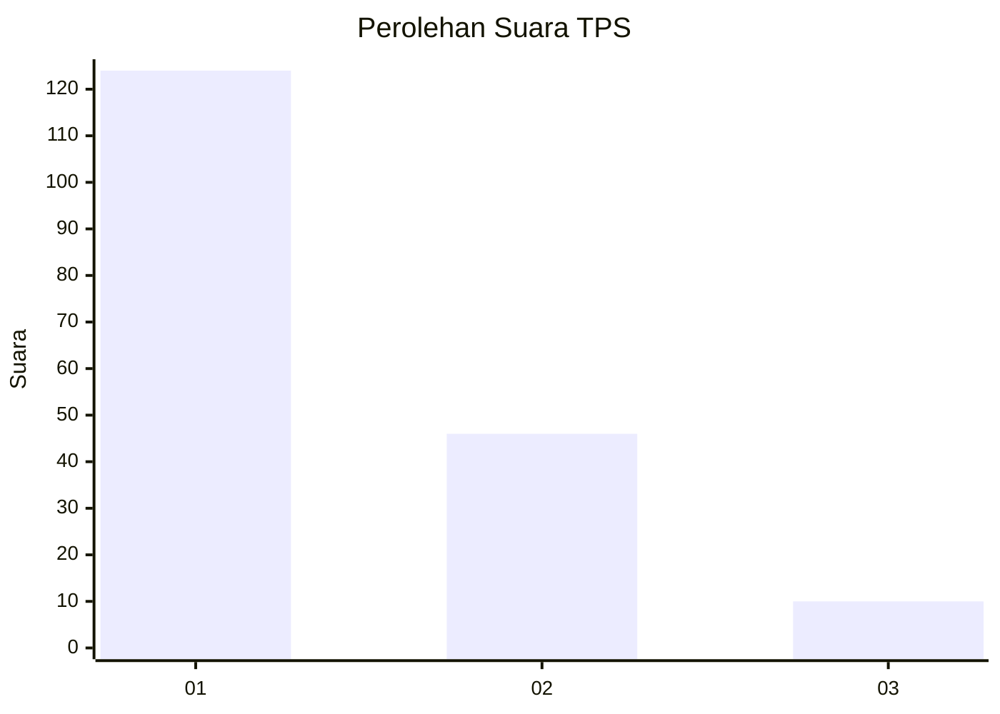
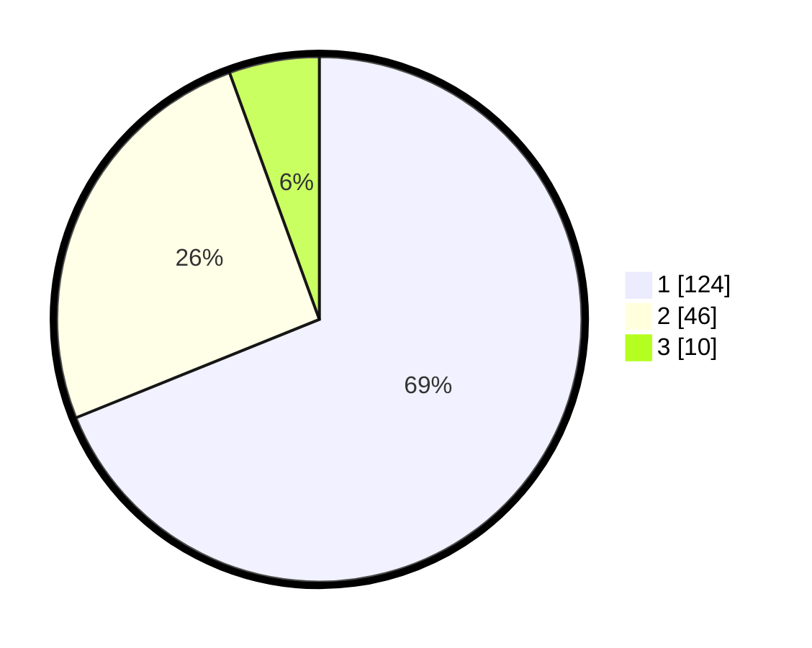

# Hasil

## Grafik

## Tabel

| No. | Nama Paslon    | Suara | Suara (raw) | Persentase |
|:--- |:-------------- | -----:| -----------:| ----------:|
| 1   | ANIES MUHAIMIN | 124   | [124][p-1]  | 68,89      |
| 2   | PRABOWO GIBRAN | 46    | [46][p-2]   | 25,56      |
| 3   | GANJAR MAHFUD  | 10    | [10][p-3]   | 5,56       |

[p-1]: https://github.com/gigit-pemilu/pemilu-2024/blob/main/pilpres/hitung-suara/sub/12-sumatera-utara/sub/71-kota-medan/sub/10-medan-area/sub/1006-kota-matsum-i/sub/004-tps/sub/paslon-1.txt
[p-2]: https://github.com/gigit-pemilu/pemilu-2024/blob/main/pilpres/hitung-suara/sub/12-sumatera-utara/sub/71-kota-medan/sub/10-medan-area/sub/1006-kota-matsum-i/sub/004-tps/sub/paslon-2.txt
[p-3]: https://github.com/gigit-pemilu/pemilu-2024/blob/main/pilpres/hitung-suara/sub/12-sumatera-utara/sub/71-kota-medan/sub/10-medan-area/sub/1006-kota-matsum-i/sub/004-tps/sub/paslon-3.txt

## Foto C Plano

https://sirekap-obj-formc.kpu.go.id/fd1c/pemilu/ppwp/12/71/10/10/06/1271101006004-20240214-213933--1fa70fd0-af04-4686-acbd-344b22a1bcf3.jpg

https://sirekap-obj-formc.kpu.go.id/fd1c/pemilu/ppwp/12/71/10/10/06/1271101006004-20240214-214030--1922ff66-7f47-43cd-a7ab-7fba75db98f1.jpg

https://sirekap-obj-formc.kpu.go.id/fd1c/pemilu/ppwp/12/71/10/10/06/1271101006004-20240214-214120--6c100a25-18bd-4ccd-a6a7-65636047800d.jpg

## Metadata

| Key        | Value               |
| ---------- | ------------------- |
| Time Stamp | 2024-02-25 12:00:00 |

