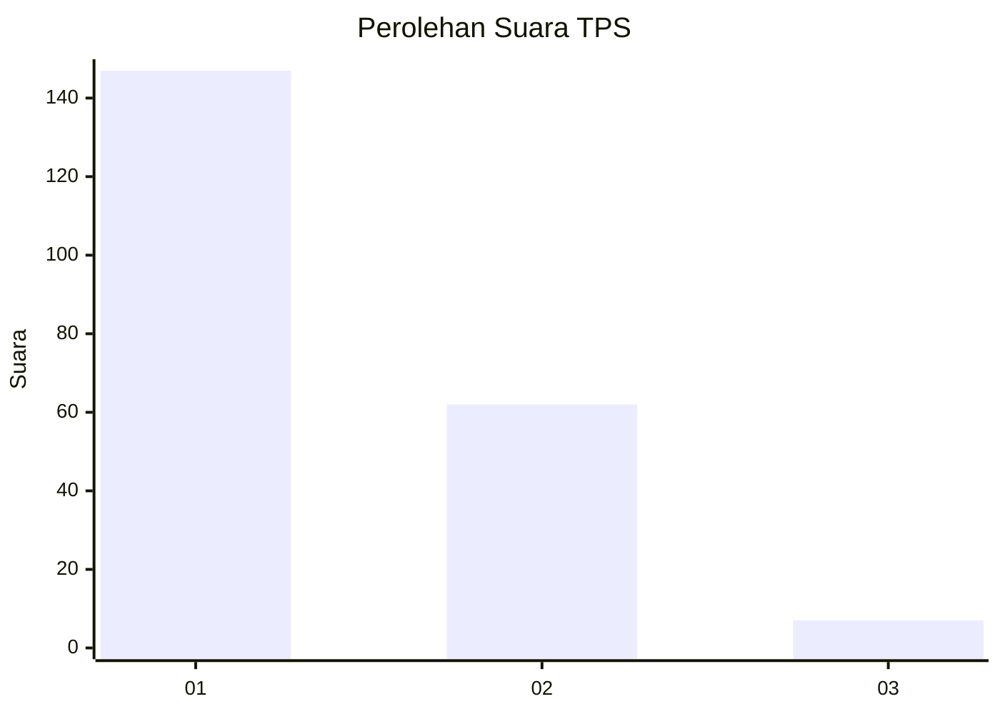
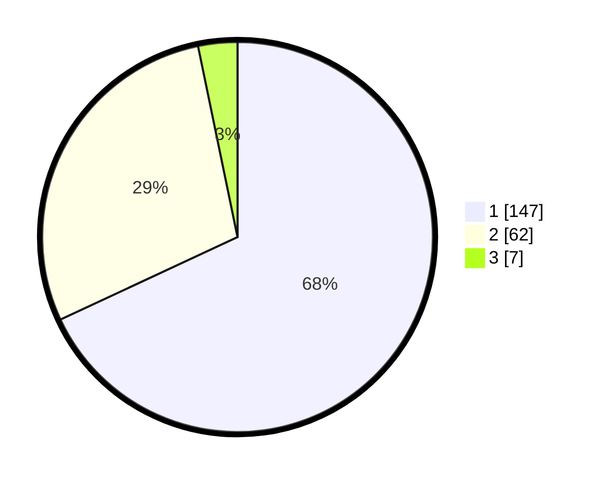

# Hasil

## Grafik

## Tabel

| No. | Nama Paslon    | Suara | Suara (raw) | Persentase |
|:--- |:-------------- | -----:| -----------:| ----------:|
| 1   | ANIES MUHAIMIN | 147   | [147][p-1]  | 68,06      |
| 2   | PRABOWO GIBRAN | 62    | [62][p-2]   | 28,70      |
| 3   | GANJAR MAHFUD  | 7     | [7][p-3]    | 3,24       |

[p-1]: https://github.com/gigit-pemilu/pemilu-2024-12-sumatera-utara/blob/main/pilpres/hitung-suara/sub/12-sumatera-utara/sub/71-kota-medan/sub/10-medan-area/sub/1006-kota-matsum-i/sub/006-tps/sub/paslon-1.txt
[p-2]: https://github.com/gigit-pemilu/pemilu-2024-12-sumatera-utara/blob/main/pilpres/hitung-suara/sub/12-sumatera-utara/sub/71-kota-medan/sub/10-medan-area/sub/1006-kota-matsum-i/sub/006-tps/sub/paslon-2.txt
[p-3]: https://github.com/gigit-pemilu/pemilu-2024-12-sumatera-utara/blob/main/pilpres/hitung-suara/sub/12-sumatera-utara/sub/71-kota-medan/sub/10-medan-area/sub/1006-kota-matsum-i/sub/006-tps/sub/paslon-3.txt

## Foto C Plano

https://sirekap-obj-formc.kpu.go.id/cbad/pemilu/ppwp/12/71/10/10/06/1271101006006-20240215-035322--5b3878a0-add9-469b-afae-500b2dc10ea8.jpg

https://sirekap-obj-formc.kpu.go.id/cbad/pemilu/ppwp/12/71/10/10/06/1271101006006-20240215-035342--5b462345-14fa-4a54-88ca-de08a3a8a5c3.jpg

https://sirekap-obj-formc.kpu.go.id/cbad/pemilu/ppwp/12/71/10/10/06/1271101006006-20240215-035406--4d8ade69-73bf-49d9-ab7a-59a97a10ba25.jpg

## Metadata

| Key        | Value               |
| ---------- | ------------------- |
| Time Stamp | 2024-02-25 17:00:00 |

