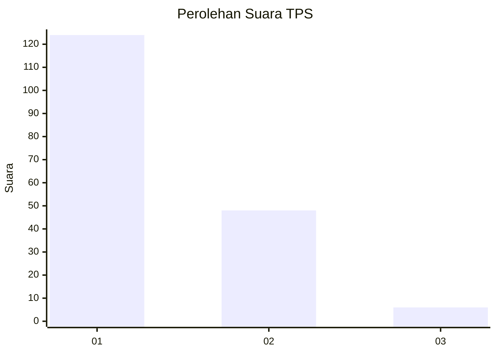
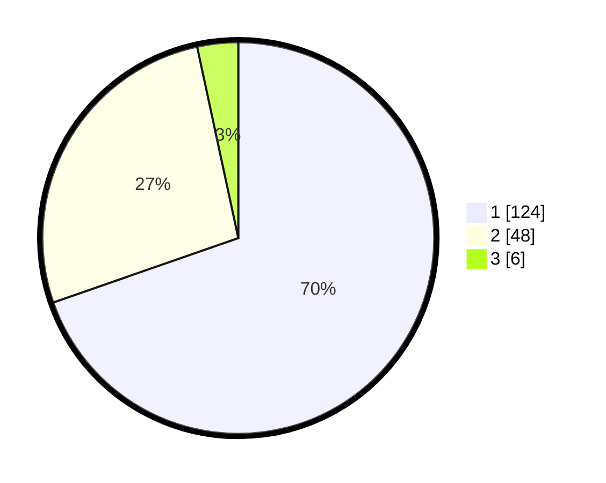

# Hasil

## Grafik

## Tabel

| No. | Nama Paslon    | Suara | Suara (raw) | Persentase |
|:--- |:-------------- | -----:| -----------:| ----------:|
| 1   | ANIES MUHAIMIN | 124   | [124][p-1]  | 69,66      |
| 2   | PRABOWO GIBRAN | 48    | [48][p-2]   | 26,97      |
| 3   | GANJAR MAHFUD  | 6     | [6][p-3]    | 3,37       |

[p-1]: https://github.com/gigit-pemilu/pemilu-2024/blob/main/pilpres/hitung-suara/sub/12-sumatera-utara/sub/71-kota-medan/sub/10-medan-area/sub/1006-kota-matsum-i/sub/010-tps/sub/paslon-1.txt
[p-2]: https://github.com/gigit-pemilu/pemilu-2024/blob/main/pilpres/hitung-suara/sub/12-sumatera-utara/sub/71-kota-medan/sub/10-medan-area/sub/1006-kota-matsum-i/sub/010-tps/sub/paslon-2.txt
[p-3]: https://github.com/gigit-pemilu/pemilu-2024/blob/main/pilpres/hitung-suara/sub/12-sumatera-utara/sub/71-kota-medan/sub/10-medan-area/sub/1006-kota-matsum-i/sub/010-tps/sub/paslon-3.txt

## Foto C Plano

https://sirekap-obj-formc.kpu.go.id/e541/pemilu/ppwp/12/71/10/10/06/1271101006010-20240214-155029--195e9d75-2d34-4bb2-9c09-1240149a7a30.jpg

https://sirekap-obj-formc.kpu.go.id/e541/pemilu/ppwp/12/71/10/10/06/1271101006010-20240214-155154--13d84629-56dc-465c-bec2-6c67f52171d8.jpg

https://sirekap-obj-formc.kpu.go.id/e541/pemilu/ppwp/12/71/10/10/06/1271101006010-20240214-155320--d1aef505-18d4-4f28-b083-b761e99fcbb2.jpg

## Metadata

| Key        | Value               |
| ---------- | ------------------- |
| Time Stamp | 2024-02-25 12:00:00 |

