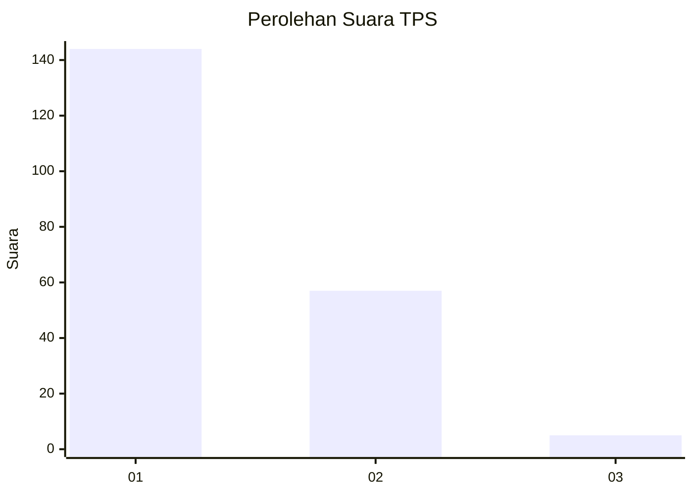
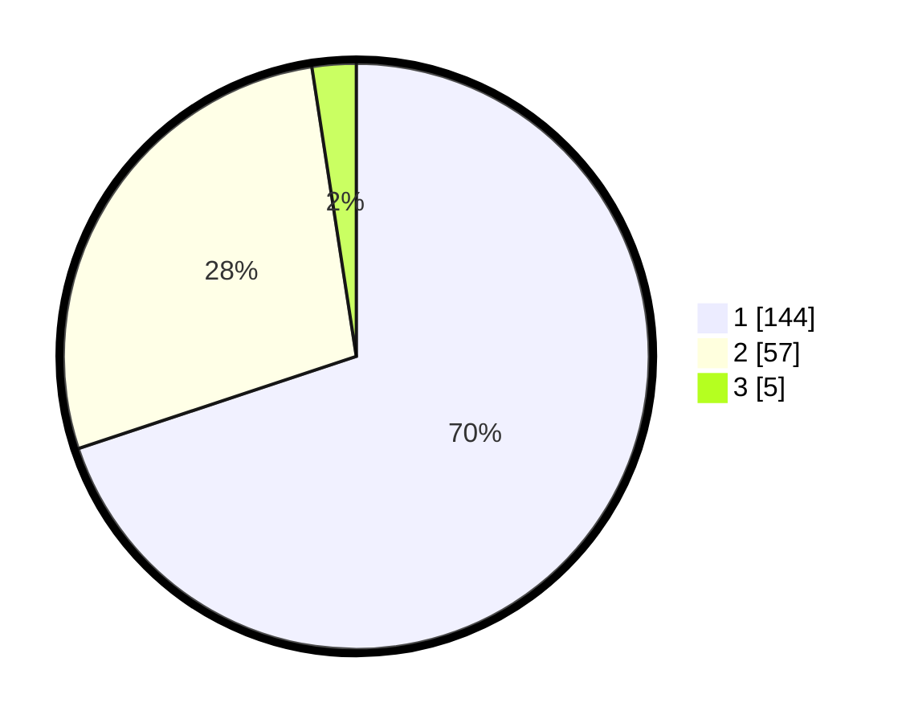

# Hasil

## Grafik

## Tabel

| No. | Nama Paslon    | Suara | Suara (raw) | Persentase |
|:--- |:-------------- | -----:| -----------:| ----------:|
| 1   | ANIES MUHAIMIN | 144   | [144][p-1]  | 69,90      |
| 2   | PRABOWO GIBRAN | 57    | [57][p-2]   | 27,67      |
| 3   | GANJAR MAHFUD  | 5     | [5][p-3]    | 2,43       |

[p-1]: https://github.com/gigit-pemilu/pemilu-2024/blob/main/pilpres/hitung-suara/sub/12-sumatera-utara/sub/71-kota-medan/sub/10-medan-area/sub/1006-kota-matsum-i/sub/025-tps/sub/paslon-1.txt
[p-2]: https://github.com/gigit-pemilu/pemilu-2024/blob/main/pilpres/hitung-suara/sub/12-sumatera-utara/sub/71-kota-medan/sub/10-medan-area/sub/1006-kota-matsum-i/sub/025-tps/sub/paslon-2.txt
[p-3]: https://github.com/gigit-pemilu/pemilu-2024/blob/main/pilpres/hitung-suara/sub/12-sumatera-utara/sub/71-kota-medan/sub/10-medan-area/sub/1006-kota-matsum-i/sub/025-tps/sub/paslon-3.txt

## Foto C Plano

https://sirekap-obj-formc.kpu.go.id/813a/pemilu/ppwp/12/71/10/10/06/1271101006025-20240214-213609--6e486222-2eee-463c-aa24-8f8bc211ca27.jpg

https://sirekap-obj-formc.kpu.go.id/813a/pemilu/ppwp/12/71/10/10/06/1271101006025-20240214-213658--6e7f50e6-ed86-41a9-b9e7-d64c387f77a8.jpg

https://sirekap-obj-formc.kpu.go.id/813a/pemilu/ppwp/12/71/10/10/06/1271101006025-20240214-213801--c606e889-3ff0-4af1-b015-54bd8cae034e.jpg

## Metadata

| Key        | Value               |
| ---------- | ------------------- |
| Time Stamp | 2024-02-24 22:31:28 |

