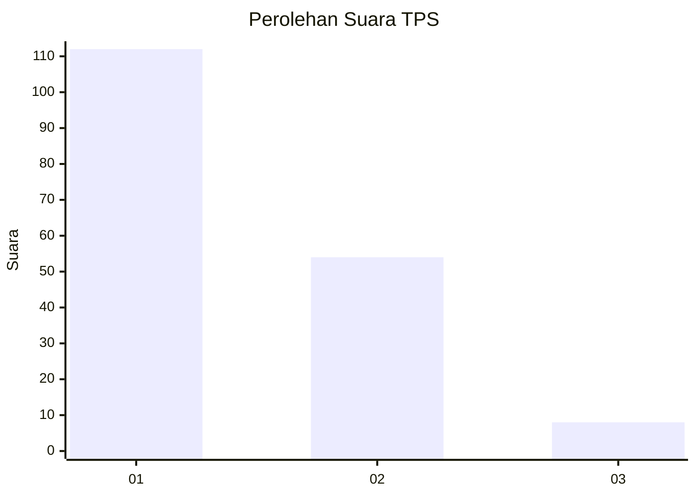
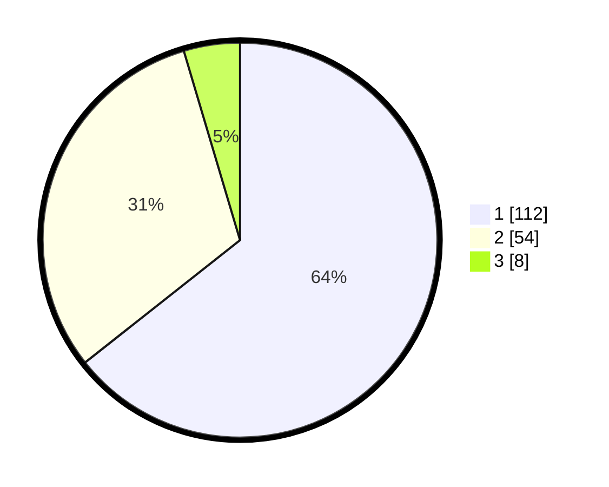

# Hasil

## Grafik

## Tabel

| No. | Nama Paslon    | Suara | Suara (raw) | Persentase |
|:--- |:-------------- | -----:| -----------:| ----------:|
| 1   | ANIES MUHAIMIN | 112   | [112][p-1]  | 64,37      |
| 2   | PRABOWO GIBRAN | 54    | [54][p-2]   | 31,03      |
| 3   | GANJAR MAHFUD  | 8     | [8][p-3]    | 4,60       |

[p-1]: https://github.com/gigit-pemilu/pemilu-2024-12-sumatera-utara/blob/main/pilpres/hitung-suara/sub/12-sumatera-utara/sub/71-kota-medan/sub/10-medan-area/sub/1006-kota-matsum-i/sub/037-tps/sub/paslon-1.txt
[p-2]: https://github.com/gigit-pemilu/pemilu-2024-12-sumatera-utara/blob/main/pilpres/hitung-suara/sub/12-sumatera-utara/sub/71-kota-medan/sub/10-medan-area/sub/1006-kota-matsum-i/sub/037-tps/sub/paslon-2.txt
[p-3]: https://github.com/gigit-pemilu/pemilu-2024-12-sumatera-utara/blob/main/pilpres/hitung-suara/sub/12-sumatera-utara/sub/71-kota-medan/sub/10-medan-area/sub/1006-kota-matsum-i/sub/037-tps/sub/paslon-3.txt

## Foto C Plano

https://sirekap-obj-formc.kpu.go.id/05d7/pemilu/ppwp/12/71/10/10/06/1271101006037-20240214-234003--557676d3-dfaa-4c9a-a4ad-2e0c9b03166c.jpg

https://sirekap-obj-formc.kpu.go.id/05d7/pemilu/ppwp/12/71/10/10/06/1271101006037-20240214-233915--03129455-dee1-465a-8c9d-f91d08bb0acb.jpg

https://sirekap-obj-formc.kpu.go.id/05d7/pemilu/ppwp/12/71/10/10/06/1271101006037-20240214-234110--4d1b30e6-1fb8-44b2-bc6c-8411fe5f4e2c.jpg

## Metadata

| Key        | Value               |
| ---------- | ------------------- |
| Time Stamp | 2024-02-24 22:31:28 |

