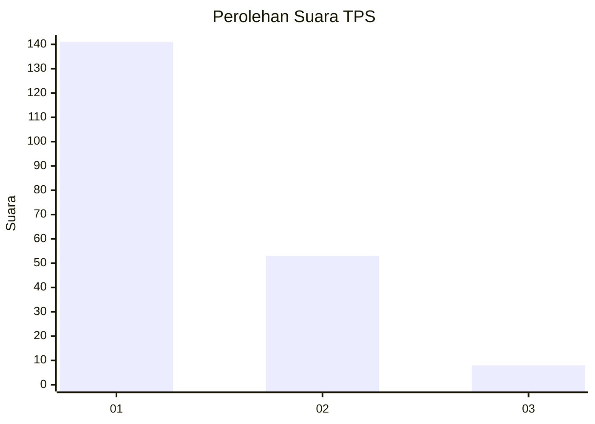
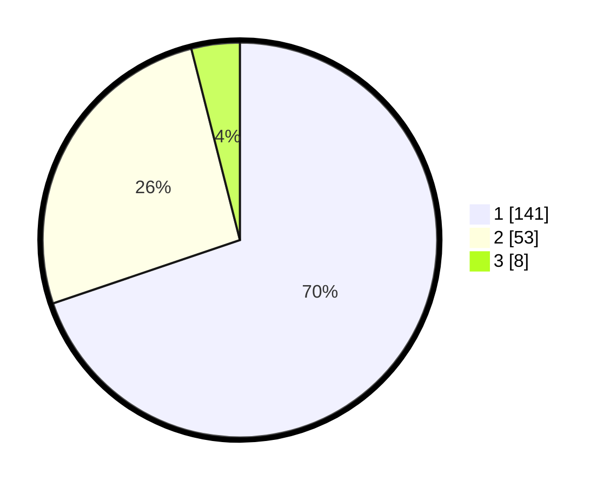

# Hasil

## Grafik

## Tabel

| No. | Nama Paslon    | Suara | Suara (raw) | Persentase |
|:--- |:-------------- | -----:| -----------:| ----------:|
| 1   | ANIES MUHAIMIN | 141   | [141][p-1]  | 69,80      |
| 2   | PRABOWO GIBRAN | 53    | [53][p-2]   | 26,24      |
| 3   | GANJAR MAHFUD  | 8     | [8][p-3]    | 3,96       |

[p-1]: https://github.com/gigit-pemilu/pemilu-2024-12-sumatera-utara/blob/main/pilpres/hitung-suara/sub/12-sumatera-utara/sub/71-kota-medan/sub/10-medan-area/sub/1007-kota-matsum-ii/sub/001-tps/sub/paslon-1.txt
[p-2]: https://github.com/gigit-pemilu/pemilu-2024-12-sumatera-utara/blob/main/pilpres/hitung-suara/sub/12-sumatera-utara/sub/71-kota-medan/sub/10-medan-area/sub/1007-kota-matsum-ii/sub/001-tps/sub/paslon-2.txt
[p-3]: https://github.com/gigit-pemilu/pemilu-2024-12-sumatera-utara/blob/main/pilpres/hitung-suara/sub/12-sumatera-utara/sub/71-kota-medan/sub/10-medan-area/sub/1007-kota-matsum-ii/sub/001-tps/sub/paslon-3.txt

## Foto C Plano

https://sirekap-obj-formc.kpu.go.id/7811/pemilu/ppwp/12/71/10/10/07/1271101007001-20240214-224258--ddf0c216-7717-45a5-83bc-325311a8cdce.jpg

https://sirekap-obj-formc.kpu.go.id/7811/pemilu/ppwp/12/71/10/10/07/1271101007001-20240214-224807--e566d130-da14-4095-90a5-d2261b75f0ee.jpg

https://sirekap-obj-formc.kpu.go.id/7811/pemilu/ppwp/12/71/10/10/07/1271101007001-20240214-224618--617e4816-4647-4e7f-9253-a8dd790ef556.jpg

## Metadata

| Key        | Value               |
| ---------- | ------------------- |
| Time Stamp | 2024-02-24 23:00:00 |

