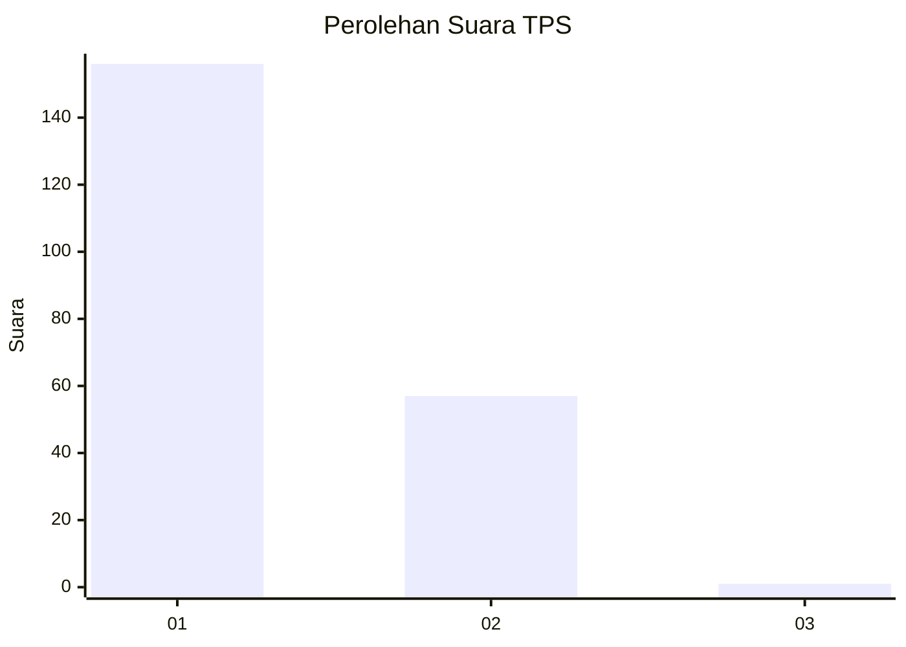
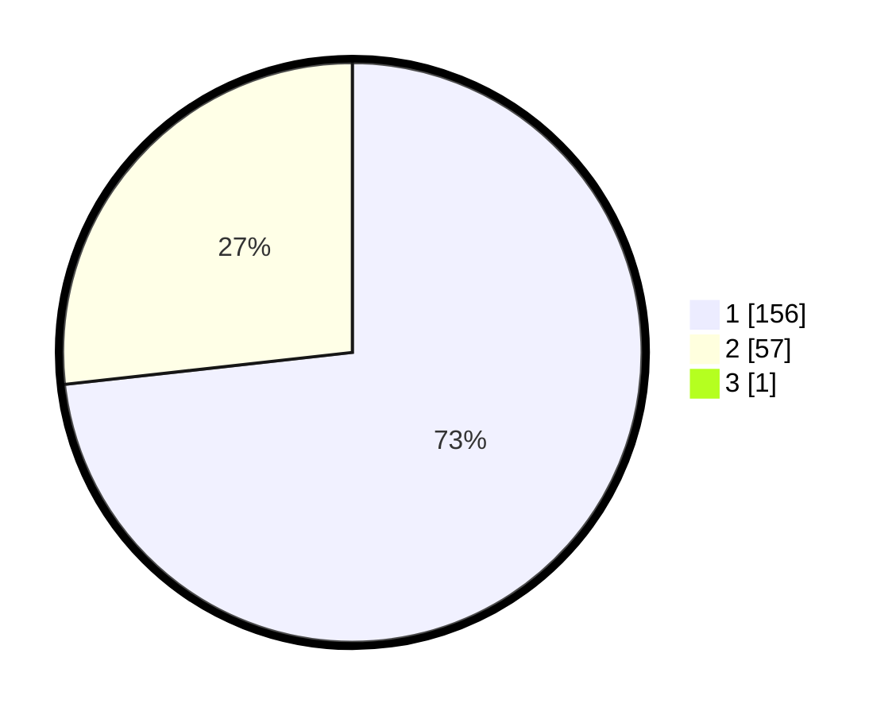

# Hasil

## Grafik

## Tabel

| No. | Nama Paslon    | Suara | Suara (raw) | Persentase |
|:--- |:-------------- | -----:| -----------:| ----------:|
| 1   | ANIES MUHAIMIN | 156   | [156][p-1]  | 72,90      |
| 2   | PRABOWO GIBRAN | 57    | [57][p-2]   | 26,64      |
| 3   | GANJAR MAHFUD  | 1     | [1][p-3]    | 0,47       |

[p-1]: https://github.com/gigit-pemilu/pemilu-2024-12-sumatera-utara/blob/main/pilpres/hitung-suara/sub/12-sumatera-utara/sub/71-kota-medan/sub/10-medan-area/sub/1007-kota-matsum-ii/sub/004-tps/sub/paslon-1.txt
[p-2]: https://github.com/gigit-pemilu/pemilu-2024-12-sumatera-utara/blob/main/pilpres/hitung-suara/sub/12-sumatera-utara/sub/71-kota-medan/sub/10-medan-area/sub/1007-kota-matsum-ii/sub/004-tps/sub/paslon-2.txt
[p-3]: https://github.com/gigit-pemilu/pemilu-2024-12-sumatera-utara/blob/main/pilpres/hitung-suara/sub/12-sumatera-utara/sub/71-kota-medan/sub/10-medan-area/sub/1007-kota-matsum-ii/sub/004-tps/sub/paslon-3.txt

## Foto C Plano

https://sirekap-obj-formc.kpu.go.id/a806/pemilu/ppwp/12/71/10/10/07/1271101007004-20240215-043342--f1586cd3-ce75-4adb-81d9-d6dad06557c2.jpg

https://sirekap-obj-formc.kpu.go.id/a806/pemilu/ppwp/12/71/10/10/07/1271101007004-20240215-043454--e253767e-232d-41f7-a736-1af240ba6955.jpg

https://sirekap-obj-formc.kpu.go.id/a806/pemilu/ppwp/12/71/10/10/07/1271101007004-20240215-044306--1cdce295-aeab-40aa-afab-0433d46b9e63.jpg

## Metadata

| Key        | Value               |
| ---------- | ------------------- |
| Time Stamp | 2024-02-25 18:00:00 |

