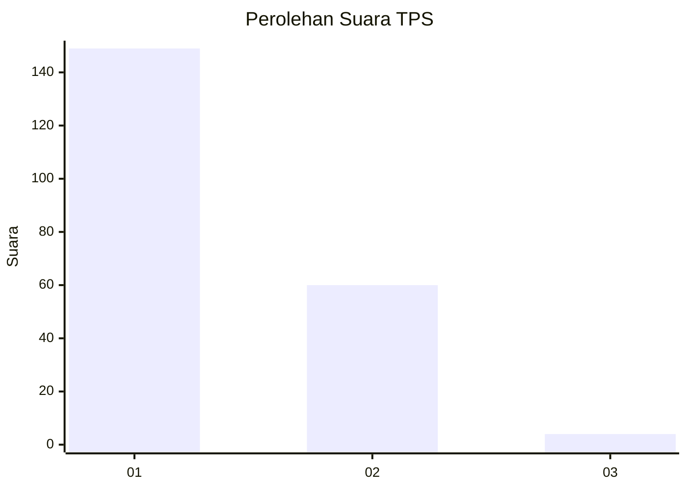
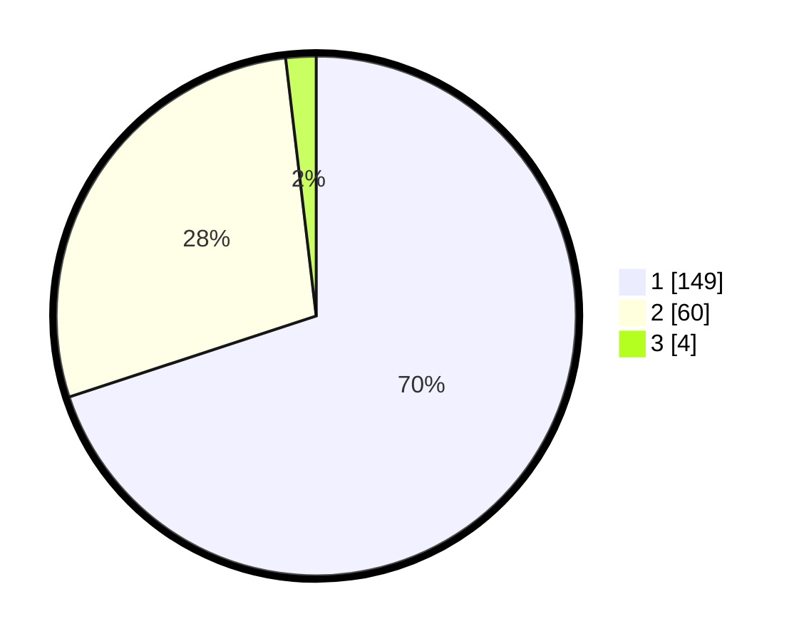

# Hasil

## Grafik

## Tabel

| No. | Nama Paslon    | Suara | Suara (raw) | Persentase |
|:--- |:-------------- | -----:| -----------:| ----------:|
| 1   | ANIES MUHAIMIN | 149   | [149][p-1]  | 69,95      |
| 2   | PRABOWO GIBRAN | 60    | [60][p-2]   | 28,17      |
| 3   | GANJAR MAHFUD  | 4     | [4][p-3]    | 1,88       |

[p-1]: https://github.com/gigit-pemilu/pemilu-2024/blob/main/pilpres/hitung-suara/sub/12-sumatera-utara/sub/71-kota-medan/sub/10-medan-area/sub/1007-kota-matsum-ii/sub/007-tps/sub/paslon-1.txt
[p-2]: https://github.com/gigit-pemilu/pemilu-2024/blob/main/pilpres/hitung-suara/sub/12-sumatera-utara/sub/71-kota-medan/sub/10-medan-area/sub/1007-kota-matsum-ii/sub/007-tps/sub/paslon-2.txt
[p-3]: https://github.com/gigit-pemilu/pemilu-2024/blob/main/pilpres/hitung-suara/sub/12-sumatera-utara/sub/71-kota-medan/sub/10-medan-area/sub/1007-kota-matsum-ii/sub/007-tps/sub/paslon-3.txt

## Foto C Plano

https://sirekap-obj-formc.kpu.go.id/c0fb/pemilu/ppwp/12/71/10/10/07/1271101007007-20240214-215111--d6bdad30-0b9b-42ed-aefb-304941c70d7e.jpg

https://sirekap-obj-formc.kpu.go.id/c0fb/pemilu/ppwp/12/71/10/10/07/1271101007007-20240214-215151--4aab2869-52b2-4592-92f8-437b66359500.jpg

https://sirekap-obj-formc.kpu.go.id/c0fb/pemilu/ppwp/12/71/10/10/07/1271101007007-20240214-215639--a1438f89-d481-4e40-99bc-0ce8a0e7203f.jpg

## Metadata

| Key        | Value               |
| ---------- | ------------------- |
| Time Stamp | 2024-02-25 16:00:00 |

