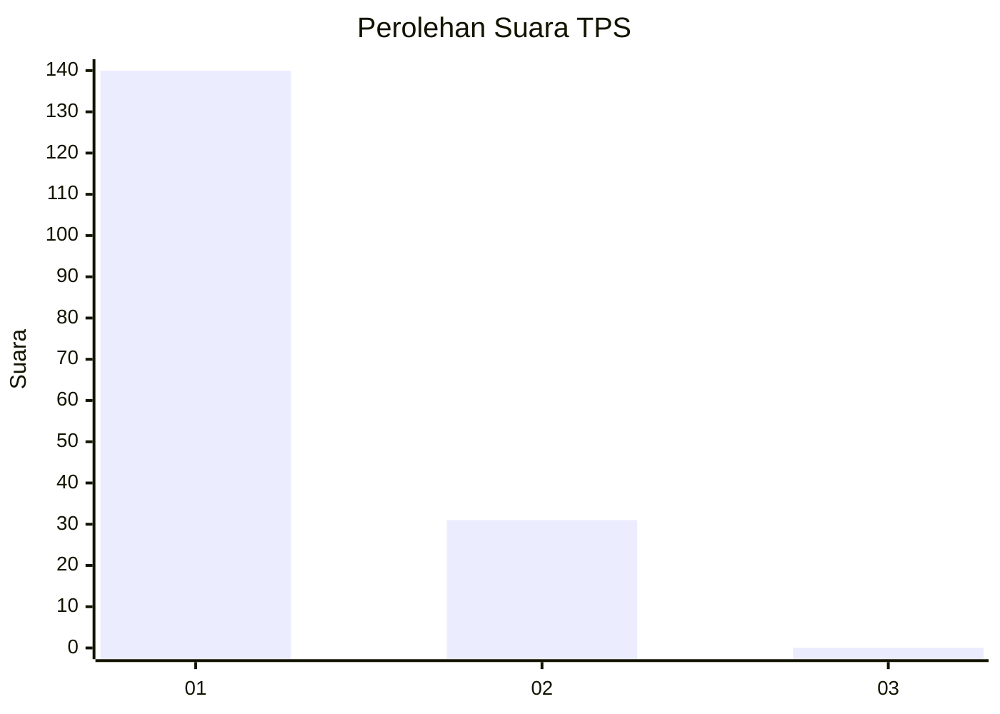
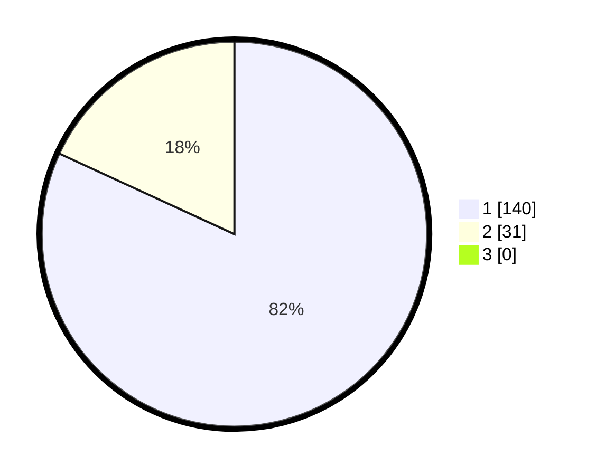

# Hasil

## Grafik

## Tabel

| No. | Nama Paslon    | Suara | Suara (raw) | Persentase |
|:--- |:-------------- | -----:| -----------:| ----------:|
| 1   | ANIES MUHAIMIN | 140   | [140][p-1]  | 81,87      |
| 2   | PRABOWO GIBRAN | 31    | [31][p-2]   | 18,13      |
| 3   | GANJAR MAHFUD  | 0     | [0][p-3]    | 0,00       |

[p-1]: https://github.com/gigit-pemilu/pemilu-2024/blob/main/pilpres/hitung-suara/sub/12-sumatera-utara/sub/71-kota-medan/sub/10-medan-area/sub/1007-kota-matsum-ii/sub/020-tps/sub/paslon-1.txt
[p-2]: https://github.com/gigit-pemilu/pemilu-2024/blob/main/pilpres/hitung-suara/sub/12-sumatera-utara/sub/71-kota-medan/sub/10-medan-area/sub/1007-kota-matsum-ii/sub/020-tps/sub/paslon-2.txt
[p-3]: https://github.com/gigit-pemilu/pemilu-2024/blob/main/pilpres/hitung-suara/sub/12-sumatera-utara/sub/71-kota-medan/sub/10-medan-area/sub/1007-kota-matsum-ii/sub/020-tps/sub/paslon-3.txt

## Foto C Plano

https://sirekap-obj-formc.kpu.go.id/61f8/pemilu/ppwp/12/71/10/10/07/1271101007020-20240214-185605--d1bc69ab-003c-4af1-9672-1a6728976319.jpg

https://sirekap-obj-formc.kpu.go.id/61f8/pemilu/ppwp/12/71/10/10/07/1271101007020-20240214-184926--09ec7fbb-4fca-4479-bff7-eb9840e6c7bc.jpg

https://sirekap-obj-formc.kpu.go.id/61f8/pemilu/ppwp/12/71/10/10/07/1271101007020-20240214-184949--ed5b8d41-9b49-4517-9a31-b7f11e8aad90.jpg

## Metadata

| Key        | Value               |
| ---------- | ------------------- |
| Time Stamp | 2024-02-22 11:00:00 |

