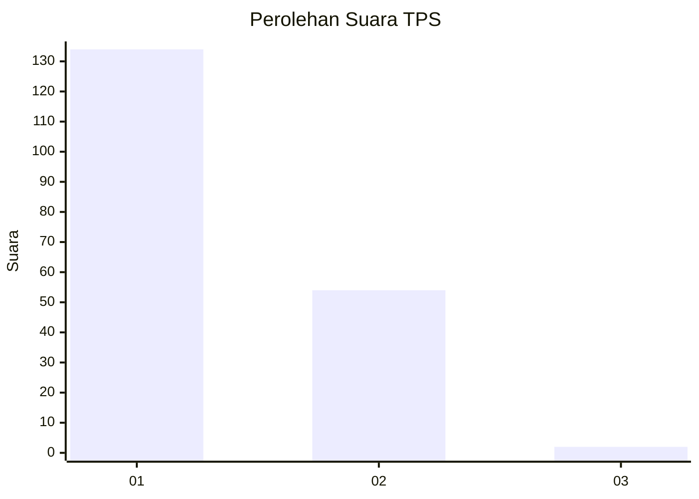
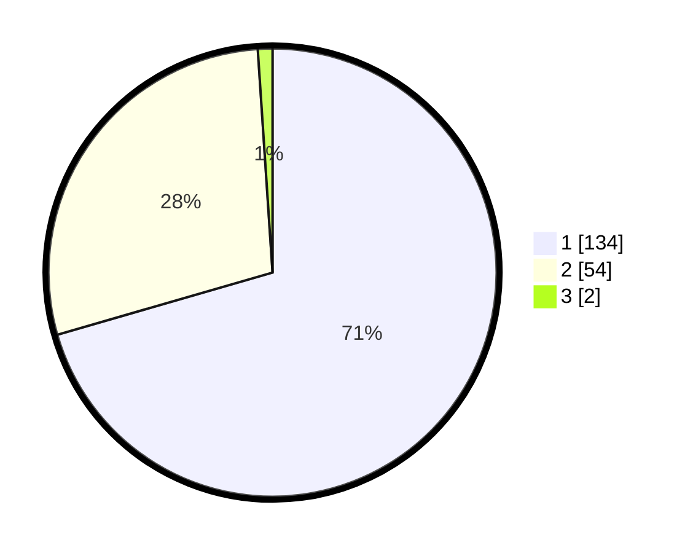

# Hasil

## Grafik

## Tabel

| No. | Nama Paslon    | Suara | Suara (raw) | Persentase |
|:--- |:-------------- | -----:| -----------:| ----------:|
| 1   | ANIES MUHAIMIN | 134   | [134][p-1]  | 70,53      |
| 2   | PRABOWO GIBRAN | 54    | [54][p-2]   | 28,42      |
| 3   | GANJAR MAHFUD  | 2     | [2][p-3]    | 1,05       |

[p-1]: https://github.com/gigit-pemilu/pemilu-2024/blob/main/pilpres/hitung-suara/sub/12-sumatera-utara/sub/71-kota-medan/sub/10-medan-area/sub/1007-kota-matsum-ii/sub/029-tps/sub/paslon-1.txt
[p-2]: https://github.com/gigit-pemilu/pemilu-2024/blob/main/pilpres/hitung-suara/sub/12-sumatera-utara/sub/71-kota-medan/sub/10-medan-area/sub/1007-kota-matsum-ii/sub/029-tps/sub/paslon-2.txt
[p-3]: https://github.com/gigit-pemilu/pemilu-2024/blob/main/pilpres/hitung-suara/sub/12-sumatera-utara/sub/71-kota-medan/sub/10-medan-area/sub/1007-kota-matsum-ii/sub/029-tps/sub/paslon-3.txt

## Foto C Plano

https://sirekap-obj-formc.kpu.go.id/fd08/pemilu/ppwp/12/71/10/10/07/1271101007029-20240214-222435--99484642-65ea-4a69-9794-b9f67097d830.jpg

https://sirekap-obj-formc.kpu.go.id/fd08/pemilu/ppwp/12/71/10/10/07/1271101007029-20240214-222606--200dd743-d2a9-4c5e-b87c-d11a5b0f1ea7.jpg

https://sirekap-obj-formc.kpu.go.id/fd08/pemilu/ppwp/12/71/10/10/07/1271101007029-20240214-222317--7ea79ec8-b6d0-4f56-82b3-8dcba4980fb7.jpg

## Metadata

| Key        | Value               |
| ---------- | ------------------- |
| Time Stamp | 2024-02-24 22:31:28 |

