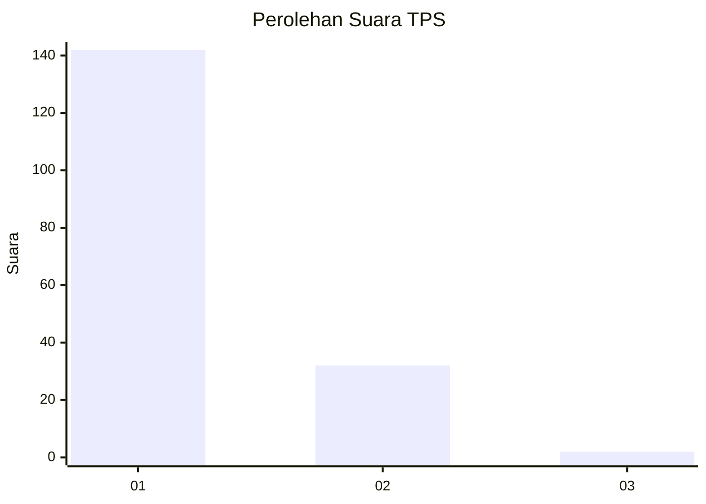
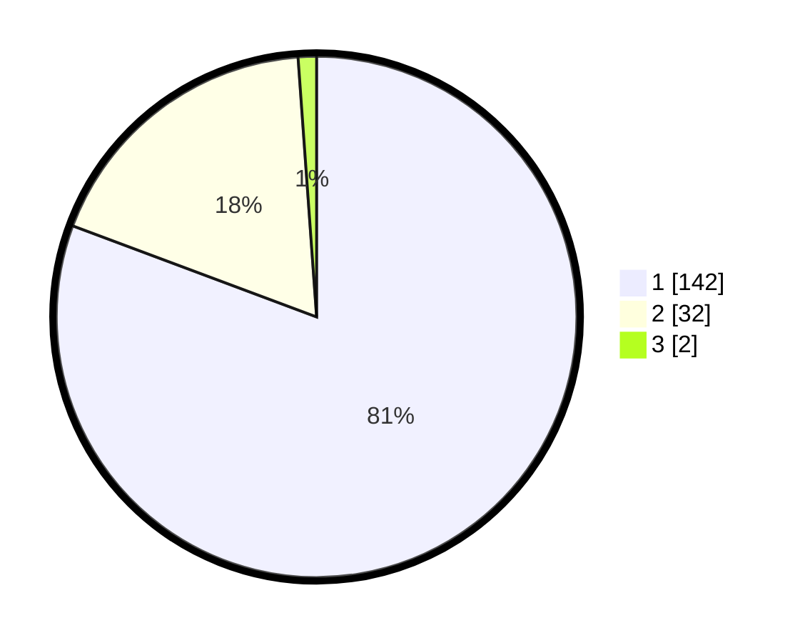

# Hasil

## Grafik

## Tabel

| No. | Nama Paslon    | Suara | Suara (raw) | Persentase |
|:--- |:-------------- | -----:| -----------:| ----------:|
| 1   | ANIES MUHAIMIN | 142   | [142][p-1]  | 80,68      |
| 2   | PRABOWO GIBRAN | 32    | [32][p-2]   | 18,18      |
| 3   | GANJAR MAHFUD  | 2     | [2][p-3]    | 1,14       |

[p-1]: https://github.com/gigit-pemilu/pemilu-2024-12-sumatera-utara/blob/main/pilpres/hitung-suara/sub/12-sumatera-utara/sub/71-kota-medan/sub/10-medan-area/sub/1008-kota-matsum-iv/sub/003-tps/sub/paslon-1.txt
[p-2]: https://github.com/gigit-pemilu/pemilu-2024-12-sumatera-utara/blob/main/pilpres/hitung-suara/sub/12-sumatera-utara/sub/71-kota-medan/sub/10-medan-area/sub/1008-kota-matsum-iv/sub/003-tps/sub/paslon-2.txt
[p-3]: https://github.com/gigit-pemilu/pemilu-2024-12-sumatera-utara/blob/main/pilpres/hitung-suara/sub/12-sumatera-utara/sub/71-kota-medan/sub/10-medan-area/sub/1008-kota-matsum-iv/sub/003-tps/sub/paslon-3.txt

## Foto C Plano

https://sirekap-obj-formc.kpu.go.id/538a/pemilu/ppwp/12/71/10/10/08/1271101008003-20240215-000601--1ee83273-2cc1-4bdf-ac6f-69912d92e9e0.jpg

https://sirekap-obj-formc.kpu.go.id/538a/pemilu/ppwp/12/71/10/10/08/1271101008003-20240215-000740--e2ca582f-fe99-4c65-a198-66a064bb9271.jpg

https://sirekap-obj-formc.kpu.go.id/538a/pemilu/ppwp/12/71/10/10/08/1271101008003-20240215-001304--249e1a1a-0f13-4263-9d1d-1045883a7e10.jpg

## Metadata

| Key        | Value               |
| ---------- | ------------------- |
| Time Stamp | 2024-02-24 22:31:28 |

