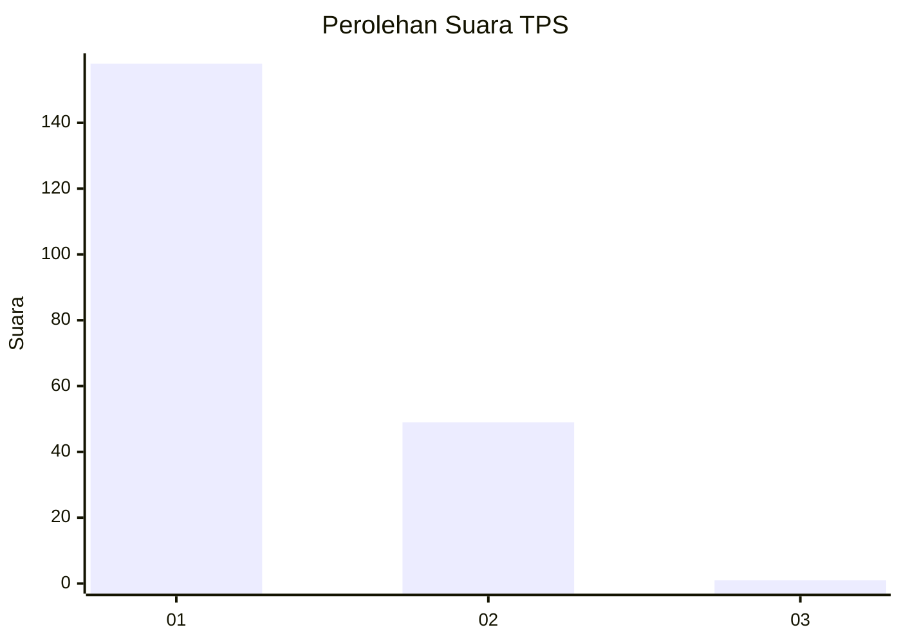
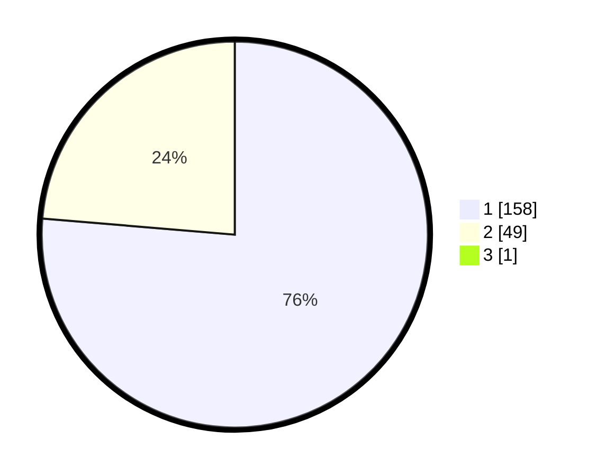

# Hasil

## Grafik

## Tabel

| No. | Nama Paslon    | Suara | Suara (raw) | Persentase |
|:--- |:-------------- | -----:| -----------:| ----------:|
| 1   | ANIES MUHAIMIN | 158   | [158][p-1]  | 75,96      |
| 2   | PRABOWO GIBRAN | 49    | [49][p-2]   | 23,56      |
| 3   | GANJAR MAHFUD  | 1     | [1][p-3]    | 0,48       |

[p-1]: https://github.com/gigit-pemilu/pemilu-2024-12-sumatera-utara/blob/main/pilpres/hitung-suara/sub/12-sumatera-utara/sub/71-kota-medan/sub/10-medan-area/sub/1008-kota-matsum-iv/sub/007-tps/sub/paslon-1.txt
[p-2]: https://github.com/gigit-pemilu/pemilu-2024-12-sumatera-utara/blob/main/pilpres/hitung-suara/sub/12-sumatera-utara/sub/71-kota-medan/sub/10-medan-area/sub/1008-kota-matsum-iv/sub/007-tps/sub/paslon-2.txt
[p-3]: https://github.com/gigit-pemilu/pemilu-2024-12-sumatera-utara/blob/main/pilpres/hitung-suara/sub/12-sumatera-utara/sub/71-kota-medan/sub/10-medan-area/sub/1008-kota-matsum-iv/sub/007-tps/sub/paslon-3.txt

## Foto C Plano

https://sirekap-obj-formc.kpu.go.id/a362/pemilu/ppwp/12/71/10/10/08/1271101008007-20240215-012855--5fe02691-29b4-4297-8bd4-a383cf1c8771.jpg

https://sirekap-obj-formc.kpu.go.id/a362/pemilu/ppwp/12/71/10/10/08/1271101008007-20240215-013007--fb5b3cc1-bc3c-4197-a364-2d0d6bbdd8e9.jpg

https://sirekap-obj-formc.kpu.go.id/a362/pemilu/ppwp/12/71/10/10/08/1271101008007-20240215-013125--3095b0dd-ff91-4df3-a389-f0fe44c1bf3e.jpg

## Metadata

| Key        | Value               |
| ---------- | ------------------- |
| Time Stamp | 2024-02-25 13:00:00 |

