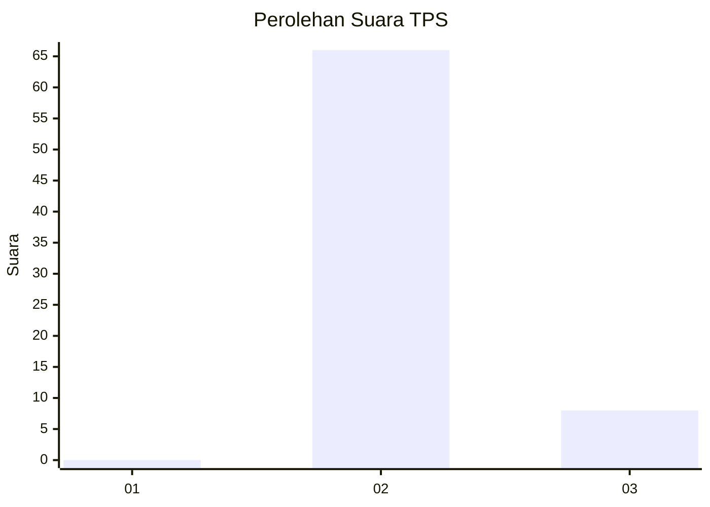
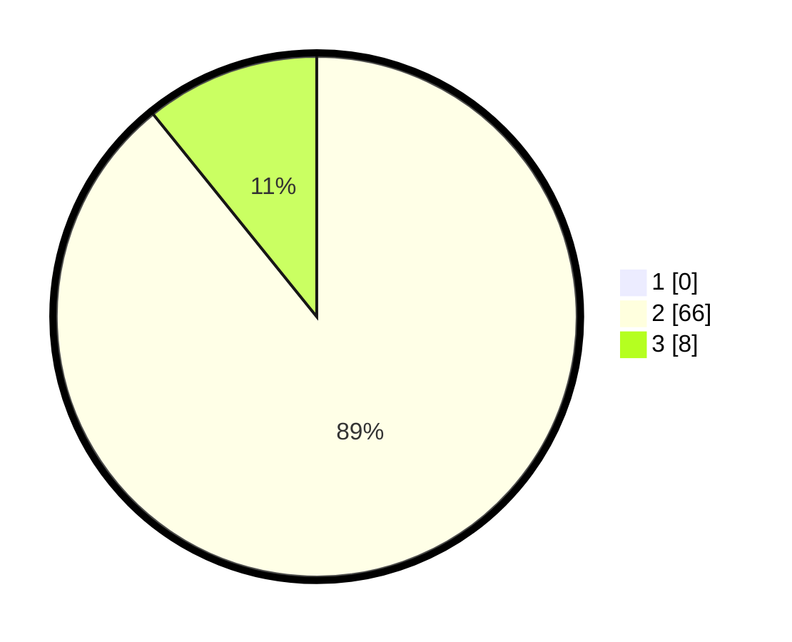

# Hasil

## Grafik

## Tabel

| No. | Nama Paslon    | Suara | Suara (raw) | Persentase |
|:--- |:-------------- | -----:| -----------:| ----------:|
| 1   | ANIES MUHAIMIN | 0     | [0][p-1]    | 0,00       |
| 2   | PRABOWO GIBRAN | 66    | [66][p-2]   | 89,19      |
| 3   | GANJAR MAHFUD  | 8     | [8][p-3]    | 10,81      |

[p-1]: https://github.com/gigit-pemilu/pemilu-2024-12-sumatera-utara/blob/main/pilpres/hitung-suara/sub/12-sumatera-utara/sub/71-kota-medan/sub/10-medan-area/sub/1008-kota-matsum-iv/sub/008-tps/sub/paslon-1.txt
[p-2]: https://github.com/gigit-pemilu/pemilu-2024-12-sumatera-utara/blob/main/pilpres/hitung-suara/sub/12-sumatera-utara/sub/71-kota-medan/sub/10-medan-area/sub/1008-kota-matsum-iv/sub/008-tps/sub/paslon-2.txt
[p-3]: https://github.com/gigit-pemilu/pemilu-2024-12-sumatera-utara/blob/main/pilpres/hitung-suara/sub/12-sumatera-utara/sub/71-kota-medan/sub/10-medan-area/sub/1008-kota-matsum-iv/sub/008-tps/sub/paslon-3.txt

## Foto C Plano

https://sirekap-obj-formc.kpu.go.id/4879/pemilu/ppwp/12/71/10/10/08/1271101008008-20240215-003836--a9d695a3-9447-4ef3-a8cc-f163c7bcf802.jpg

https://sirekap-obj-formc.kpu.go.id/4879/pemilu/ppwp/12/71/10/10/08/1271101008008-20240215-003823--91ea66fa-0b67-4681-8df9-719aa5ec6af9.jpg

https://sirekap-obj-formc.kpu.go.id/4879/pemilu/ppwp/12/71/10/10/08/1271101008008-20240215-003957--1b221788-edf7-4a90-8ebf-509dfc6f954d.jpg

## Metadata

| Key        | Value               |
| ---------- | ------------------- |
| Time Stamp | 2024-02-25 12:00:00 |

