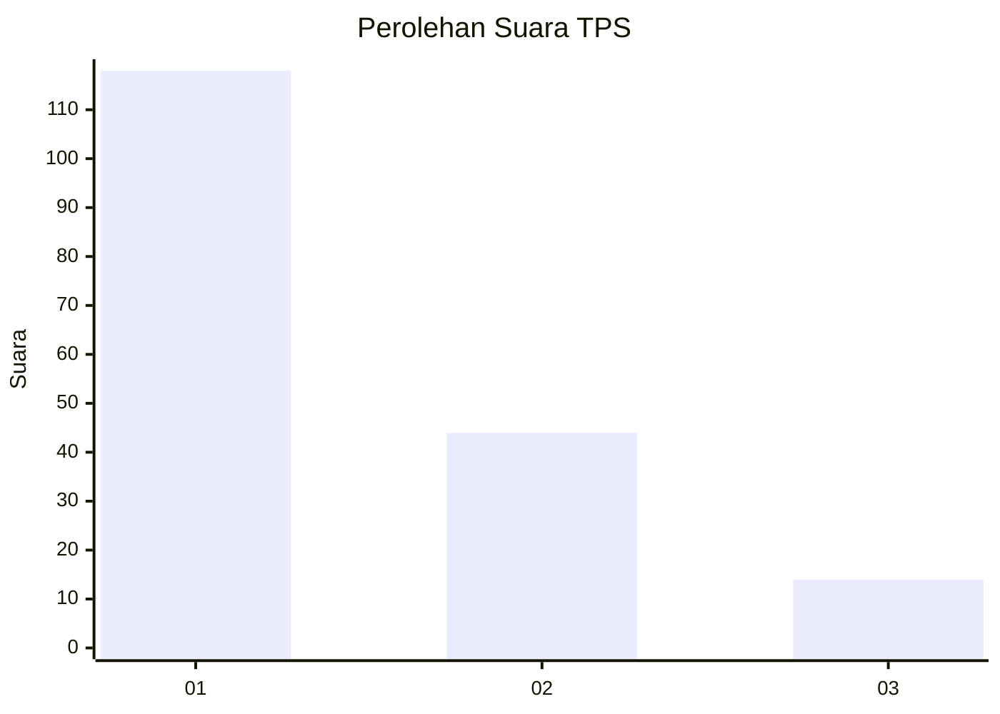
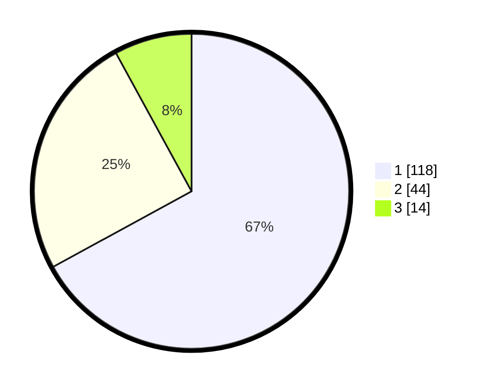

# Hasil

## Grafik

## Tabel

| No. | Nama Paslon    | Suara | Suara (raw) | Persentase |
|:--- |:-------------- | -----:| -----------:| ----------:|
| 1   | ANIES MUHAIMIN | 118   | [118][p-1]  | 67,05      |
| 2   | PRABOWO GIBRAN | 44    | [44][p-2]   | 25,00      |
| 3   | GANJAR MAHFUD  | 14    | [14][p-3]   | 7,95       |

[p-1]: https://github.com/gigit-pemilu/pemilu-2024/blob/main/pilpres/hitung-suara/sub/12-sumatera-utara/sub/71-kota-medan/sub/10-medan-area/sub/1008-kota-matsum-iv/sub/014-tps/sub/paslon-1.txt
[p-2]: https://github.com/gigit-pemilu/pemilu-2024/blob/main/pilpres/hitung-suara/sub/12-sumatera-utara/sub/71-kota-medan/sub/10-medan-area/sub/1008-kota-matsum-iv/sub/014-tps/sub/paslon-2.txt
[p-3]: https://github.com/gigit-pemilu/pemilu-2024/blob/main/pilpres/hitung-suara/sub/12-sumatera-utara/sub/71-kota-medan/sub/10-medan-area/sub/1008-kota-matsum-iv/sub/014-tps/sub/paslon-3.txt

## Foto C Plano

https://sirekap-obj-formc.kpu.go.id/cbf6/pemilu/ppwp/12/71/10/10/08/1271101008014-20240215-063548--c4665104-05fe-4850-8b53-f4ab06756422.jpg

https://sirekap-obj-formc.kpu.go.id/cbf6/pemilu/ppwp/12/71/10/10/08/1271101008014-20240220-211329--1c6d50f8-328f-4eff-9e54-c07bb0927365.jpg

https://sirekap-obj-formc.kpu.go.id/cbf6/pemilu/ppwp/12/71/10/10/08/1271101008014-20240215-063229--bd3261d2-5f69-479b-bd05-6bec996ae9a9.jpg

## Metadata

| Key        | Value               |
| ---------- | ------------------- |
| Time Stamp | 2024-02-25 21:00:00 |

