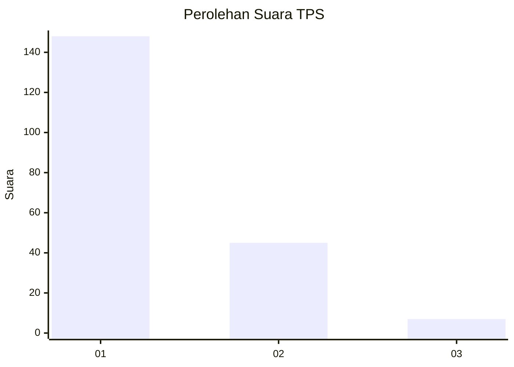
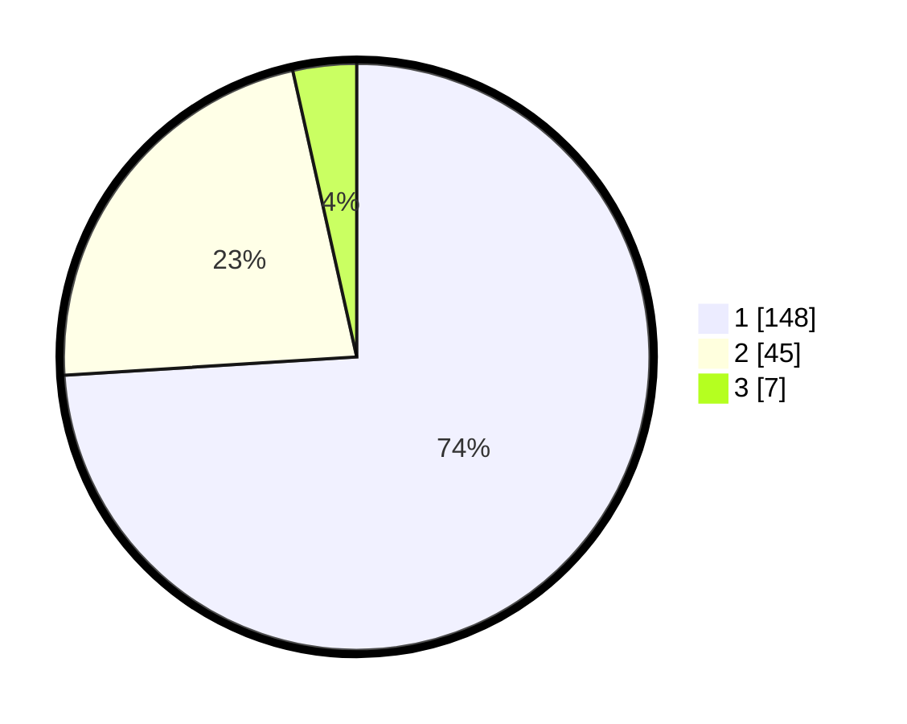

# Hasil

## Grafik

## Tabel

| No. | Nama Paslon    | Suara | Suara (raw) | Persentase |
|:--- |:-------------- | -----:| -----------:| ----------:|
| 1   | ANIES MUHAIMIN | 148   | [148][p-1]  | 74,00      |
| 2   | PRABOWO GIBRAN | 45    | [45][p-2]   | 22,50      |
| 3   | GANJAR MAHFUD  | 7     | [7][p-3]    | 3,50       |

[p-1]: https://github.com/gigit-pemilu/pemilu-2024/blob/main/pilpres/hitung-suara/sub/12-sumatera-utara/sub/71-kota-medan/sub/10-medan-area/sub/1008-kota-matsum-iv/sub/024-tps/sub/paslon-1.txt
[p-2]: https://github.com/gigit-pemilu/pemilu-2024/blob/main/pilpres/hitung-suara/sub/12-sumatera-utara/sub/71-kota-medan/sub/10-medan-area/sub/1008-kota-matsum-iv/sub/024-tps/sub/paslon-2.txt
[p-3]: https://github.com/gigit-pemilu/pemilu-2024/blob/main/pilpres/hitung-suara/sub/12-sumatera-utara/sub/71-kota-medan/sub/10-medan-area/sub/1008-kota-matsum-iv/sub/024-tps/sub/paslon-3.txt

## Foto C Plano

https://sirekap-obj-formc.kpu.go.id/a5e1/pemilu/ppwp/12/71/10/10/08/1271101008024-20240215-004543--7c1a05be-4a42-4f52-a89f-0c159b26ec44.jpg

https://sirekap-obj-formc.kpu.go.id/a5e1/pemilu/ppwp/12/71/10/10/08/1271101008024-20240215-005006--5981b86d-1b95-4cde-860c-d41a8719af6e.jpg

https://sirekap-obj-formc.kpu.go.id/a5e1/pemilu/ppwp/12/71/10/10/08/1271101008024-20240215-004736--db9d17bd-18b9-48e1-8fa3-c8f28f7800ce.jpg

## Metadata

| Key        | Value               |
| ---------- | ------------------- |
| Time Stamp | 2024-02-25 22:00:00 |

