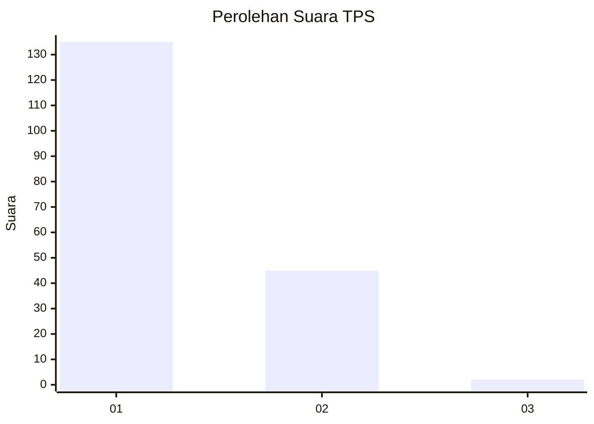
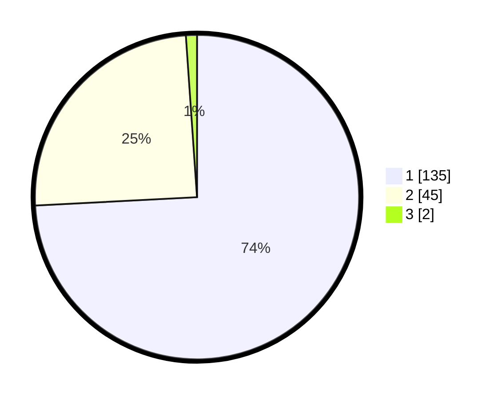

# Hasil

## Grafik

## Tabel

| No. | Nama Paslon    | Suara | Suara (raw) | Persentase |
|:--- |:-------------- | -----:| -----------:| ----------:|
| 1   | ANIES MUHAIMIN | 135   | [135][p-1]  | 74,18      |
| 2   | PRABOWO GIBRAN | 45    | [45][p-2]   | 24,73      |
| 3   | GANJAR MAHFUD  | 2     | [2][p-3]    | 1,10       |

[p-1]: https://github.com/gigit-pemilu/pemilu-2024-12-sumatera-utara/blob/main/pilpres/hitung-suara/sub/12-sumatera-utara/sub/71-kota-medan/sub/10-medan-area/sub/1008-kota-matsum-iv/sub/027-tps/sub/paslon-1.txt
[p-2]: https://github.com/gigit-pemilu/pemilu-2024-12-sumatera-utara/blob/main/pilpres/hitung-suara/sub/12-sumatera-utara/sub/71-kota-medan/sub/10-medan-area/sub/1008-kota-matsum-iv/sub/027-tps/sub/paslon-2.txt
[p-3]: https://github.com/gigit-pemilu/pemilu-2024-12-sumatera-utara/blob/main/pilpres/hitung-suara/sub/12-sumatera-utara/sub/71-kota-medan/sub/10-medan-area/sub/1008-kota-matsum-iv/sub/027-tps/sub/paslon-3.txt

## Foto C Plano

https://sirekap-obj-formc.kpu.go.id/5f6d/pemilu/ppwp/12/71/10/10/08/1271101008027-20240214-202952--d7d2392b-037c-4f83-ae01-35ac063bebe0.jpg

https://sirekap-obj-formc.kpu.go.id/5f6d/pemilu/ppwp/12/71/10/10/08/1271101008027-20240218-113038--f301acb1-1636-4b5f-b056-d82b9ab03ecc.jpg

https://sirekap-obj-formc.kpu.go.id/5f6d/pemilu/ppwp/12/71/10/10/08/1271101008027-20240218-113138--48191517-f1b5-495b-9a02-3f87a7814af9.jpg

## Metadata

| Key        | Value               |
| ---------- | ------------------- |
| Time Stamp | 2024-02-24 22:31:28 |

