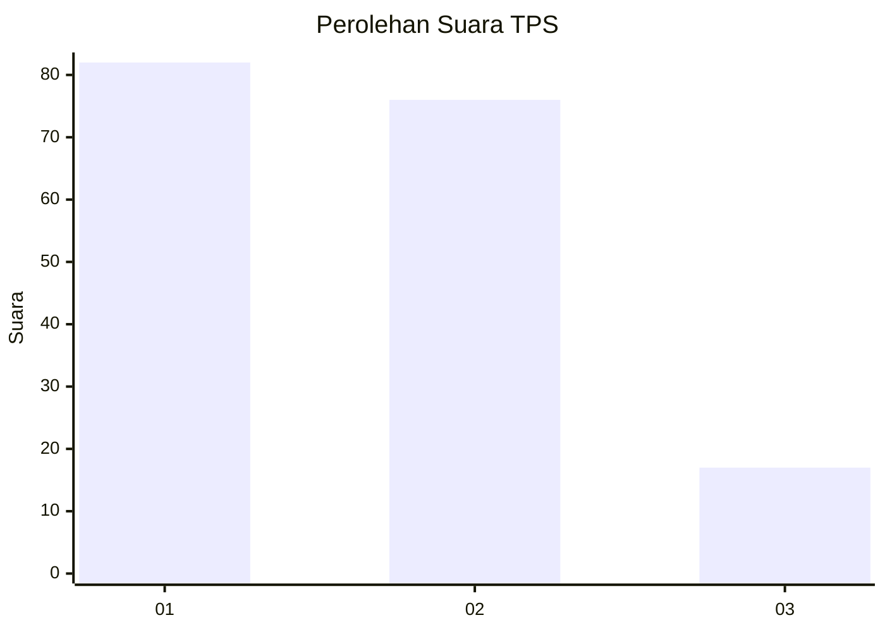
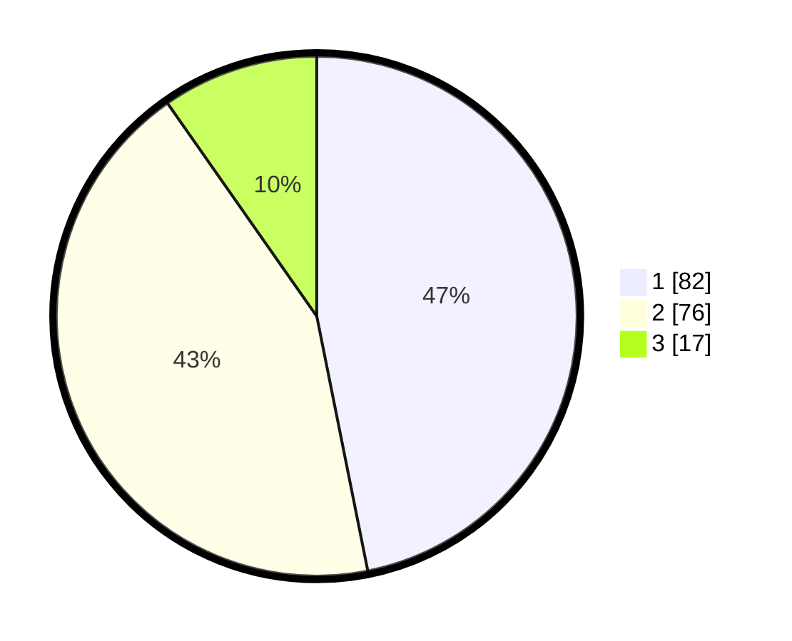

# Hasil

## Grafik

## Tabel

| No. | Nama Paslon    | Suara | Suara (raw) | Persentase |
|:--- |:-------------- | -----:| -----------:| ----------:|
| 1   | ANIES MUHAIMIN | 82    | [82][p-1]   | 46,86      |
| 2   | PRABOWO GIBRAN | 76    | [76][p-2]   | 43,43      |
| 3   | GANJAR MAHFUD  | 17    | [17][p-3]   | 9,71       |

[p-1]: https://github.com/gigit-pemilu/pemilu-2024-12-sumatera-utara/blob/main/pilpres/hitung-suara/sub/12-sumatera-utara/sub/71-kota-medan/sub/10-medan-area/sub/1009-pasar-merah-timur/sub/007-tps/sub/paslon-1.txt
[p-2]: https://github.com/gigit-pemilu/pemilu-2024-12-sumatera-utara/blob/main/pilpres/hitung-suara/sub/12-sumatera-utara/sub/71-kota-medan/sub/10-medan-area/sub/1009-pasar-merah-timur/sub/007-tps/sub/paslon-2.txt
[p-3]: https://github.com/gigit-pemilu/pemilu-2024-12-sumatera-utara/blob/main/pilpres/hitung-suara/sub/12-sumatera-utara/sub/71-kota-medan/sub/10-medan-area/sub/1009-pasar-merah-timur/sub/007-tps/sub/paslon-3.txt

## Foto C Plano

https://sirekap-obj-formc.kpu.go.id/1fc2/pemilu/ppwp/12/71/10/10/09/1271101009007-20240214-220617--b11d33e6-e87d-4348-a957-3f8afe9eb595.jpg

https://sirekap-obj-formc.kpu.go.id/1fc2/pemilu/ppwp/12/71/10/10/09/1271101009007-20240214-220648--cc0d44b4-9f6b-4014-bb9a-d9793c9a4eab.jpg

https://sirekap-obj-formc.kpu.go.id/1fc2/pemilu/ppwp/12/71/10/10/09/1271101009007-20240214-220717--a5d5ed09-ed2b-4a9a-b72f-b9803d9c7772.jpg

## Metadata

| Key        | Value               |
| ---------- | ------------------- |
| Time Stamp | 2024-02-25 15:00:00 |

