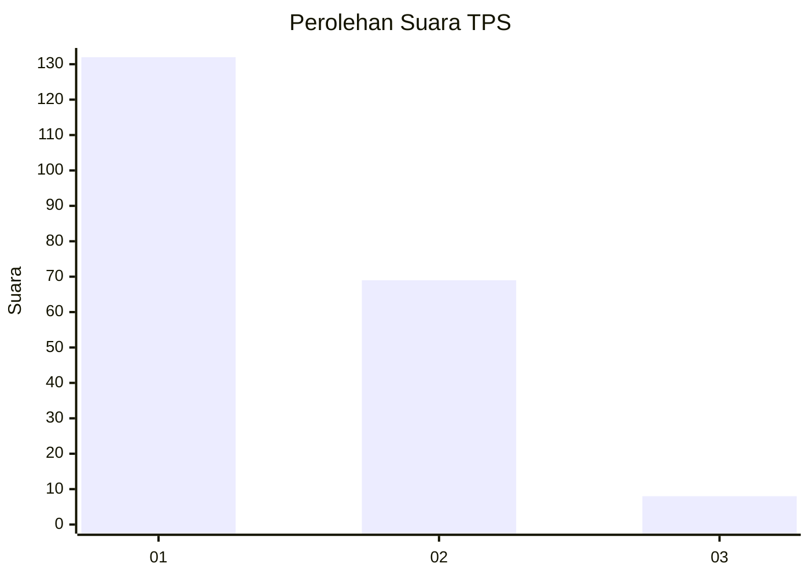
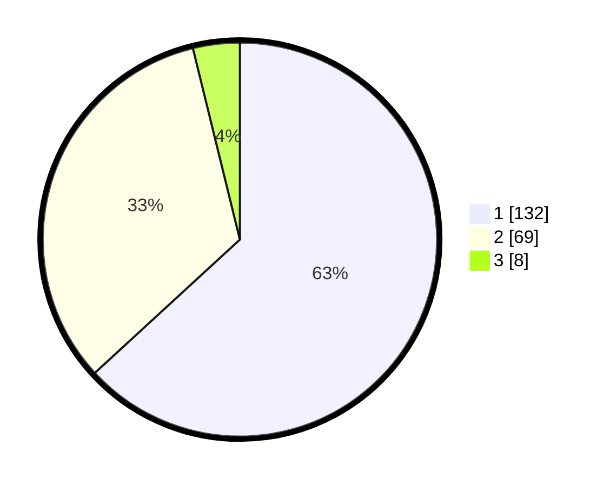

# Hasil

## Grafik

## Tabel

| No. | Nama Paslon    | Suara | Suara (raw) | Persentase |
|:--- |:-------------- | -----:| -----------:| ----------:|
| 1   | ANIES MUHAIMIN | 132   | [132][p-1]  | 63,16      |
| 2   | PRABOWO GIBRAN | 69    | [69][p-2]   | 33,01      |
| 3   | GANJAR MAHFUD  | 8     | [8][p-3]    | 3,83       |

[p-1]: https://github.com/gigit-pemilu/pemilu-2024-12-sumatera-utara/blob/main/pilpres/hitung-suara/sub/12-sumatera-utara/sub/71-kota-medan/sub/10-medan-area/sub/1009-pasar-merah-timur/sub/025-tps/sub/paslon-1.txt
[p-2]: https://github.com/gigit-pemilu/pemilu-2024-12-sumatera-utara/blob/main/pilpres/hitung-suara/sub/12-sumatera-utara/sub/71-kota-medan/sub/10-medan-area/sub/1009-pasar-merah-timur/sub/025-tps/sub/paslon-2.txt
[p-3]: https://github.com/gigit-pemilu/pemilu-2024-12-sumatera-utara/blob/main/pilpres/hitung-suara/sub/12-sumatera-utara/sub/71-kota-medan/sub/10-medan-area/sub/1009-pasar-merah-timur/sub/025-tps/sub/paslon-3.txt

## Foto C Plano

https://sirekap-obj-formc.kpu.go.id/ab50/pemilu/ppwp/12/71/10/10/09/1271101009025-20240215-031750--1035aaf7-7a4c-44d8-be0c-360803786451.jpg

https://sirekap-obj-formc.kpu.go.id/ab50/pemilu/ppwp/12/71/10/10/09/1271101009025-20240215-032024--2b1b2a3e-3306-490f-a925-74935c3073dc.jpg

https://sirekap-obj-formc.kpu.go.id/ab50/pemilu/ppwp/12/71/10/10/09/1271101009025-20240215-032241--8262612f-c832-4fd0-8c69-50f5395faf82.jpg

## Metadata

| Key        | Value               |
| ---------- | ------------------- |
| Time Stamp | 2024-02-25 12:00:00 |

