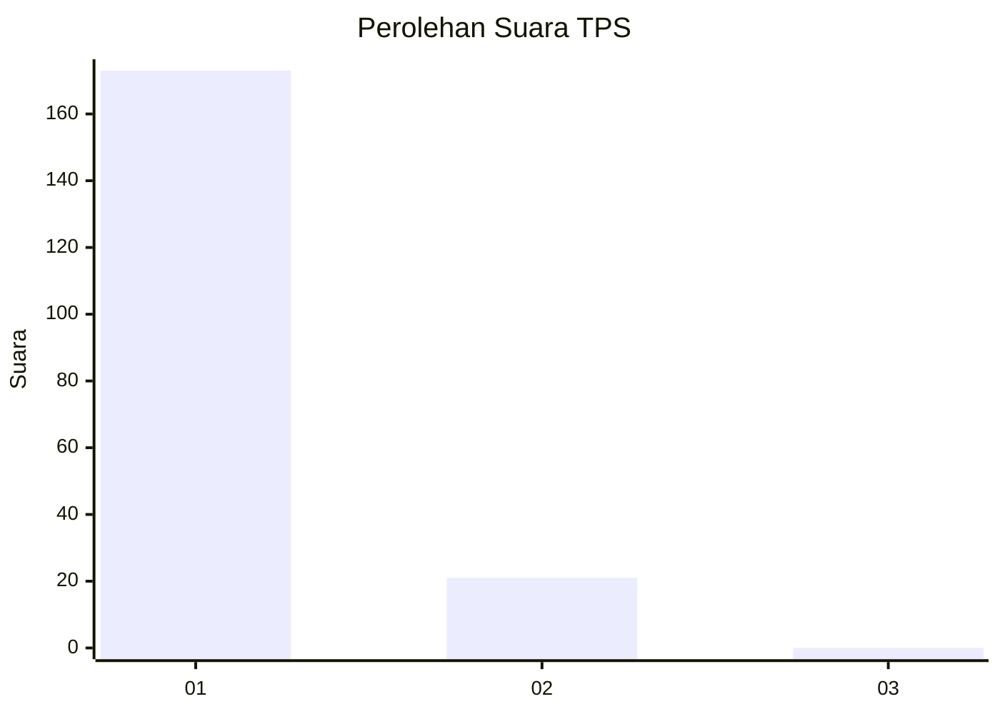
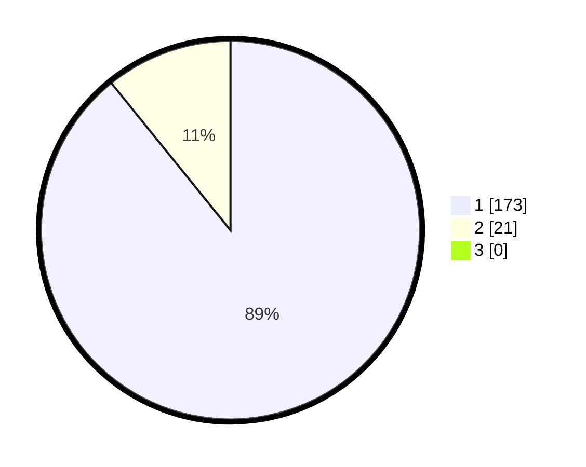

# Hasil

## Grafik

## Tabel

| No. | Nama Paslon    | Suara | Suara (raw) | Persentase |
|:--- |:-------------- | -----:| -----------:| ----------:|
| 1   | ANIES MUHAIMIN | 173   | [173][p-1]  | 89,18      |
| 2   | PRABOWO GIBRAN | 21    | [21][p-2]   | 10,82      |
| 3   | GANJAR MAHFUD  | 0     | [0][p-3]    | 0,00       |

[p-1]: https://github.com/gigit-pemilu/pemilu-2024-12-sumatera-utara/blob/main/pilpres/hitung-suara/sub/12-sumatera-utara/sub/71-kota-medan/sub/10-medan-area/sub/1010-tegal-sari-i/sub/017-tps/sub/paslon-1.txt
[p-2]: https://github.com/gigit-pemilu/pemilu-2024-12-sumatera-utara/blob/main/pilpres/hitung-suara/sub/12-sumatera-utara/sub/71-kota-medan/sub/10-medan-area/sub/1010-tegal-sari-i/sub/017-tps/sub/paslon-2.txt
[p-3]: https://github.com/gigit-pemilu/pemilu-2024-12-sumatera-utara/blob/main/pilpres/hitung-suara/sub/12-sumatera-utara/sub/71-kota-medan/sub/10-medan-area/sub/1010-tegal-sari-i/sub/017-tps/sub/paslon-3.txt

## Foto C Plano

https://sirekap-obj-formc.kpu.go.id/eaf3/pemilu/ppwp/12/71/10/10/10/1271101010017-20240215-015645--f44ec8f4-35b3-42d9-b910-d03d5b94b027.jpg

https://sirekap-obj-formc.kpu.go.id/eaf3/pemilu/ppwp/12/71/10/10/10/1271101010017-20240215-015816--69d82ef9-c38e-4aff-b47e-3dabed54790d.jpg

https://sirekap-obj-formc.kpu.go.id/eaf3/pemilu/ppwp/12/71/10/10/10/1271101010017-20240215-021851--f41b30c0-4242-4221-8f9b-9cc32a195a49.jpg

## Metadata

| Key        | Value               |
| ---------- | ------------------- |
| Time Stamp | 2024-02-24 22:31:28 |

