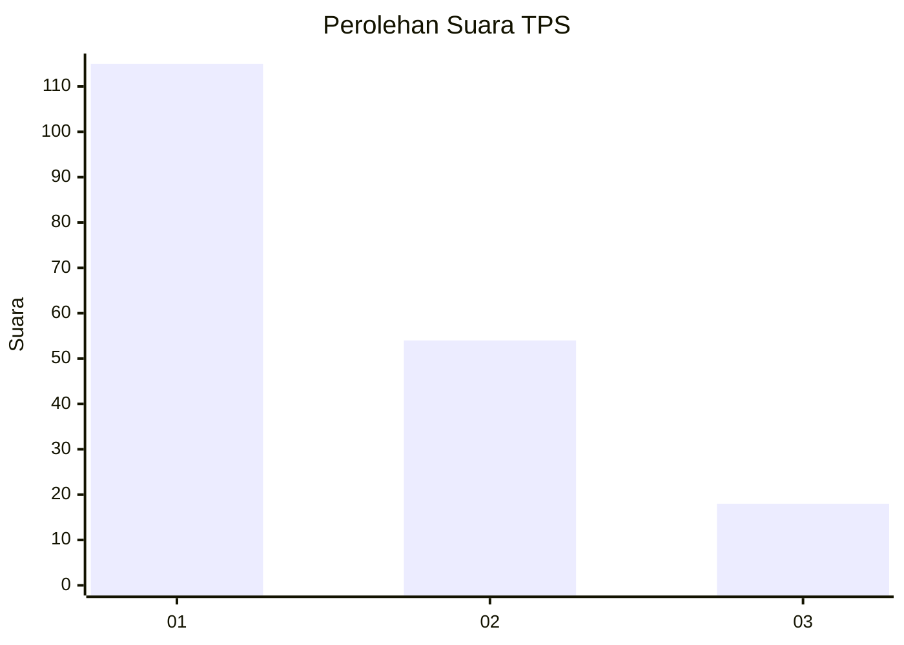
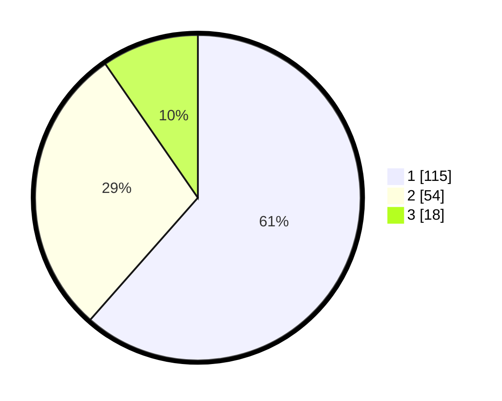

# Hasil

## Grafik

## Tabel

| No. | Nama Paslon    | Suara | Suara (raw) | Persentase |
|:--- |:-------------- | -----:| -----------:| ----------:|
| 1   | ANIES MUHAIMIN | 115   | [115][p-1]  | 61,50      |
| 2   | PRABOWO GIBRAN | 54    | [54][p-2]   | 28,88      |
| 3   | GANJAR MAHFUD  | 18    | [18][p-3]   | 9,63       |

[p-1]: https://github.com/gigit-pemilu/pemilu-2024/blob/main/pilpres/hitung-suara/sub/12-sumatera-utara/sub/71-kota-medan/sub/10-medan-area/sub/1010-tegal-sari-i/sub/019-tps/sub/paslon-1.txt
[p-2]: https://github.com/gigit-pemilu/pemilu-2024/blob/main/pilpres/hitung-suara/sub/12-sumatera-utara/sub/71-kota-medan/sub/10-medan-area/sub/1010-tegal-sari-i/sub/019-tps/sub/paslon-2.txt
[p-3]: https://github.com/gigit-pemilu/pemilu-2024/blob/main/pilpres/hitung-suara/sub/12-sumatera-utara/sub/71-kota-medan/sub/10-medan-area/sub/1010-tegal-sari-i/sub/019-tps/sub/paslon-3.txt

## Foto C Plano

https://sirekap-obj-formc.kpu.go.id/efaa/pemilu/ppwp/12/71/10/10/10/1271101010019-20240215-010242--b5ef1531-2ddc-4a23-aa1d-301110a860b6.jpg

https://sirekap-obj-formc.kpu.go.id/efaa/pemilu/ppwp/12/71/10/10/10/1271101010019-20240215-010345--1c12ade0-cd1f-4899-a6bc-76ac8ac6bd81.jpg

https://sirekap-obj-formc.kpu.go.id/efaa/pemilu/ppwp/12/71/10/10/10/1271101010019-20240215-010424--e9820a64-76ca-4d89-a089-bd634e0500ac.jpg

## Metadata

| Key        | Value               |
| ---------- | ------------------- |
| Time Stamp | 2024-02-25 19:00:00 |

