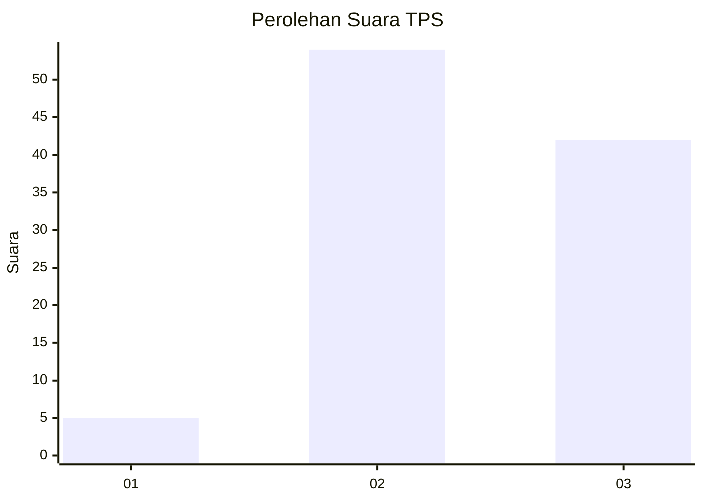
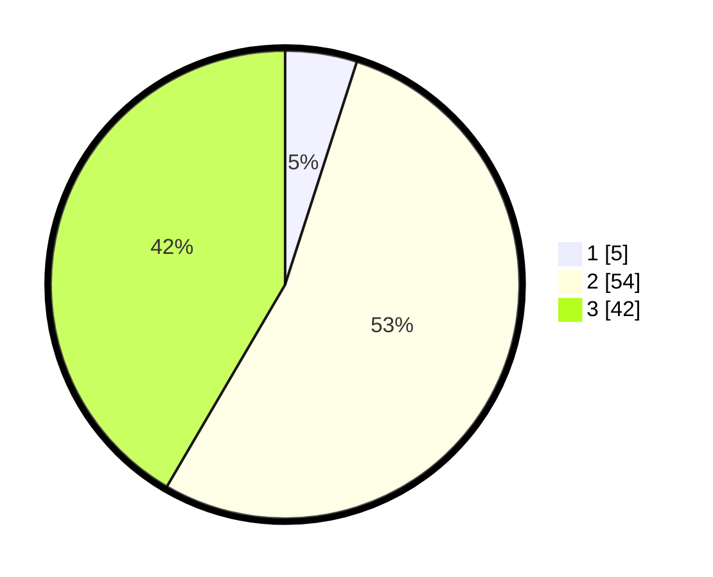

# Hasil

## Grafik

## Tabel

| No. | Nama Paslon    | Suara | Suara (raw) | Persentase |
|:--- |:-------------- | -----:| -----------:| ----------:|
| 1   | ANIES MUHAIMIN | 5     | [5][p-1]    | 4,95       |
| 2   | PRABOWO GIBRAN | 54    | [54][p-2]   | 53,47      |
| 3   | GANJAR MAHFUD  | 42    | [42][p-3]   | 41,58      |

[p-1]: https://github.com/gigit-pemilu/pemilu-2024-12-sumatera-utara/blob/main/pilpres/hitung-suara/sub/12-sumatera-utara/sub/71-kota-medan/sub/10-medan-area/sub/1010-tegal-sari-i/sub/026-tps/sub/paslon-1.txt
[p-2]: https://github.com/gigit-pemilu/pemilu-2024-12-sumatera-utara/blob/main/pilpres/hitung-suara/sub/12-sumatera-utara/sub/71-kota-medan/sub/10-medan-area/sub/1010-tegal-sari-i/sub/026-tps/sub/paslon-2.txt
[p-3]: https://github.com/gigit-pemilu/pemilu-2024-12-sumatera-utara/blob/main/pilpres/hitung-suara/sub/12-sumatera-utara/sub/71-kota-medan/sub/10-medan-area/sub/1010-tegal-sari-i/sub/026-tps/sub/paslon-3.txt

## Foto C Plano

https://sirekap-obj-formc.kpu.go.id/dca2/pemilu/ppwp/12/71/10/10/10/1271101010026-20240214-205512--35e9e21b-d477-4844-983e-d9e5829af940.jpg

https://sirekap-obj-formc.kpu.go.id/dca2/pemilu/ppwp/12/71/10/10/10/1271101010026-20240214-205620--24ca0226-2464-4b5c-8148-b6d224aaa945.jpg

https://sirekap-obj-formc.kpu.go.id/dca2/pemilu/ppwp/12/71/10/10/10/1271101010026-20240214-205720--689d2e67-6530-4bcd-819a-fa4f82088758.jpg

## Metadata

| Key        | Value               |
| ---------- | ------------------- |
| Time Stamp | 2024-02-24 22:31:28 |

