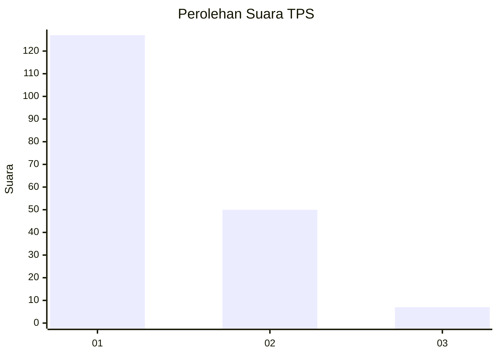
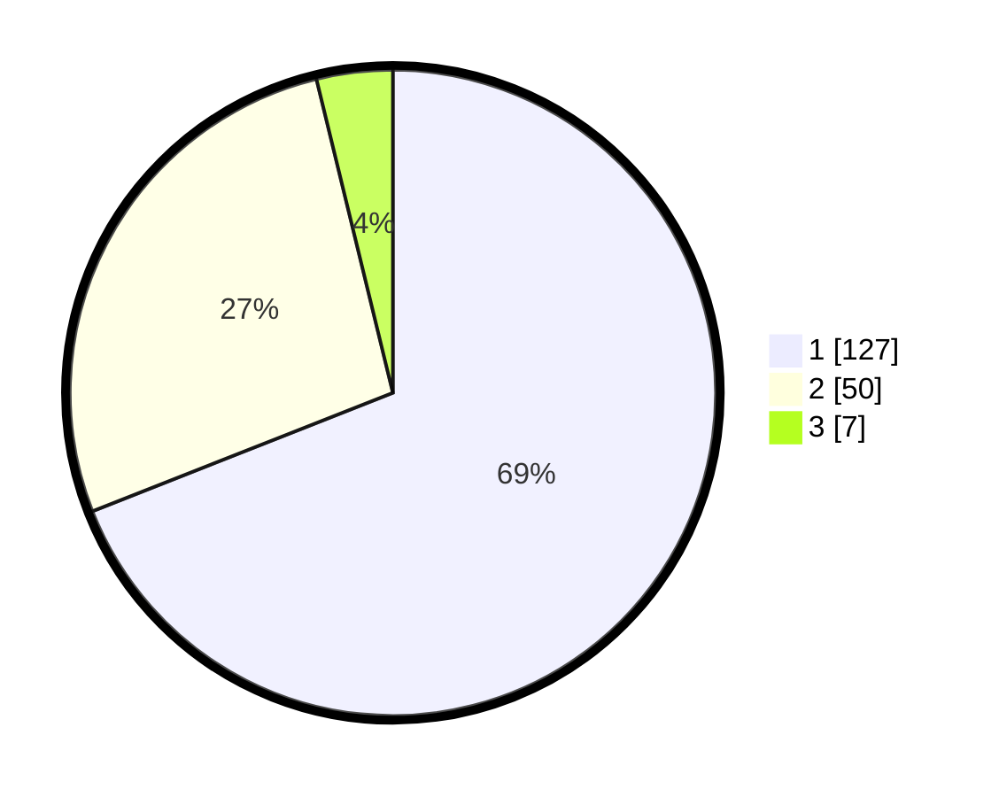

# Hasil

## Grafik

## Tabel

| No. | Nama Paslon    | Suara | Suara (raw) | Persentase |
|:--- |:-------------- | -----:| -----------:| ----------:|
| 1   | ANIES MUHAIMIN | 127   | [127][p-1]  | 69,02      |
| 2   | PRABOWO GIBRAN | 50    | [50][p-2]   | 27,17      |
| 3   | GANJAR MAHFUD  | 7     | [7][p-3]    | 3,80       |

[p-1]: https://github.com/gigit-pemilu/pemilu-2024-12-sumatera-utara/blob/main/pilpres/hitung-suara/sub/12-sumatera-utara/sub/71-kota-medan/sub/10-medan-area/sub/1011-tegal-sari-ii/sub/013-tps/sub/paslon-1.txt
[p-2]: https://github.com/gigit-pemilu/pemilu-2024-12-sumatera-utara/blob/main/pilpres/hitung-suara/sub/12-sumatera-utara/sub/71-kota-medan/sub/10-medan-area/sub/1011-tegal-sari-ii/sub/013-tps/sub/paslon-2.txt
[p-3]: https://github.com/gigit-pemilu/pemilu-2024-12-sumatera-utara/blob/main/pilpres/hitung-suara/sub/12-sumatera-utara/sub/71-kota-medan/sub/10-medan-area/sub/1011-tegal-sari-ii/sub/013-tps/sub/paslon-3.txt

## Foto C Plano

https://sirekap-obj-formc.kpu.go.id/e56e/pemilu/ppwp/12/71/10/10/11/1271101011013-20240215-030219--b28a20be-ab57-4c27-9284-e09fc36a8204.jpg

https://sirekap-obj-formc.kpu.go.id/e56e/pemilu/ppwp/12/71/10/10/11/1271101011013-20240215-030624--70584719-cf59-4cd5-bee4-0bf1cfb2dbc5.jpg

https://sirekap-obj-formc.kpu.go.id/e56e/pemilu/ppwp/12/71/10/10/11/1271101011013-20240215-030929--bfee73b0-4765-4930-b411-90b2875b6170.jpg

## Metadata

| Key        | Value               |
| ---------- | ------------------- |
| Time Stamp | 2024-02-25 12:00:00 |

