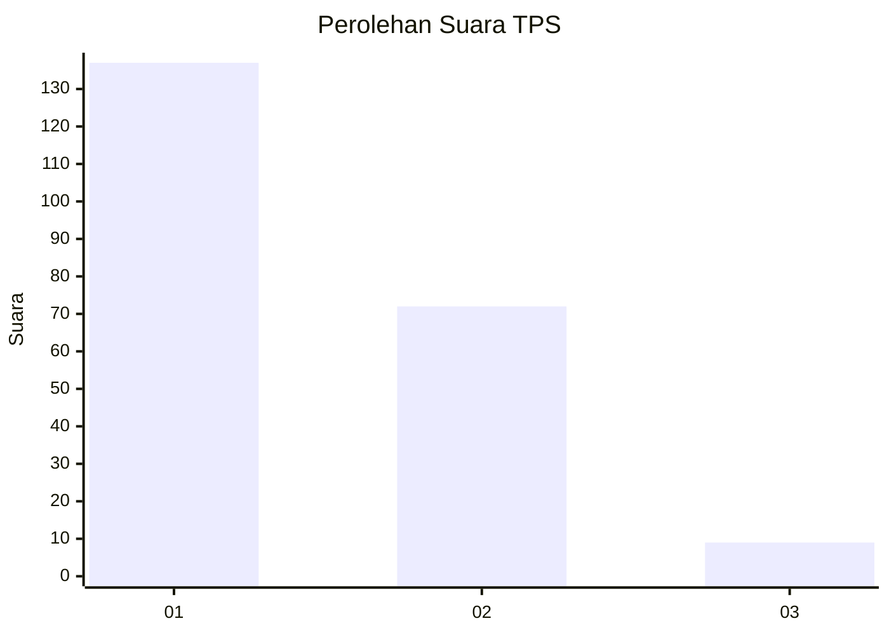
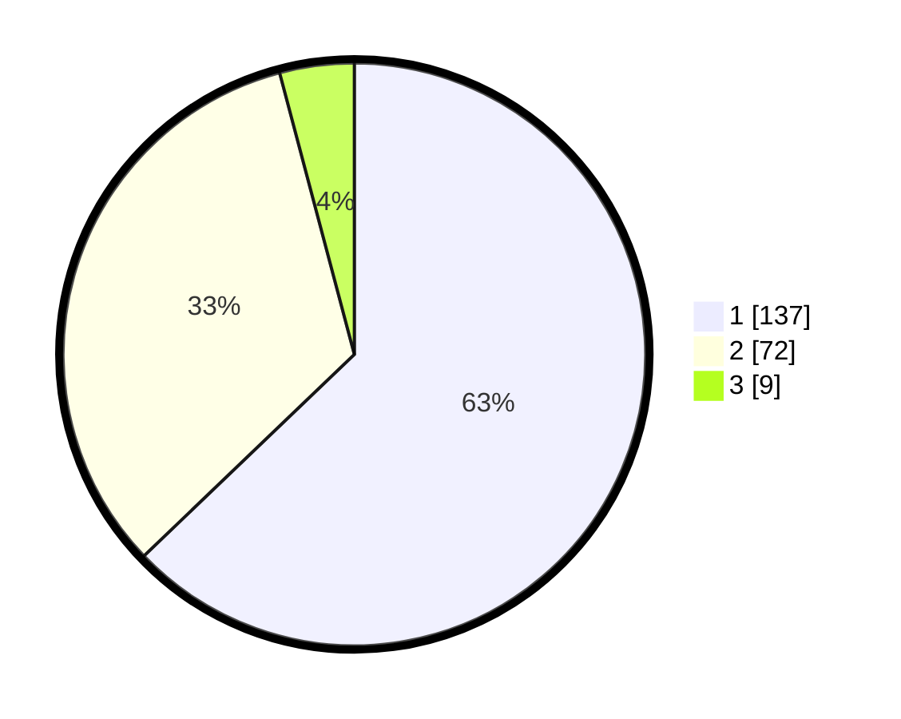

# Hasil

## Grafik

## Tabel

| No. | Nama Paslon    | Suara | Suara (raw) | Persentase |
|:--- |:-------------- | -----:| -----------:| ----------:|
| 1   | ANIES MUHAIMIN | 137   | [137][p-1]  | 62,84      |
| 2   | PRABOWO GIBRAN | 72    | [72][p-2]   | 33,03      |
| 3   | GANJAR MAHFUD  | 9     | [9][p-3]    | 4,13       |

[p-1]: https://github.com/gigit-pemilu/pemilu-2024/blob/main/pilpres/hitung-suara/sub/12-sumatera-utara/sub/71-kota-medan/sub/10-medan-area/sub/1012-tegal-sari-iii/sub/004-tps/sub/paslon-1.txt
[p-2]: https://github.com/gigit-pemilu/pemilu-2024/blob/main/pilpres/hitung-suara/sub/12-sumatera-utara/sub/71-kota-medan/sub/10-medan-area/sub/1012-tegal-sari-iii/sub/004-tps/sub/paslon-2.txt
[p-3]: https://github.com/gigit-pemilu/pemilu-2024/blob/main/pilpres/hitung-suara/sub/12-sumatera-utara/sub/71-kota-medan/sub/10-medan-area/sub/1012-tegal-sari-iii/sub/004-tps/sub/paslon-3.txt

## Foto C Plano

https://sirekap-obj-formc.kpu.go.id/ac47/pemilu/ppwp/12/71/10/10/12/1271101012004-20240214-193623--c10d8eb5-f4a9-492a-a8fc-5c07baef997b.jpg

https://sirekap-obj-formc.kpu.go.id/ac47/pemilu/ppwp/12/71/10/10/12/1271101012004-20240214-160125--ec7cb5c5-9281-46d8-b1ed-4ba870972c49.jpg

https://sirekap-obj-formc.kpu.go.id/ac47/pemilu/ppwp/12/71/10/10/12/1271101012004-20240214-160058--3d80e20a-00fe-4bfd-9e68-53dcfb611d7f.jpg

## Metadata

| Key        | Value               |
| ---------- | ------------------- |
| Time Stamp | 2024-02-25 23:00:00 |

