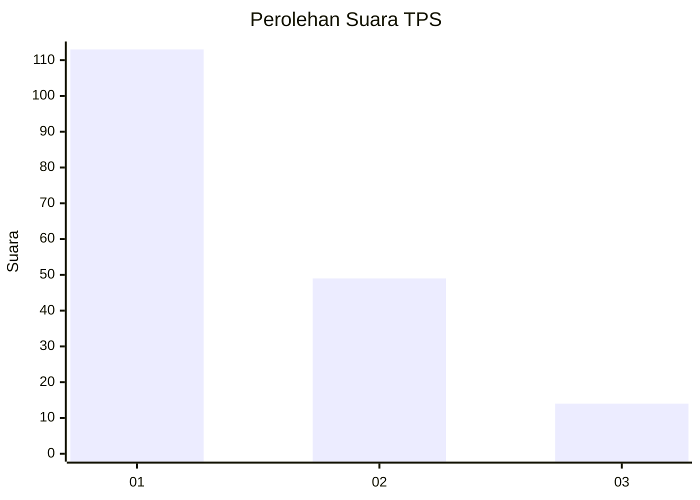
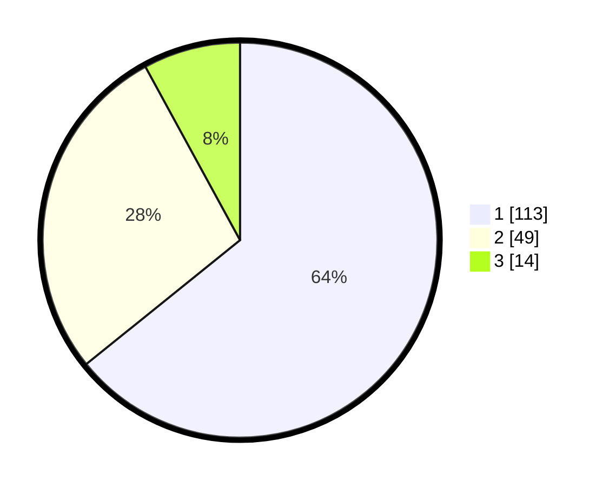

# Hasil

## Grafik

## Tabel

| No. | Nama Paslon    | Suara | Suara (raw) | Persentase |
|:--- |:-------------- | -----:| -----------:| ----------:|
| 1   | ANIES MUHAIMIN | 113   | [113][p-1]  | 64,20      |
| 2   | PRABOWO GIBRAN | 49    | [49][p-2]   | 27,84      |
| 3   | GANJAR MAHFUD  | 14    | [14][p-3]   | 7,95       |

[p-1]: https://github.com/gigit-pemilu/pemilu-2024-12-sumatera-utara/blob/main/pilpres/hitung-suara/sub/12-sumatera-utara/sub/71-kota-medan/sub/10-medan-area/sub/1012-tegal-sari-iii/sub/016-tps/sub/paslon-1.txt
[p-2]: https://github.com/gigit-pemilu/pemilu-2024-12-sumatera-utara/blob/main/pilpres/hitung-suara/sub/12-sumatera-utara/sub/71-kota-medan/sub/10-medan-area/sub/1012-tegal-sari-iii/sub/016-tps/sub/paslon-2.txt
[p-3]: https://github.com/gigit-pemilu/pemilu-2024-12-sumatera-utara/blob/main/pilpres/hitung-suara/sub/12-sumatera-utara/sub/71-kota-medan/sub/10-medan-area/sub/1012-tegal-sari-iii/sub/016-tps/sub/paslon-3.txt

## Foto C Plano

https://sirekap-obj-formc.kpu.go.id/52a8/pemilu/ppwp/12/71/10/10/12/1271101012016-20240214-213705--8ffbc462-73e2-4dfb-9e3a-fb2fa670c628.jpg

https://sirekap-obj-formc.kpu.go.id/52a8/pemilu/ppwp/12/71/10/10/12/1271101012016-20240214-213857--6c47d1a4-8e0e-414b-9660-6384fb255882.jpg

https://sirekap-obj-formc.kpu.go.id/52a8/pemilu/ppwp/12/71/10/10/12/1271101012016-20240214-213952--b97ca8d0-89d4-47ea-949c-3e18eb29b1a0.jpg

## Metadata

| Key        | Value               |
| ---------- | ------------------- |
| Time Stamp | 2024-02-25 16:00:00 |

