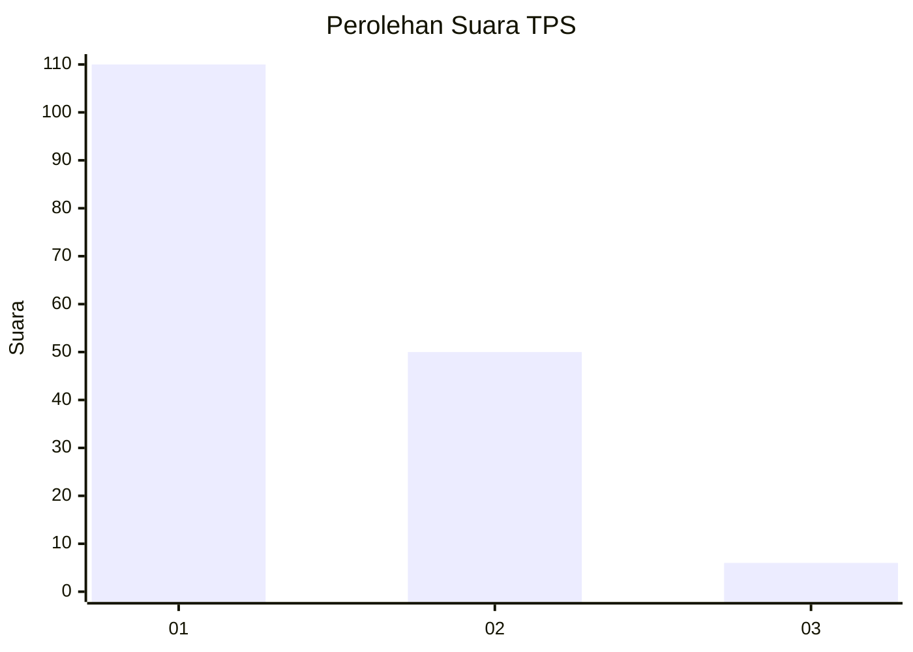
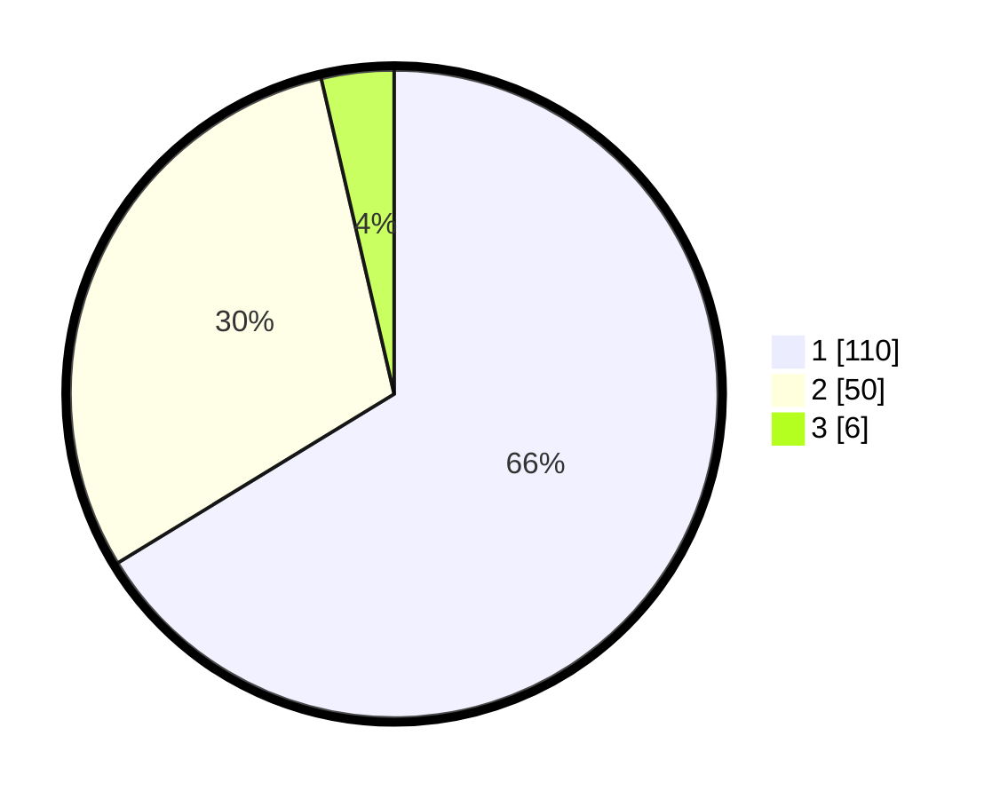

# Hasil

## Grafik

## Tabel

| No. | Nama Paslon    | Suara | Suara (raw) | Persentase |
|:--- |:-------------- | -----:| -----------:| ----------:|
| 1   | ANIES MUHAIMIN | 110   | [110][p-1]  | 66,27      |
| 2   | PRABOWO GIBRAN | 50    | [50][p-2]   | 30,12      |
| 3   | GANJAR MAHFUD  | 6     | [6][p-3]    | 3,61       |

[p-1]: https://github.com/gigit-pemilu/pemilu-2024/blob/main/pilpres/hitung-suara/sub/12-sumatera-utara/sub/71-kota-medan/sub/11-medan-johor/sub/1001-suka-maju/sub/004-tps/sub/paslon-1.txt
[p-2]: https://github.com/gigit-pemilu/pemilu-2024/blob/main/pilpres/hitung-suara/sub/12-sumatera-utara/sub/71-kota-medan/sub/11-medan-johor/sub/1001-suka-maju/sub/004-tps/sub/paslon-2.txt
[p-3]: https://github.com/gigit-pemilu/pemilu-2024/blob/main/pilpres/hitung-suara/sub/12-sumatera-utara/sub/71-kota-medan/sub/11-medan-johor/sub/1001-suka-maju/sub/004-tps/sub/paslon-3.txt

## Foto C Plano

https://sirekap-obj-formc.kpu.go.id/f6c2/pemilu/ppwp/12/71/11/10/01/1271111001004-20240214-155021--6afd1a77-a5be-4825-9dce-b5769df61b88.jpg

https://sirekap-obj-formc.kpu.go.id/f6c2/pemilu/ppwp/12/71/11/10/01/1271111001004-20240214-155121--d1ea3969-34d4-4534-95a3-eacb8cd0caf6.jpg

https://sirekap-obj-formc.kpu.go.id/f6c2/pemilu/ppwp/12/71/11/10/01/1271111001004-20240214-155219--99177a87-26ff-4f1d-9f8f-10e61663fdd4.jpg

## Metadata

| Key        | Value               |
| ---------- | ------------------- |
| Time Stamp | 2024-02-24 22:31:28 |

