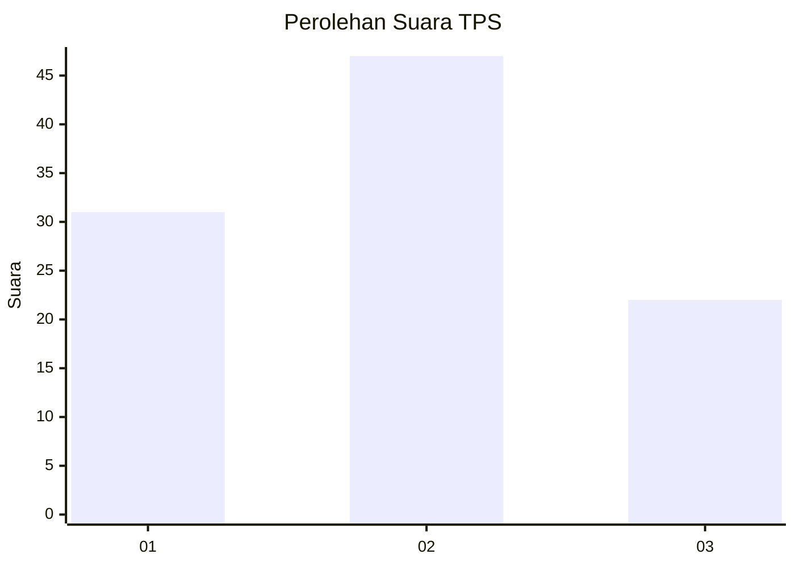
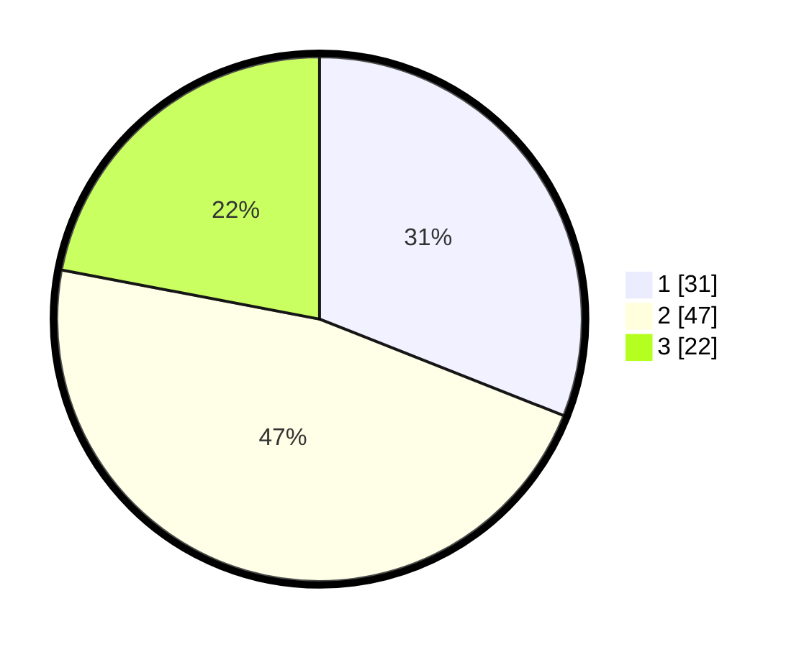

# Hasil

## Grafik

## Tabel

| No. | Nama Paslon    | Suara | Suara (raw) | Persentase |
|:--- |:-------------- | -----:| -----------:| ----------:|
| 1   | ANIES MUHAIMIN | 31    | [31][p-1]   | 31,00      |
| 2   | PRABOWO GIBRAN | 47    | [47][p-2]   | 47,00      |
| 3   | GANJAR MAHFUD  | 22    | [22][p-3]   | 22,00      |

[p-1]: https://github.com/gigit-pemilu/pemilu-2024-12-sumatera-utara/blob/main/pilpres/hitung-suara/sub/12-sumatera-utara/sub/71-kota-medan/sub/11-medan-johor/sub/1002-titi-kuning/sub/004-tps/sub/paslon-1.txt
[p-2]: https://github.com/gigit-pemilu/pemilu-2024-12-sumatera-utara/blob/main/pilpres/hitung-suara/sub/12-sumatera-utara/sub/71-kota-medan/sub/11-medan-johor/sub/1002-titi-kuning/sub/004-tps/sub/paslon-2.txt
[p-3]: https://github.com/gigit-pemilu/pemilu-2024-12-sumatera-utara/blob/main/pilpres/hitung-suara/sub/12-sumatera-utara/sub/71-kota-medan/sub/11-medan-johor/sub/1002-titi-kuning/sub/004-tps/sub/paslon-3.txt

## Foto C Plano

https://sirekap-obj-formc.kpu.go.id/7e65/pemilu/ppwp/12/71/11/10/02/1271111002004-20240214-212515--fab71485-cd2d-4596-9038-d328b00e89b1.jpg

https://sirekap-obj-formc.kpu.go.id/7e65/pemilu/ppwp/12/71/11/10/02/1271111002004-20240214-212755--e477cb57-652e-46f4-99fb-1c41fb3ba763.jpg

https://sirekap-obj-formc.kpu.go.id/7e65/pemilu/ppwp/12/71/11/10/02/1271111002004-20240214-212946--510fbfed-fbd9-4dff-a04f-7a303fc0dea2.jpg

## Metadata

| Key        | Value               |
| ---------- | ------------------- |
| Time Stamp | 2024-02-24 22:31:28 |

