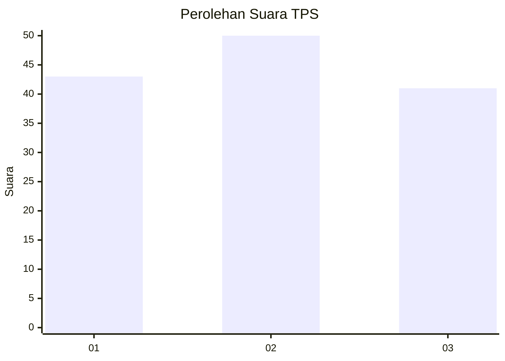
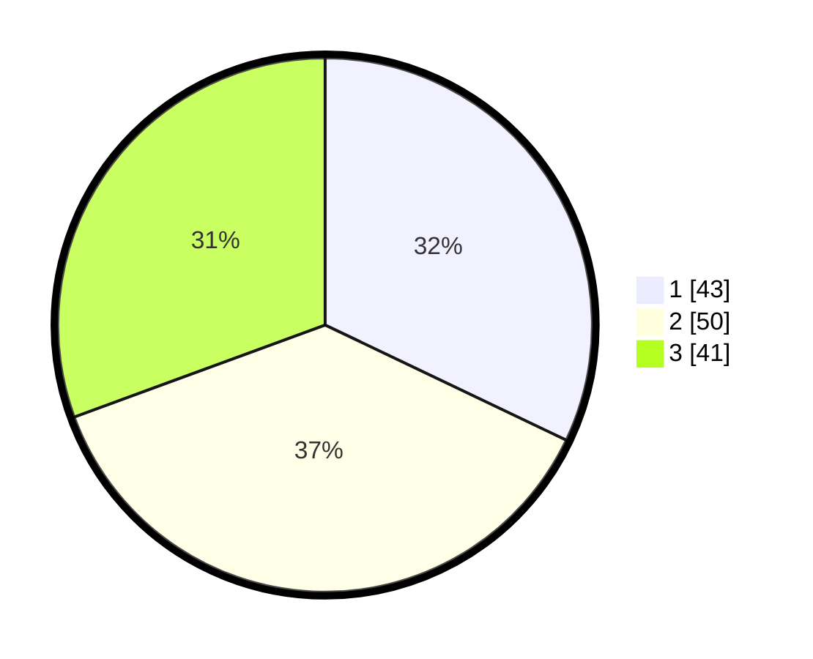

# Hasil

## Grafik

## Tabel

| No. | Nama Paslon    | Suara | Suara (raw) | Persentase |
|:--- |:-------------- | -----:| -----------:| ----------:|
| 1   | ANIES MUHAIMIN | 43    | [43][p-1]   | 32,09      |
| 2   | PRABOWO GIBRAN | 50    | [50][p-2]   | 37,31      |
| 3   | GANJAR MAHFUD  | 41    | [41][p-3]   | 30,60      |

[p-1]: https://github.com/gigit-pemilu/pemilu-2024/blob/main/pilpres/hitung-suara/sub/12-sumatera-utara/sub/71-kota-medan/sub/11-medan-johor/sub/1002-titi-kuning/sub/046-tps/sub/paslon-1.txt
[p-2]: https://github.com/gigit-pemilu/pemilu-2024/blob/main/pilpres/hitung-suara/sub/12-sumatera-utara/sub/71-kota-medan/sub/11-medan-johor/sub/1002-titi-kuning/sub/046-tps/sub/paslon-2.txt
[p-3]: https://github.com/gigit-pemilu/pemilu-2024/blob/main/pilpres/hitung-suara/sub/12-sumatera-utara/sub/71-kota-medan/sub/11-medan-johor/sub/1002-titi-kuning/sub/046-tps/sub/paslon-3.txt

## Foto C Plano

https://sirekap-obj-formc.kpu.go.id/75c1/pemilu/ppwp/12/71/11/10/02/1271111002046-20240214-212316--8920b61a-94cc-4cc4-b591-4717e509a6b6.jpg

https://sirekap-obj-formc.kpu.go.id/75c1/pemilu/ppwp/12/71/11/10/02/1271111002046-20240214-212418--13193a08-b067-45d5-9448-aee641d04b8e.jpg

https://sirekap-obj-formc.kpu.go.id/75c1/pemilu/ppwp/12/71/11/10/02/1271111002046-20240214-214547--da6d2910-f904-4b78-96ff-31913669165a.jpg

## Metadata

| Key        | Value               |
| ---------- | ------------------- |
| Time Stamp | 2024-02-15 15:00:29 |

