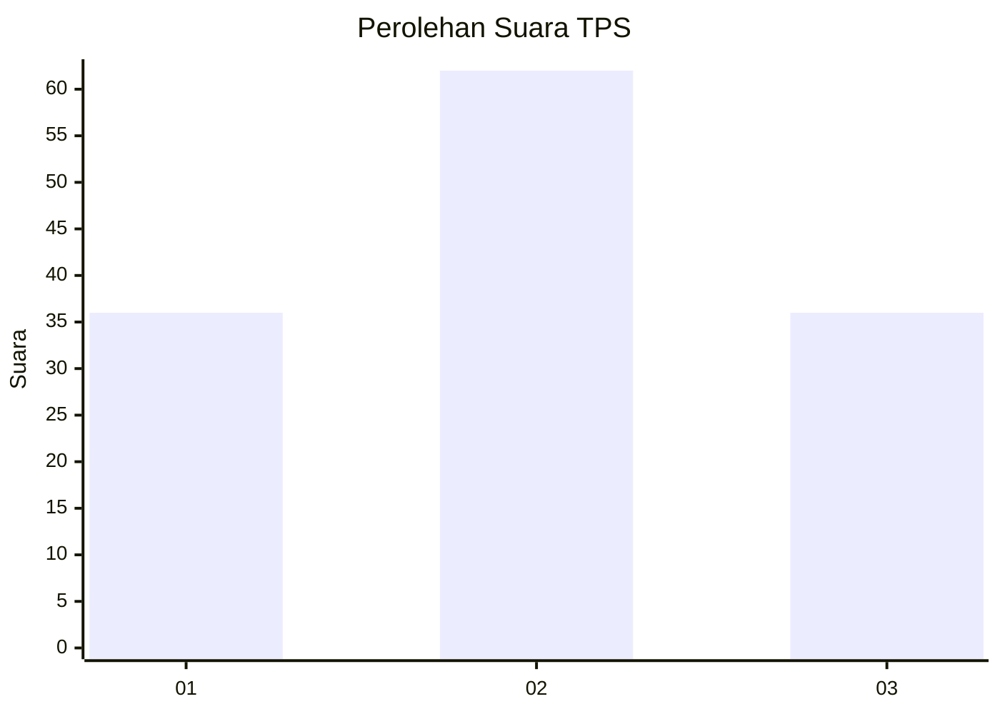
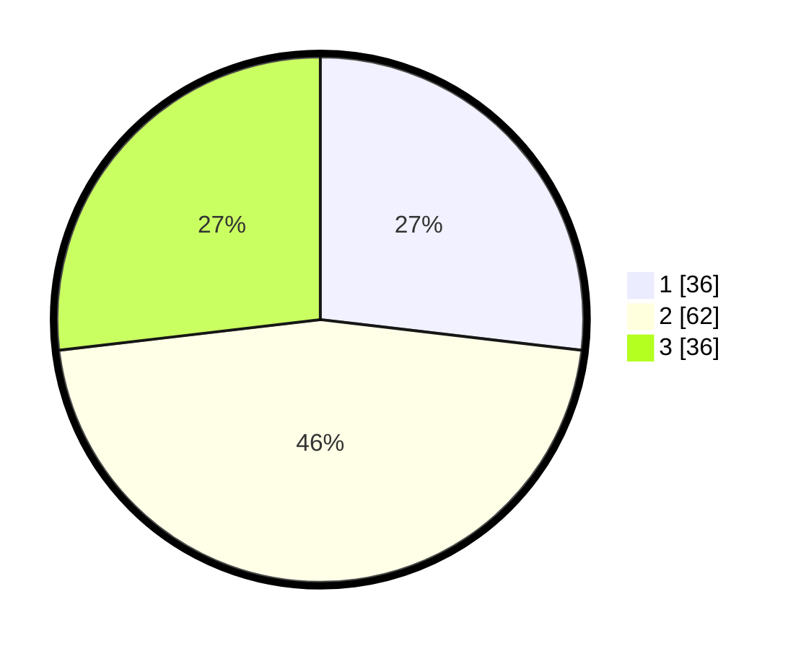

# Hasil

## Grafik

## Tabel

| No. | Nama Paslon    | Suara | Suara (raw) | Persentase |
|:--- |:-------------- | -----:| -----------:| ----------:|
| 1   | ANIES MUHAIMIN | 36    | [36][p-1]   | 26,87      |
| 2   | PRABOWO GIBRAN | 62    | [62][p-2]   | 46,27      |
| 3   | GANJAR MAHFUD  | 36    | [36][p-3]   | 26,87      |

[p-1]: https://github.com/gigit-pemilu/pemilu-2024-12-sumatera-utara/blob/main/pilpres/hitung-suara/sub/12-sumatera-utara/sub/71-kota-medan/sub/11-medan-johor/sub/1002-titi-kuning/sub/069-tps/sub/paslon-1.txt
[p-2]: https://github.com/gigit-pemilu/pemilu-2024-12-sumatera-utara/blob/main/pilpres/hitung-suara/sub/12-sumatera-utara/sub/71-kota-medan/sub/11-medan-johor/sub/1002-titi-kuning/sub/069-tps/sub/paslon-2.txt
[p-3]: https://github.com/gigit-pemilu/pemilu-2024-12-sumatera-utara/blob/main/pilpres/hitung-suara/sub/12-sumatera-utara/sub/71-kota-medan/sub/11-medan-johor/sub/1002-titi-kuning/sub/069-tps/sub/paslon-3.txt

## Foto C Plano

https://sirekap-obj-formc.kpu.go.id/91b5/pemilu/ppwp/12/71/11/10/02/1271111002069-20240214-223718--30d965d1-41de-4cfc-a150-7f868ecf42b7.jpg

https://sirekap-obj-formc.kpu.go.id/91b5/pemilu/ppwp/12/71/11/10/02/1271111002069-20240214-223837--d3b71cb5-85fe-4646-8ddc-ad474e604d9c.jpg

https://sirekap-obj-formc.kpu.go.id/91b5/pemilu/ppwp/12/71/11/10/02/1271111002069-20240214-223930--3ba7c602-2abe-478a-a2ee-d05d106d9d81.jpg

## Metadata

| Key        | Value               |
| ---------- | ------------------- |
| Time Stamp | 2024-02-25 12:00:00 |

