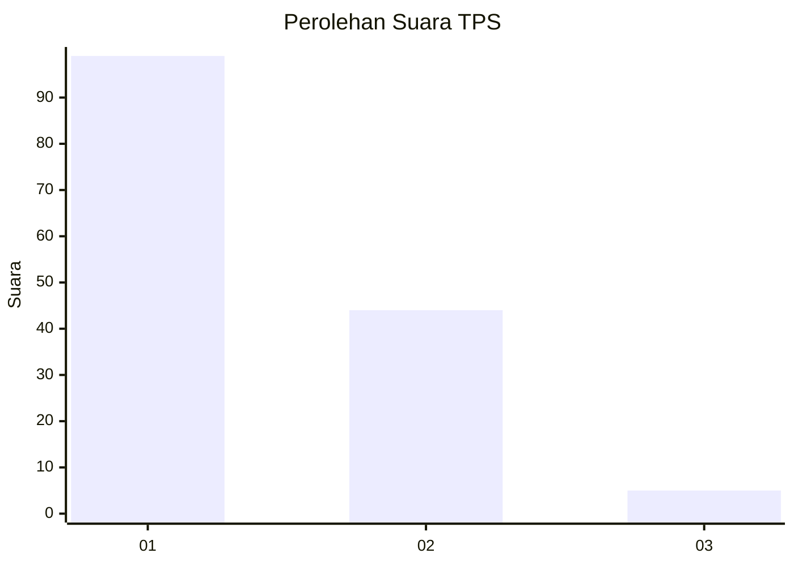
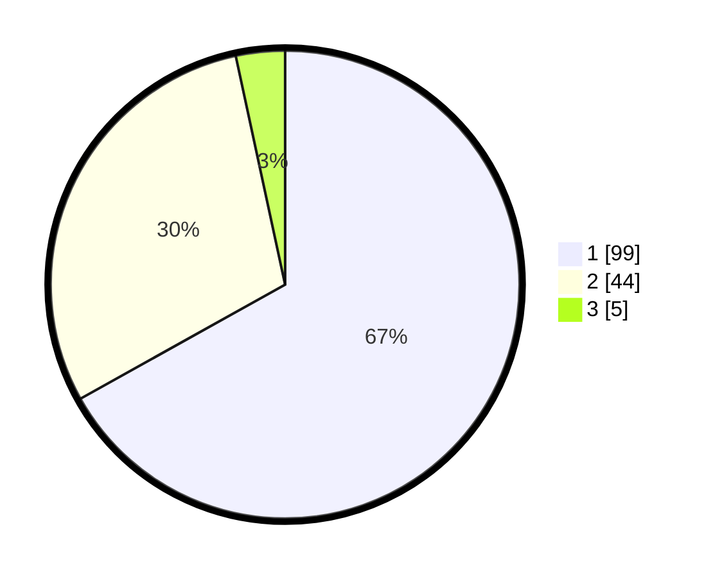

# Hasil

## Grafik

## Tabel

| No. | Nama Paslon    | Suara | Suara (raw) | Persentase |
|:--- |:-------------- | -----:| -----------:| ----------:|
| 1   | ANIES MUHAIMIN | 99    | [99][p-1]   | 66,89      |
| 2   | PRABOWO GIBRAN | 44    | [44][p-2]   | 29,73      |
| 3   | GANJAR MAHFUD  | 5     | [5][p-3]    | 3,38       |

[p-1]: https://github.com/gigit-pemilu/pemilu-2024/blob/main/pilpres/hitung-suara/sub/12-sumatera-utara/sub/71-kota-medan/sub/11-medan-johor/sub/1004-pangkalan-mansur/sub/016-tps/sub/paslon-1.txt
[p-2]: https://github.com/gigit-pemilu/pemilu-2024/blob/main/pilpres/hitung-suara/sub/12-sumatera-utara/sub/71-kota-medan/sub/11-medan-johor/sub/1004-pangkalan-mansur/sub/016-tps/sub/paslon-2.txt
[p-3]: https://github.com/gigit-pemilu/pemilu-2024/blob/main/pilpres/hitung-suara/sub/12-sumatera-utara/sub/71-kota-medan/sub/11-medan-johor/sub/1004-pangkalan-mansur/sub/016-tps/sub/paslon-3.txt

## Foto C Plano

https://sirekap-obj-formc.kpu.go.id/572c/pemilu/ppwp/12/71/11/10/04/1271111004016-20240214-191640--c8f7b74e-e8a3-4808-a127-fd2866782a09.jpg

https://sirekap-obj-formc.kpu.go.id/572c/pemilu/ppwp/12/71/11/10/04/1271111004016-20240214-191823--0e59e9ec-c0ca-4d3d-9100-5c5442a6a49f.jpg

https://sirekap-obj-formc.kpu.go.id/572c/pemilu/ppwp/12/71/11/10/04/1271111004016-20240214-192005--e193d56a-f1f6-4648-b7ce-68dfafa2fe91.jpg

## Metadata

| Key        | Value               |
| ---------- | ------------------- |
| Time Stamp | 2024-02-24 22:31:28 |

