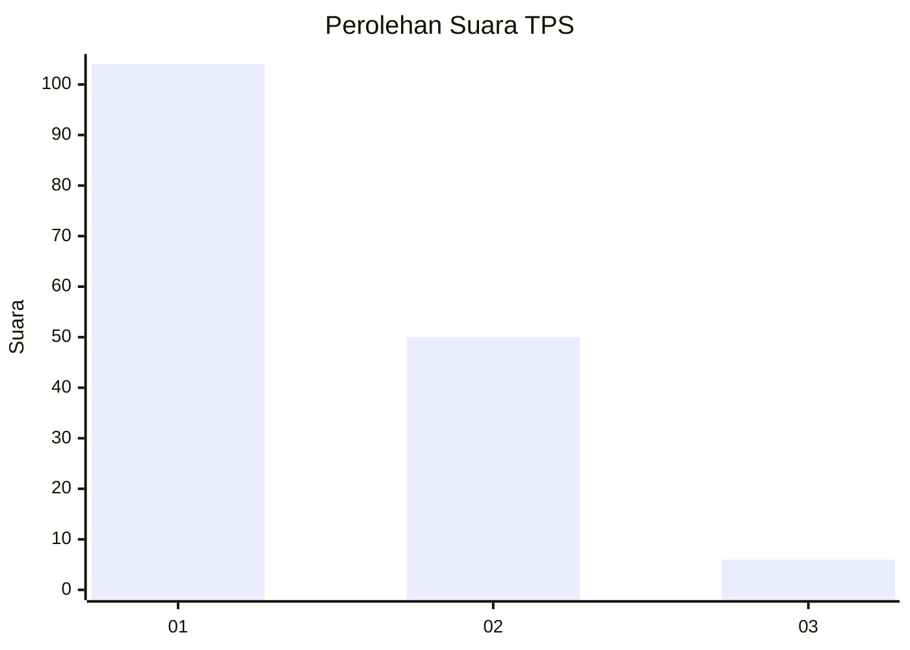
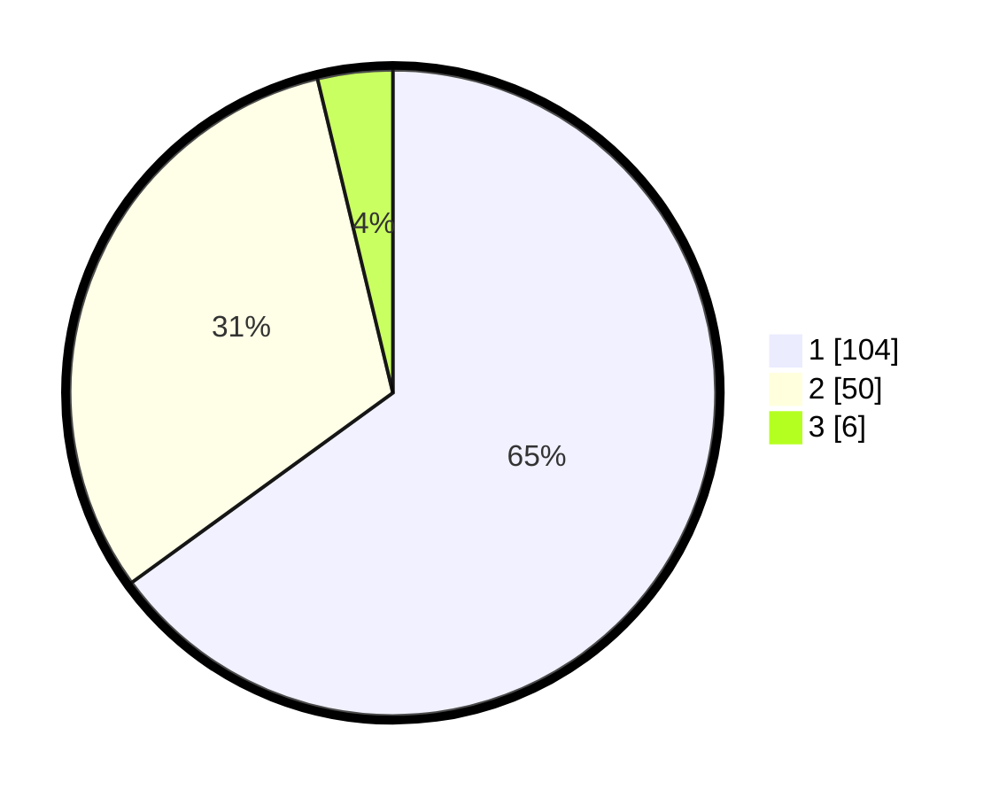

# Hasil

## Grafik

## Tabel

| No. | Nama Paslon    | Suara | Suara (raw) | Persentase |
|:--- |:-------------- | -----:| -----------:| ----------:|
| 1   | ANIES MUHAIMIN | 104   | [104][p-1]  | 65,00      |
| 2   | PRABOWO GIBRAN | 50    | [50][p-2]   | 31,25      |
| 3   | GANJAR MAHFUD  | 6     | [6][p-3]    | 3,75       |

[p-1]: https://github.com/gigit-pemilu/pemilu-2024-12-sumatera-utara/blob/main/pilpres/hitung-suara/sub/12-sumatera-utara/sub/71-kota-medan/sub/11-medan-johor/sub/1004-pangkalan-mansur/sub/046-tps/sub/paslon-1.txt
[p-2]: https://github.com/gigit-pemilu/pemilu-2024-12-sumatera-utara/blob/main/pilpres/hitung-suara/sub/12-sumatera-utara/sub/71-kota-medan/sub/11-medan-johor/sub/1004-pangkalan-mansur/sub/046-tps/sub/paslon-2.txt
[p-3]: https://github.com/gigit-pemilu/pemilu-2024-12-sumatera-utara/blob/main/pilpres/hitung-suara/sub/12-sumatera-utara/sub/71-kota-medan/sub/11-medan-johor/sub/1004-pangkalan-mansur/sub/046-tps/sub/paslon-3.txt

## Foto C Plano

https://sirekap-obj-formc.kpu.go.id/94e7/pemilu/ppwp/12/71/11/10/04/1271111004046-20240215-013629--da346405-25e5-4d6f-87d9-0a6dda8628f4.jpg

https://sirekap-obj-formc.kpu.go.id/94e7/pemilu/ppwp/12/71/11/10/04/1271111004046-20240215-013844--01273121-09ca-4063-851c-4e760812a165.jpg

https://sirekap-obj-formc.kpu.go.id/94e7/pemilu/ppwp/12/71/11/10/04/1271111004046-20240215-014029--d3ae995c-f12c-406d-ae12-f111eb288e08.jpg

## Metadata

| Key        | Value               |
| ---------- | ------------------- |
| Time Stamp | 2024-02-24 22:31:28 |

