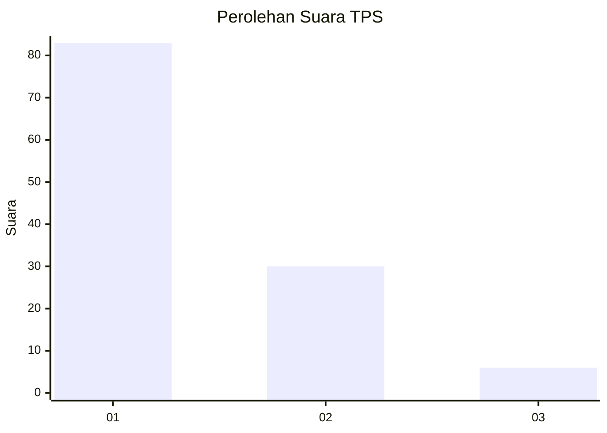
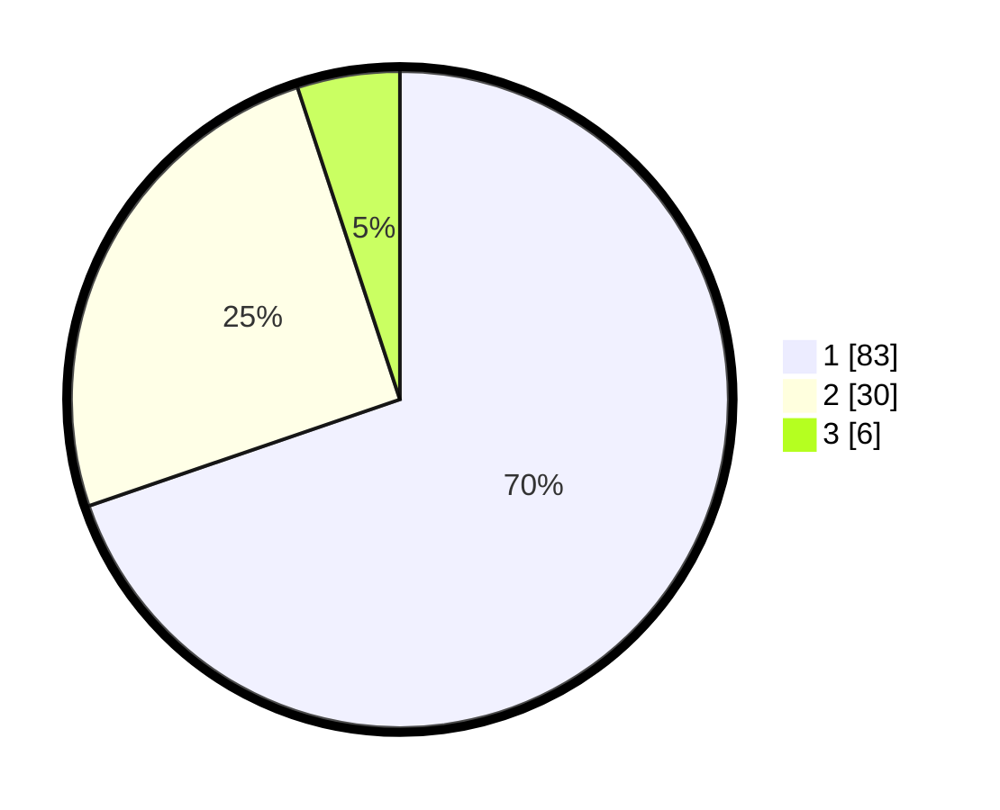

# Hasil

## Grafik

## Tabel

| No. | Nama Paslon    | Suara | Suara (raw) | Persentase |
|:--- |:-------------- | -----:| -----------:| ----------:|
| 1   | ANIES MUHAIMIN | 83    | [83][p-1]   | 69,75      |
| 2   | PRABOWO GIBRAN | 30    | [30][p-2]   | 25,21      |
| 3   | GANJAR MAHFUD  | 6     | [6][p-3]    | 5,04       |

[p-1]: https://github.com/gigit-pemilu/pemilu-2024/blob/main/pilpres/hitung-suara/sub/12-sumatera-utara/sub/71-kota-medan/sub/11-medan-johor/sub/1004-pangkalan-mansur/sub/066-tps/sub/paslon-1.txt
[p-2]: https://github.com/gigit-pemilu/pemilu-2024/blob/main/pilpres/hitung-suara/sub/12-sumatera-utara/sub/71-kota-medan/sub/11-medan-johor/sub/1004-pangkalan-mansur/sub/066-tps/sub/paslon-2.txt
[p-3]: https://github.com/gigit-pemilu/pemilu-2024/blob/main/pilpres/hitung-suara/sub/12-sumatera-utara/sub/71-kota-medan/sub/11-medan-johor/sub/1004-pangkalan-mansur/sub/066-tps/sub/paslon-3.txt

## Foto C Plano

https://sirekap-obj-formc.kpu.go.id/d694/pemilu/ppwp/12/71/11/10/04/1271111004066-20240214-231357--d7df712c-7f9f-458f-b977-eca71ea362d8.jpg

https://sirekap-obj-formc.kpu.go.id/d694/pemilu/ppwp/12/71/11/10/04/1271111004066-20240214-231624--1c3f6a3d-2d89-4949-a4c2-d3fe6d5609df.jpg

https://sirekap-obj-formc.kpu.go.id/d694/pemilu/ppwp/12/71/11/10/04/1271111004066-20240214-231811--79ff7809-9cbd-4e58-92c0-d3ae4fd14fb1.jpg

## Metadata

| Key        | Value               |
| ---------- | ------------------- |
| Time Stamp | 2024-02-25 15:00:00 |

